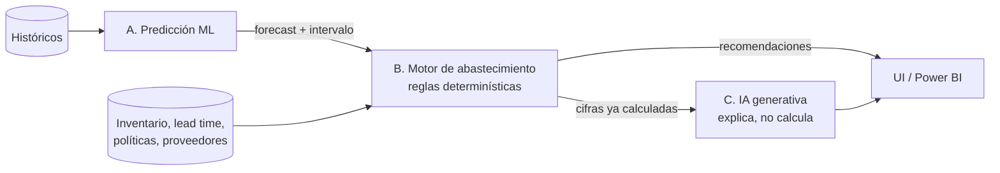
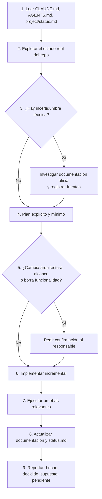

# CLAUDE.md — Guía permanente para agentes de IA

> Este archivo es la **fuente de verdad operativa** para cualquier agente de IA que trabaje sobre este repositorio.
> Debe leerse **completo** al inicio de cada sesión, antes de cualquier modificación.
> Última actualización: 2026-10-06 · Etapa vigente: **ETAPA 2 — Sistema principal** (iniciada: arquitectura y fundación) · Etapa 1 — Datos: **completada**

---

## 1. Descripción del proyecto

**Motor Predictivo de Abastecimiento de Inventarios.**

Sistema empresarial que analiza históricos de consumo, inventarios, tiempos de entrega y
comportamiento de proveedores para **predecir la demanda futura** y, a partir de esa predicción,
**recomendar decisiones de abastecimiento** (cuánto pedir, cuándo pedir, a quién pedir).

El sistema NO es un chatbot ni un dashboard. Es un motor de decisión con tres capas
claramente separadas: predicción, reglas de negocio e interfaz/explicación.

## 2. Objetivo

Reducir simultáneamente:

- el **riesgo de desabasto** (pérdida de venta / paro operativo),
- el **sobreinventario** (capital inmovilizado, obsolescencia),
- el **costo logístico** (órdenes urgentes, fletes extraordinarios, compras reactivas),

sustituyendo decisiones de compra basadas en intuición por decisiones basadas en evidencia
cuantitativa, **auditables y reproducibles**.

## 3. Alcance

### Dentro del alcance
Administración de productos, categorías, inventarios, movimientos, consumo/ventas,
proveedores, lead times y órdenes de compra; análisis de históricos; predicción de demanda
por SKU; cálculo de stock de seguridad, punto de reorden y cantidad recomendada; detección de
riesgo de desabasto y sobreinventario; interfaz web; indicadores en Power BI; explicaciones
en lenguaje natural mediante IA generativa; autenticación corporativa; CI/CD.

### Fuera del alcance (hasta nueva instrucción)
Ejecución automática de compras sin aprobación humana; integración con ERP específico;
optimización de rutas/transporte; gestión de almacén (WMS); pricing; MRP multinivel con
lista de materiales; finanzas y contabilidad.

> Ver el detalle formal en `docs/01-requerimientos.md`.

## 4. Arquitectura conceptual

Tres responsabilidades **estrictamente separadas**:

| Capa | Responsable de | NO responsable de |
|---|---|---|
| **A. Predicción (ML)** | Estimar demanda futura por SKU y horizonte, con incertidumbre | Decidir cuánto comprar |
| **B. Motor de abastecimiento (reglas)** | Convertir predicción + inventario + lead time + política en recomendaciones determinísticas | Estimar la demanda |
| **C. IA generativa** | Explicar, resumir, responder preguntas, recuperar conocimiento documental | Calcular cifras de inventario |



**Regla arquitectónica no negociable:** Azure OpenAI **nunca** produce, altera ni recalcula
una cifra de inventario, un punto de reorden, un stock de seguridad ni una cantidad
recomendada. Recibe cifras ya calculadas por la capa B y solo las **explica**.
Ver `docs/03-arquitectura.md` y `docs/09-ia-generativa.md`.

## 5. Tecnologías

| Tecnología | Rol en el proyecto |
|---|---|
| Python | Lenguaje de backend, ML y ETL |
| FastAPI | API REST, contrato OpenAPI, validación con Pydantic |
| React.js | Interfaz web (SPA) |
| PostgreSQL | Almacenamiento transaccional e histórico |
| Docker | Empaquetado reproducible de servicios |
| Azure Machine Learning | Entrenamiento, registro de modelos, despliegue, monitoreo |
| Azure OpenAI Service | Explicaciones y asistente en lenguaje natural |
| Azure AI Search | Recuperación de conocimiento documental (RAG) |
| Power BI | Analítica e indicadores para negocio |
| GitHub | Control de versiones y colaboración |
| GitHub Actions | Lint, tests, build, despliegue |
| Microsoft Entra ID | Autenticación y autorización corporativa |
| Scrum | Marco de gestión (épicas, historias, sprints) |

**No se añaden tecnologías adicionales relevantes sin justificarlas primero** en
`docs/15-decisiones-tecnicas.md` y obtener validación del responsable del proyecto.
Librerías menores dentro de un lenguaje ya adoptado (p. ej. `pandas`, `pytest`) no requieren
ADR, pero sí deben quedar registradas en el archivo de dependencias correspondiente.

## 6. Reglas de desarrollo

1. **Incremental siempre.** Un cambio = un propósito. Nada de refactorizaciones masivas no solicitadas.
2. **Sin sobreingeniería.** No introducir colas, microservicios, orquestadores, capas de
   abstracción o patrones que el alcance actual no exija. Si una carpeta o una capa no tiene
   un uso hoy, no se crea.
3. **No inventar requisitos.** Si algo no está en `docs/01-requerimientos.md` ni fue pedido
   explícitamente, no se implementa.
4. **No convertir hipótesis en requisitos.** Toda hipótesis se registra en `knowledge/assumptions.md`.
   Un requisito que dependa de un supuesto debe marcarlo con `SUPUESTO` y enlazar su `ASSUMPTION-NNN`;
   nunca se presenta una hipótesis como hecho confirmado ni como valor acordado con el negocio.
5. **No eliminar funcionalidad existente sin autorización explícita** del responsable.
6. **Investigar antes de implementar** cuando exista incertidumbre técnica (ver §7).
7. **Determinismo donde importa.** Todo cálculo de abastecimiento debe ser reproducible:
   mismas entradas → mismas salidas. Sin aleatoriedad no sembrada, sin LLM en la ruta de cálculo.
8. **Trazabilidad.** Toda recomendación generada debe poder explicarse a partir de sus insumos
   (versión de modelo, forecast usado, parámetros de política, inventario en el momento del cálculo).
9. Código y comentarios en **inglés**; documentación de proyecto y de negocio en **español**.
10. Objetivo: black + ruff (Python) y eslint + prettier (JS/TS). Situación actual: en Python no se instalan
    ni se ejecutan, por instrucción del responsable, hasta la DT de la Fase 13. Mientras tanto: compileall,
    pruebas AST de dependencias y la suite de pruebas. El tipado sigue siendo obligatorio en firmas públicas,
    sin verificador automático.

## 7. Comportamiento esperado ante información desconocida

Cuando el agente no sepa algo, en este orden:

1. **Buscar en el repositorio** (`docs/`, `knowledge/`, `project/`). La respuesta suele estar documentada.
2. **Consultar documentación oficial** (ver §11). No asumir el comportamiento de una API de
   Azure, de FastAPI o de PostgreSQL a partir de memoria o de blogs.
3. Si sigue sin resolverse: **registrar la duda** en `knowledge/assumptions.md` o en
   `project/status.md` (sección *Problemas conocidos*) y **preguntar al responsable**.
4. **Nunca rellenar el vacío con datos de negocio inventados** (costos, márgenes, niveles de
   servicio objetivo, nombres de proveedores, políticas de compra). Esos datos los define el negocio.

Si se detecta una **contradicción** entre documentos o entre una instrucción y lo documentado:
documentarla, no resolverla unilateralmente, y solicitar validación.

## 8. Reglas de documentación

- La documentación vive en `docs/`, `knowledge/` y `project/`. No se dispersa en el código.
- **Si una decisión técnica cambia, se actualiza la documentación en el mismo cambio**, no después.
- Toda decisión arquitectónica relevante se registra en `docs/15-decisiones-tecnicas.md`
  (formato ADR: ID, decisión, contexto, alternativas, razón, consecuencias, estado).
- Estados válidos de una decisión: `PROPUESTA` · `ACEPTADA` · `RECHAZADA` · `SUPERSEDIDA` · `PENDIENTE`.
  Nada se marca `ACEPTADA` si todavía es una hipótesis.
- Los supuestos se numeran `ASSUMPTION-NNN` y son **revocables**: cada uno indica cómo se valida
  y qué se rompe si resulta falso.
- Las fuentes externas usadas para decidir se registran en `knowledge/sources.md` con URL y fecha de consulta.
- `project/status.md` se actualiza al cierre de cada bloque de trabajo.

## 9. Reglas de seguridad

1. **Nunca** almacenar en el repositorio: secretos, claves de API, tokens, cadenas de conexión
   con credenciales, certificados o archivos `.env` reales. Solo `.env.example` con valores ficticios.
2. Toda configuración sensible se lee de **variables de entorno**; en la nube, de un **almacén de
   secretos gestionado** (producto sin fijar, `DT-022`) o de los *secrets* de GitHub Actions.
3. Preferir **identidad administrada / Entra ID** sobre claves de API para acceder a servicios de Azure.
4. Nunca registrar (log) secretos, tokens, ni datos personales. Los logs no incluyen cuerpos
   de petición completos en producción.
5. Toda ruta de la API es **autenticada por defecto**; la excepción (p. ej. `/health`) se declara explícitamente.
6. Autorización por **roles** (`ADMIN`, `PLANNER`, `ANALYST`, `VIEWER`) validada en el backend,
   nunca solo en el frontend.
7. Sin datos reales de clientes/proveedores en entornos de desarrollo o pruebas.
8. Cualquier hallazgo de seguridad se documenta y se reporta antes de continuar.

Detalle en `docs/10-seguridad.md`.

## 10. Reglas para Machine Learning

1. **Validación temporal obligatoria.** Nunca `train_test_split` aleatorio sobre series
   temporales: se usa *rolling origin* / *backtesting* con corte por fecha.
2. **Prohibido el data leakage.** Ninguna feature puede contener información posterior al
   instante de predicción (incluidas medias móviles mal alineadas y agregados globales).
3. **Baseline primero.** Ningún modelo se acepta si no supera de forma medible a un baseline
   simple (naïve estacional / media móvil). El baseline se conserva y se reporta siempre.
4. **Métricas declaradas antes de entrenar**, no elegidas después según convenga.
5. Todo entrenamiento es **reproducible**: semilla fija, versión de datos, versión de código,
   hiperparámetros y entorno registrados.
6. Todo modelo desplegado tiene **versión**, métricas de validación y fecha; se registra en
   `ModelVersion` y en el registro de modelos de Azure ML.
7. El modelo **no decide compras**: entrega demanda estimada e incertidumbre. La decisión es de la capa B.
8. Si el modelo no está disponible o su calidad cae por debajo del umbral, el sistema
   **degrada al baseline** y lo señala explícitamente en la salida. Nunca falla en silencio.
9. Los datos sintéticos se marcan como tales y **jamás** se mezclan con datos reales en el mismo dataset sin bandera de origen.

Detalle en `docs/05-motor-predictivo.md`.

## 11. Reglas para Azure

1. **Verificar la documentación oficial vigente antes de implementar** cualquier integración de
   Azure. Las APIs, los nombres de servicio y las versiones cambian (ejemplo real: Azure OpenAI
   pasó a exponerse como *Azure OpenAI in Microsoft Foundry Models* con una API `v1` GA que ya no
   exige el parámetro `api-version`). No escribir código basado en memoria.
2. Orden de fuentes: Microsoft Learn → referencia oficial del SDK → repositorio oficial de ejemplos.
   Blogs y tutoriales no son fuente de decisión.
3. **Ningún recurso real de Azure se aprovisiona en Etapa 0.** Las integraciones se diseñan
   contra interfaces (`ports`) con implementación *fake* local hasta que el negocio autorice el gasto.
4. Todo acceso a Azure desde CI se hace por **OIDC / federated credentials**, sin secretos de larga vida.
5. Los costos son una restricción de diseño: cualquier propuesta que implique consumo relevante
   (endpoints en línea, capacidad de Azure OpenAI, tier de AI Search) se documenta con su
   implicación de costo antes de adoptarse.
6. Toda dependencia de Azure debe estar **encapsulada** detrás de una interfaz propia para que el
   sistema sea ejecutable y testeable en local sin conexión.

## 12. Reglas para testing

1. Todo cambio de comportamiento viene acompañado de pruebas.
2. **Ejecutar las pruebas relevantes después de cada cambio.** No se reporta trabajo terminado
   con pruebas en rojo.
3. La lógica del motor de abastecimiento requiere pruebas unitarias **determinísticas** con
   casos límite: inventario cero, lead time cero, demanda cero, demanda constante, MOQ mayor
   que la necesidad, tránsito **efectivo** superior al punto de reorden, y tránsito **total** superior al
   punto de reorden con efectivo insuficiente.
4. Las pruebas de ML no verifican una métrica exacta sino **propiedades e invariantes**
   (no hay leakage, el modelo supera al baseline, la salida tiene la forma y el rango esperados).
5. Sin llamadas de red reales en pruebas unitarias: Azure OpenAI, AI Search y Azure ML se
   sustituyen por dobles de prueba.
6. Cobertura como señal, no como objetivo. Prioridad: motor de abastecimiento > API > ETL > UI.

Detalle en `docs/13-testing.md`.

## 13. Reglas para Git

1. **El agente hace los commits necesarios en ramas de trabajo; el push, los PR y los merges los hace el
   responsable** (instrucción del responsable, 2026-10-06; antes, el agente no hacía commits).
   Nunca hace push.
2. Nunca trabajar directamente sobre `main`. Rama por unidad de trabajo:
   `feature/`, `fix/`, `docs/`, `chore/`, `exp/`.
3. Mensajes de commit en formato *Conventional Commits*: `feat:`, `fix:`, `docs:`, `test:`,
   `refactor:`, `chore:`.
4. Un Pull Request por historia de usuario, con descripción, alcance y evidencia de pruebas.
5. Nunca reescribir historia publicada (`push --force` sobre ramas compartidas).
6. Nunca commitear: `.env`, datos reales, artefactos de modelos pesados, `node_modules/`, `__pycache__/`, credenciales.
7. Los datasets y modelos no van al repositorio; se referencian por versión.

## 14. Estructura del proyecto

```
.
├── CLAUDE.md                  # Esta guía (fuente de verdad operativa)
├── AGENTS.md                  # Protocolo de trabajo de los agentes de IA
├── README.md                  # Presentación del proyecto
├── .gitignore
├── docs/                      # Documentación técnica
│   ├── 01-requerimientos.md
│   ├── 02-propuesta-tecnica.md
│   ├── 03-arquitectura.md
│   ├── 04-modelo-datos.md
│   ├── 05-motor-predictivo.md
│   ├── 06-motor-abastecimiento.md
│   ├── 07-api.md
│   ├── 08-frontend.md
│   ├── 09-ia-generativa.md
│   ├── 10-seguridad.md
│   ├── 11-power-bi.md
│   ├── 12-devops.md
│   ├── 13-testing.md
│   ├── 14-mantenimiento.md
│   ├── 15-decisiones-tecnicas.md
│   ├── architecture/          # Diagramas y vistas de detalle
│   ├── decisions/             # ADRs individuales (plantilla incluida)
│   └── reports/               # Reportes de cierre de etapa
├── knowledge/                 # Conocimiento de dominio
│   ├── glossary.md
│   ├── assumptions.md
│   ├── business-rules.md
│   └── sources.md
├── project/                   # Gestión (Scrum)
│   ├── roadmap.md
│   ├── backlog.md
│   └── status.md
└── tests/                     # Estrategia y pruebas transversales
    └── README.md
```

> Nota: `architecture/`, `decisions/` y `reports/` se ubican **dentro de `docs/`** para mantener
> toda la documentación técnica bajo una sola raíz. Ver `DT-013` en `docs/15-decisiones-tecnicas.md`.

`data/` existe desde el inicio de la Fase 1 y contiene, por ahora, solo el componente implementado:

```
data/
└── synthetic/
    ├── config/          # Componente 1 — DatasetConfig (dataset_config.yaml + config.py)
    ├── generator/       # Componentes 2 a 8 y W1 (catalog, demand, supplier_behaviour, inventory, orders, scenarios, validator, pipeline, …)
    ├── output/          # Dataset generado — NO se versiona (ver .gitignore)
    └── tests/           # Pruebas del generador, junto a su código
```

> `output/` lo crea el generador la primera vez que se ejecuta y está excluido en
> `.gitignore`: `CLAUDE.md` §13.7 mantiene los datasets fuera del repositorio. Recogerlo
> aquí era una tarea pendiente declarada en `DT-024`, *Costos aceptados*, punto 4.
>
> Con `DT-040` (W1), cada ejecución trabaja en `data/synthetic/tmp/<id_de_ejecución>/` y solo al
> final promociona el resultado a `output/`. El directorio existe **solo durante la ejecución**: se
> elimina al terminar, bien o mal, y está excluido de Git por la regla `tmp/` del `.gitignore`.

`backend/` existe desde U1 (2026-10-01): `backend/app/supply_engine/` (motor V1, solo biblioteca
estándar) y `backend/tests/`, con `backend/pyproject.toml` (Python ≥ 3.11, sin dependencias
obligatorias). U2 (2026-10-01) añade `backend/app/db/` (conexión y ejecutor de migraciones),
`backend/app/ingestion/` (ingesta del dataset 0.4.0), `backend/db/migrations/` (SQL versionado),
`backend/tests/ingestion/` y `backend/tests/db/`, y el grupo opcional `db` (`psycopg`) del `pyproject`.
U3 (2026-10-02) añade `backend/app/forecasting/` (`ForecastProvider` y baselines V1, solo biblioteca
estándar), `backend/app/runs/` (ejecución `forecast`), la migración `0002_forecast_tables.sql`,
`backend/tests/forecasting/` y `backend/tests/runs/`.
`infra/` existe desde U2 y contiene solo `docker-compose.yml` (PostgreSQL 16 local, `DT-055`).

`frontend/` existe desde la Fase 7 (2026-10-05, `DT-070`): interfaz React V1 de solo lectura (Vite, React,
TypeScript), con su `README.md`; se trabaja con Node 24 LTS y npm 11.19.0.

Carpetas que **aún no existen** y se crearán cuando su fase comience: `ml/` y `.github/workflows/`.

## 15. Flujo de trabajo esperado del agente



## 16. Criterios para modificar archivos

| Situación | Acción permitida |
|---|---|
| Archivo no existe y es parte del plan aprobado | Crear |
| Archivo existe y el cambio es aditivo y acotado | Editar, preservando lo existente |
| Archivo existe y el cambio elimina comportamiento | **Pedir confirmación primero** |
| Archivo de documentación con decisión vigente | Editar solo si se actualiza también el ADR correspondiente |
| Archivo generado o de terceros (`node_modules/`, lockfiles) | No editar a mano |
| Archivo con secretos o `.env` | No crear, no leer para copiar valores, no commitear |

Antes de sobrescribir **cualquier** archivo existente: leerlo completo y verificar su contenido.

## 17. Restricciones vigentes

**Etapa 2 — Sistema principal: iniciada el 2026-09-30** por autorización explícita del responsable.
La **Etapa 1 — Datos está completada**: `generator_version` 0.4.0, dataset `ds-6c8ad65b4999`
validado (51/51 comprobaciones, 0 fallos) y 582 pruebas en verde.

El primer bloque de la Etapa 2 es **arquitectura y fundación**: los contratos del sistema principal
están en `docs/03` §16, `docs/04` §9, `docs/05` §19, `docs/06` §16, `docs/07` §7 y `docs/09` §14, y el
orden de construcción en `DT-047` (`DT-043` y `DT-045` `ACEPTADA`; `DT-047` `ACEPTADA` en cuanto a U1,
U2, U3, U4, U5 y U6; `DT-044` `ACEPTADA` el 2026-10-01; `DT-046` `ACEPTADA` el 2026-10-02). El contrato de U1 está cerrado en `docs/06` §16.11 (`DT-048` a
`DT-052`, `DT-P22`, `DT-053` y `DT-054`), sin decisiones pendientes. **U1 está implementada**
(`backend/app/supply_engine`, 146 pruebas en verde). **U2 está implementada** (2026-10-01, `DT-044`,
`DT-055`): PostgreSQL 16, migraciones SQL y la ingesta validada, atómica e idempotente del 0.4.0
(`docs/04` §9.9). **U3 está implementada y validada** (2026-10-02: `DT-P17` cerrada por `DT-056`, `DT-046` y
`DT-057` `ACEPTADA`; `docs/05` §19.8 a §19.10). **U4 está implementada y validada** (2026-10-03:
`DT-P18` y `DT-P21` cerradas; `DT-058` a `DT-063` `ACEPTADA`; `backend/app/runs/recommendation*.py`, migración
`0003`, `python -m app.runs recommend --as-of`; `docs/04` §9.11 y `docs/06` §16.13). **U5 está implementada y validada** (2026-10-03: `DT-064`
a `DT-067` `ACEPTADA`; `backend/app/api/`, `backend/app/db/read/`, `.env.example`; `python -m app.api` solo con
`APP_ENV=local`; `docs/07` §7.4 y §7.5). Sus pruebas sin base van en `backend/tests/api` (sin `__init__.py`:
`python -m unittest discover -s tests/api -t tests/api`, con los grupos `api` y `test` instalados). **U6 está implementada y validada**
(2026-10-04: `DT-068` y `DT-069` `ACEPTADA`; `backend/app/genai/`, solo biblioteca estándar, y el endpoint 14
`GET /api/v1/recommendations/{recommendation_id}/explanation`; `docs/09` §14.5 y §14.6; commits `55e0c39` y `5861fda`). Con U6 termina el orden de `DT-047`;
lo siguiente requiere su propia autorización. **La Fase 7 (interfaz React) está implementada e integrada en
`main`** (2026-10-05, PR #2 a #5: `DT-070`, separada de `DT-047`; `docs/08` §12): `frontend/` con versiones fijadas, autenticación
simulada, proxy de `/api`, sin reglas de negocio en el cliente; unidades F7a–F7d, cada una con su rama `feature/frontend-<unidad>`
desde `main` tras integrar U1–U6 por PR con merge commit (en la práctica, ramas encadenadas por decisión del responsable, integradas en orden con merge commit). **La Fase 5 (ML) tiene sus decisiones documentadas y no está autorizada, salvo F5a y F5b**
(2026-10-05: `DT-071` a `DT-088`, `docs/05` §20; F5a por `DT-086`: baselines, Nivel 1 y segmentación provisional, sin elegir
baseline oficial ni métrica; F5b por `DT-088`: simulador de Nivel 2 aplicado a los baselines): `ml/` con solo la biblioteca estándar, `float` solo en `ml/` y en un proveedor
de modelo (`DT-074`), U1 sin cambios; antes de implementar hay que decidir las condiciones de `docs/05` §20.4.
**G1 está registrado** (2026-10-05: `DT-089` a `DT-091`, `docs/05` §20.5), con decisiones provisionales válidas solo
con datos `SYNTHETIC`:
- baseline oficial, la media móvil de 13 semanas de U3;
- SES, no promovido;
- métrica primaria MASE;
- valores de aceptación de `DT-091`.

**F5c y F5d siguen sin autorizar.** Ningún modelo se promueve ni se integra, el *holdout* no se ha usado y la banda de
predicción sigue siendo nominal 0,80, no validada. *(2026-10-06: **autorizadas F5a, F5b y F5c** (`DT-086`, `DT-088`,
`DT-092`), con los criterios complementarios de G1 de `DT-093`. F5c trabaja solo en `ml/`, sin *holdout* ni promoción.
**F5d, G2 y G3 siguen sin autorizar.**)* *(2026-10-06: F5c implementada en `ml/candidates.py` y `ml/f5c/`, revisada
e integrada en `main` (PR #11, merge commit `6a1d777`); resultados `SYNTHETIC` en `docs/05` §20.7. No promueve ningún
modelo: SES sigue siendo el candidato fuerte, sin promover; la estrategia (b) de `DT-011` sigue pendiente de decisión.)*
*(2026-10-06: `DT-094` fija el alcance de cierre de la Etapa 2: el stack completo por unidades U7 a U16, cada una con su
propia autorización. **U7 (Docker) autorizada** e implementada, pendiente de revisión (`DT-095`). «No configurar
servicios reales de Azure» y «No crear credenciales» siguen vigentes hasta la autorización de U10.)*
*(2026-10-06: U7 integrada en `main` (PR #13). **U8 (CI) autorizada** e implementada, pendiente de revisión (`DT-096`):
sin linter de Python (ni Ruff ni Black), frontend con ESLint, Prettier y `tsc`, permisos `contents: read`, sin OIDC.)*
*(2026-10-06: **U9 autorizada** e implementada, pendiente de revisión (`DT-097`): migración `0004`, esquema `analytics`
y rol `analytics_reader`; sin Power BI. Las vistas dependen de tablas operativas: una migración que las altere debe
recrearlas.)*
*(2026-10-06: **U10 autorizada**, `DT-098`: Bicep de la base de Azure de `dev` en `infra/azure/`; el despliegue lo
ejecuta el responsable con su sesión. U11–U16 siguen sin autorizar.)*
*(2026-10-07: U10 desplegada y verificada en `centralus`. **U11 autorizada**, `DT-099`: Entra ID en `dev` (registros,
app roles de ASSUMPTION-010, MSAL, validación de tokens, `APP_ENV=dev`); la configuración real la ejecuta el
responsable con `infra/azure/deploy-u11.ps1`. `APP_ENV=local` no cambia. U12–U16 siguen sin autorizar.)*
*(2026-10-07: **U12 autorizada**, `DT-100` (cierra `DT-P01` para `dev`): Container Apps Consumption, ACR Basic,
PostgreSQL 16 B1ms, job único de bootstrap; el despliegue real lo ejecuta el responsable con
`infra/azure/deploy-u12.ps1` (`infra/azure/u12/README.md`). U13–U16 siguen sin autorizar.)*
Restricciones vigentes, que se levantan solo por instrucción explícita:

- **No escribir código de aplicación fuera de una unidad autorizada.** Cada unidad (U1 a U6 de `DT-047`,
  U7 a U16 de `DT-094`, …) requiere su propia autorización.
- El generador (`data/synthetic/`) y el dataset 0.4.0 son **upstream terminado**: no se modifican, y
  el código del sistema consume su contrato, no su código.
- No configurar servicios reales de Azure. No crear credenciales. *(2026-10-06: U10 lo levanta solo para su base
  de `dev` y solo con la sesión del responsable (`DT-098`); el agente nunca recibe credenciales. Los commits los
  hace el agente en ramas de trabajo (§13); el push y los PR, el responsable.)*
- No instalar dependencias sin autorización: cada unidad declara las suyas (`DT-043`).
- Las reglas V1 (`DT-031`) y los criterios `SYNTHETIC_COVERAGE_CRITERION` (`DT-041`) **no son
  políticas de negocio**; toda recomendación calculada con ellas se marca como provisional.

### Registro de la Etapa 1 — Datos (completada)

*Texto con el que se trabajó durante la Etapa 1; se conserva como historial. Sus restricciones quedan
sustituidas por la lista anterior.*

La Etapa 0 está superada y la **Etapa 1 — Datos fue autorizada explícitamente por el responsable
el 2026-09-14**. Durante la Etapa 1 rigieron estas restricciones:

- No desarrollar todavía la aplicación: el trabajo actual es el **generador de datos sintéticos**.
  Backend, frontend, base de datos, ML, Azure, contenedores y CI/CD llegan en sus propias fases.
- No configurar servicios reales de Azure.
- No crear credenciales.
- No hacer commits automáticamente.
- No instalar dependencias innecesarias.
- No iniciar una fase posterior sin autorización.

**Estado de la Fase 1 — Datos (en progreso).** Se avanza componente a componente, con autorización
para cada uno:

| Componente | Estado |
|---|---|
| 1 — `DatasetConfig` (contrato de configuración) | ✅ Implementado y probado |
| 2 — Catalog Generator (cinco entidades maestras + `manifest.json`) | ✅ Implementado y probado |
| 3 — Demand Generator (`demand.csv`, demanda **latente**) | ✅ Implementado y probado |
| 6 — Supplier Behaviour Generator (perfiles en memoria, **sin archivos**) | ✅ Implementado y probado (2026-09-28, `DT-037`) |
| 4 — Inventory Simulator (`consumption.csv`, `inventory.csv`, `inventory_movements.csv`) | ✅ Implementado y probado (2026-09-26, `DT-036`, `DT-038`) |
| 5 — Purchase Order Generator (órdenes, líneas y recepciones) | ✅ Implementado y probado (2026-09-28, `DT-039`) |
| W1 — Publicación del dataset (workspace temporal → verificación → promoción) | ✅ Implementado (2026-09-29, `DT-040`); `__main__` ejecuta C2 → C3 → C6 → C4 → C5 → C7 → C8 a través de él |
| 7 — Scenario Assignment (`manifest.scenario_assignment`, **sin archivos**) | ✅ Implementado y probado (2026-09-29, `DT-041`); integrado en W1 |
| 8 — Dataset Validator + informe de calidad (`manifest.quality_report`, **sin archivos**) | ✅ Implementado y probado (2026-09-29, `DT-042`); integrado en W1 |

**El generador está terminado.** El dataset está publicado **y validado** en `data/synthetic/output/`
(2026-09-29, `ds-6c8ad65b4999`, `generator_version` **0.4.0**): catálogo, demanda latente, consumo,
inventario y órdenes, con `scenario_assignment` y un `quality_report` de 51/51 comprobaciones sin
fallos en el manifiesto:

```text
C2 → products.csv, locations.csv → C3 → demand.csv → C4 → consumption.csv
                                        demanda            demanda
                                        latente            satisfecha
```

**`demand.csv` es demanda latente** —lo que se habría demandado si el inventario nunca hubiera
limitado nada— y **`consumption.csv` es demanda satisfecha**, con su bandera de desabasto. Los
produce componentes distintos y no deben confundirse (`DT-034`). El Componente 4, que es el dueño del
inventario, de los desabastos y del consumo observado, recibe los perfiles del Componente 6 y entrega
las órdenes al Componente 5; los cinco se ejecutan con `python3 -m data.synthetic.generator` a través
de W1 (`DT-040`), seguidos del Componente 7, que registra `scenario_assignment` (`DT-041`), y del
Componente 8, que valida el workspace y registra `quality_report` (`DT-042`); ningún dataset que falle
C8 se publica. Los criterios `SYNTHETIC_COVERAGE_CRITERION` de `DT-041` demuestran cobertura del
dataset y **no son reglas de negocio**.

**Orden de ejecución aprobado para los tres siguientes** (2026-09-24), distinto del orden de
numeración:

```text
C6 → C4 → C5
perfiles   simulación   materialización
de          causal       de órdenes
proveedor
```

C6 entrega parámetros y no escribe archivos; C4 ejecuta el bucle causal completo y **calcula** las
órdenes causales, sus recepciones y sus identificadores; C5 las **escribe sin recalcular nada**,
añade las órdenes `CANCELLED` sintéticas y **forma el `order_number` de todas**. Las políticas
sintéticas están en `DT-036` y `DT-037`, y **no son reglas de negocio**: `s` no es un punto de
reorden, `Q` no es una recomendación de compra y `C` no es un horizonte de cobertura. Los **contratos
de salida** —columnas, claves, orden de filas e identificadores— están en `DT-038` (Componente 4) y
`DT-039` (Componente 5). **Autoría de los identificadores:** C4 asigna los de todo lo causal y los de
sus propias entidades; C5, solo los de las filas sintéticas que él mismo crea. Ningún `id` tiene dos
autoridades.

**Publicación (`DT-040`).** Ningún componente escribe en `output/`. Cada ejecución trabaja en su
propio workspace y el dataset solo se publica cuando la ejecución **completa** termina bien y el
workspace se promociona. Una ejecución fallida deja `output/` intacto.
