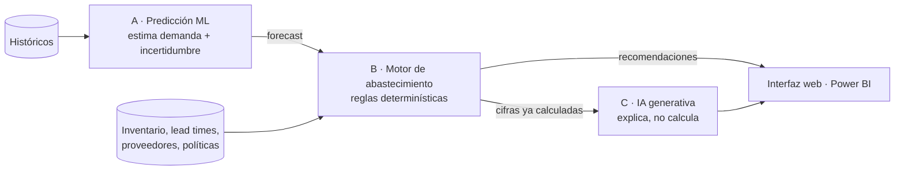

# Motor Predictivo de Abastecimiento de Inventarios

> **Estado actual (2026-09-30): ETAPA 2 — Sistema principal, iniciada** (arquitectura y fundación).
> La Etapa 1 — Datos está completada: generador de datos sintéticos 0.4.0 y dataset
> `ds-6c8ad65b4999` validado. El sistema principal todavía **no está implementado**: sus contratos y su
> orden de construcción están documentados. Estado detallado en [`project/status.md`](project/status.md).

---

## Qué es

Un sistema de apoyo a la decisión de abastecimiento. Analiza el histórico de consumo, el inventario,
los tiempos de entrega y el comportamiento de los proveedores para **predecir la demanda futura** y,
a partir de esa predicción, **recomendar qué comprar, cuánto y cuándo**.

No es un chatbot ni un tablero de indicadores. Es un motor de decisión: cada recomendación es
determinística, explicable término a término y reconstruible meses después.

## Objetivo

Reducir simultáneamente tres costos que suelen tratarse por separado:

- el **desabasto** —venta perdida, paro operativo, compras urgentes—,
- el **sobreinventario** —capital inmovilizado, obsolescencia—,
- el **costo logístico** de comprar de forma reactiva.

Sustituyendo la intuición por evidencia cuantitativa auditable, sin quitarle la decisión a la persona
que compra.

## Arquitectura

Tres capas con responsabilidades **estrictamente separadas**:



| Capa | Responsabilidad | Frontera |
|---|---|---|
| **A — Predicción** | Estimar demanda futura por SKU con su incertidumbre | No decide cuánto comprar |
| **B — Abastecimiento** | Calcular stock de seguridad, punto de reorden, cantidad y riesgos | No predice |
| **C — IA generativa** | Explicar resultados y responder en lenguaje natural | **No calcula ninguna cifra** |

La regla que sostiene el diseño: **Azure OpenAI nunca produce, altera ni recalcula una cifra de
inventario.** Recibe cifras ya calculadas y las explica. Las cantidades deben ser exactas,
reproducibles y defendibles; un modelo de lenguaje no ofrece ninguna de las tres cosas.

Detalle en [`docs/03-arquitectura.md`](docs/03-arquitectura.md).

## Tecnologías

| Capa | Tecnología |
|---|---|
| Backend | Python · FastAPI |
| Frontend | React.js |
| Datos | PostgreSQL |
| Machine Learning | Python · Azure Machine Learning |
| IA generativa | Azure OpenAI Service · Azure AI Search |
| Analítica | Power BI |
| Identidad | Microsoft Entra ID |
| Empaquetado | Docker |
| CI/CD | GitHub · GitHub Actions |
| Gestión | Scrum |

La justificación de cada elección está en [`docs/02-propuesta-tecnica.md`](docs/02-propuesta-tecnica.md) §12.

## Estructura del repositorio

```
.
├── CLAUDE.md                    # Guía permanente para agentes de IA — leer primero
├── AGENTS.md                    # Protocolo de trabajo de los agentes
├── README.md
├── .gitignore
├── docs/                        # Documentación técnica
│   ├── 01-requerimientos.md         Requisitos funcionales, no funcionales, seguridad y ML
│   ├── 02-propuesta-tecnica.md      Problema, solución, estrategias, riesgos
│   ├── 03-arquitectura.md           Componentes, flujos, interfaces, observabilidad
│   ├── 04-modelo-datos.md           Entidades, relaciones, restricciones
│   ├── 05-motor-predictivo.md       Estrategia de Machine Learning
│   ├── 06-motor-abastecimiento.md   Reglas determinísticas de reposición
│   ├── 07-api.md                    Diseño de la API REST
│   ├── 08-frontend.md               Vistas, componentes y flujos de usuario
│   ├── 09-ia-generativa.md          Azure OpenAI, Azure AI Search y RAG
│   ├── 10-seguridad.md              Entra ID, roles, secretos, auditoría
│   ├── 11-power-bi.md               KPIs y modelo dimensional
│   ├── 12-devops.md                 Git, Docker, GitHub Actions
│   ├── 13-testing.md                Estrategia de pruebas
│   ├── 14-mantenimiento.md          Operación, monitoreo del modelo, incidentes
│   ├── 15-decisiones-tecnicas.md    Registro de decisiones (ADR)
│   ├── architecture/                Diagramas y vistas de detalle
│   ├── decisions/                   ADRs individuales y plantilla
│   └── reports/                     Reportes de cierre de etapa
├── knowledge/                   # Conocimiento de dominio
│   ├── glossary.md                  Definiciones únicas y compartidas
│   ├── assumptions.md               Supuestos, con validación e impacto
│   ├── business-rules.md            Reglas confirmadas, propuestas y pendientes
│   └── sources.md                   Fuentes externas consultadas
├── project/                     # Gestión
│   ├── roadmap.md                   16 fases con criterios de finalización
│   ├── backlog.md                   Épicas, historias y tareas
│   └── status.md                    Estado actual del proyecto
└── tests/                       # Estrategia y pruebas transversales
```

Las carpetas `backend/`, `frontend/`, `ml/`, `data/`, `infra/` y `.github/workflows/` **aún no
existen**: se crearán cuando comience la fase correspondiente.

## Estado actual

**Etapa 2 iniciada (2026-09-30)** · Etapa 1 completada (2026-09-29). El resumen de esta sección
describe el cierre de la Etapa 0 y se conserva como historial; el estado vigente está en
[`project/status.md`](project/status.md).

**ETAPA 0.1 — AUDITORÍA COMPLETADA.** Documentación base creada, auditada y corregida.
Resultado: **APROBADA CON OBSERVACIONES**; pendiente de aprobación del responsable.

- ✅ Requisitos, arquitectura, modelo de datos y estrategias documentados
- ✅ Decisiones técnicas registradas, distinguiendo lo decidido de lo hipotético
- ✅ Supuestos marcados como tales, con su validación y su impacto
- ✅ Roadmap y backlog listos
- ⬜ Sin código de aplicación (es lo correcto en esta etapa)
- ✅ Auditada en la revisión 0.1: arquitectura proporcional, requisitos clasificados por origen,
  trazabilidad verificada campo a campo, evaluación de dos niveles añadida
- ⏳ Pendiente: parámetros de política que debe aportar el negocio, y tres decisiones técnicas que
  requieren datos (`DT-010`, `DT-019`, `DT-021`)

Detalle en [`project/status.md`](project/status.md).

### Lo que hace falta del negocio

El proyecto no inventa información empresarial. Estos datos están pendientes y condicionan la
parametrización del motor:

1. Nivel de servicio objetivo (y **qué definición** de nivel de servicio se usa).
2. Política de revisión: continua o periódica, y con qué frecuencia.
3. Umbrales de clasificación de riesgo de desabasto y de sobreinventario.
4. Costos de faltante y de mantener inventario.
5. Criterio de selección entre proveedores alternativos.
6. Calendario laboral y estacionalidades conocidas.
7. Volúmenes reales de catálogo e histórico.
8. Confirmación de si existe documentación interna indexable.

Los siete primeros son parámetros de política: lista completa (trece) en
[`knowledge/business-rules.md`](knowledge/business-rules.md) §3. El punto 8 corresponde a
`ASSUMPTION-008` en [`knowledge/assumptions.md`](knowledge/assumptions.md).

## Cómo continuará el desarrollo

Dieciséis fases, cada una con objetivo, entradas, actividades, entregables, dependencias y criterio
de finalización explícito ([`project/roadmap.md`](project/roadmap.md)):

```
0 Preparación → 1 Datos → 2 PostgreSQL → 3 FastAPI → 4 Motor de abastecimiento
→ 5 Machine Learning → 6 Azure ML → 7 React → 8 Entra ID → 9 Azure AI Search
→ 10 Azure OpenAI → 11 Power BI → 12 Docker → 13 GitHub Actions → 14 QA → 15 Entrega
```

Dos decisiones de secuenciación merecen explicación:

- **El motor de abastecimiento (Fase 4) va antes que el Machine Learning (Fase 5).** El motor consume
  un forecast, y ese forecast puede ser un baseline estadístico. Así el sistema entrega recomendaciones
  útiles y auditables desde temprano; cuando llegue el modelo, solo mejora una entrada de un motor ya
  probado. Al revés, todo el valor esperaría a que el ML funcione.
- **Azure se integra al final.** Primero se construye un sistema completo y ejecutable en local. Los
  servicios en la nube se incorporan cuando hay algo que integrar y una razón para pagarlo.

Principios de trabajo: incremental, verificable, documentado y sin sobreingeniería. Las reglas
completas están en [`CLAUDE.md`](CLAUDE.md).

## Para agentes de IA

Antes de tocar este repositorio, leer en este orden: [`CLAUDE.md`](CLAUDE.md) →
[`AGENTS.md`](AGENTS.md) → [`project/status.md`](project/status.md).

Reglas que no se negocian: no inventar requisitos ni datos de negocio; verificar la documentación
oficial antes de implementar una integración de Azure; mantener separadas la predicción y las reglas
determinísticas; nunca almacenar secretos; ejecutar las pruebas tras cada cambio; no hacer commit sin
autorización.
