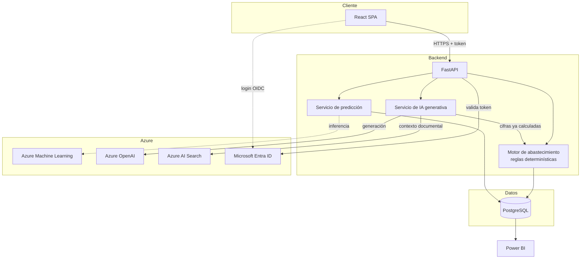

# 02 — Propuesta técnica

**Estado:** Versión 1.0 — Etapa 0 · **Fecha:** 2026-09-04 · **Versión 1.1** — revisada en la auditoría de Etapa 0.1

## 1. Problema

Las decisiones de abastecimiento se toman habitualmente con información fragmentada y criterios
heurísticos: se compra "lo de siempre", se reacciona cuando el inventario ya está bajo, y el lead
time se asume constante cuando en realidad varía por proveedor y por temporada. El resultado es un
patrón conocido:

- **Desabasto** en los productos que sí rotan, con pérdida de venta o paro operativo.
- **Sobreinventario** en los que no rotan, inmovilizando capital y generando obsolescencia.
- **Costo logístico elevado** por compras urgentes, fletes extraordinarios y órdenes fraccionadas.
- **Falta de trazabilidad**: no se puede reconstruir por qué se compró una cantidad determinada.

El problema de fondo no es la falta de datos —el histórico existe— sino la ausencia de un mecanismo
sistemático que convierta ese histórico en una decisión defendible, repetible y auditable.

## 2. Solución propuesta

Un **motor predictivo de abastecimiento** organizado en tres capas con responsabilidades separadas:

1. **Capa de predicción (ML).** Estima la demanda futura por SKU y su incertidumbre a partir del
   histórico de consumo. No decide nada.
2. **Capa de reglas de abastecimiento.** Combina la predicción con inventario disponible, inventario
   en tránsito, lead time observado, variabilidad y política de servicio para calcular stock de
   seguridad, punto de reorden y cantidad recomendada, de forma **determinística y explicable**.
3. **Capa de interacción.** Interfaz web, indicadores en Power BI y explicaciones en lenguaje natural
   mediante IA generativa, que **describe** los resultados sin producirlos.

La decisión final de compra sigue siendo humana. El sistema es un asistente de decisión, no un
autómata de compras.

### Por qué esta separación es la decisión central del proyecto

Sería técnicamente posible pedirle a un LLM que "recomiende cuánto comprar". Sería un error:
la salida no sería reproducible, no sería auditable, no podría probarse con casos límite exactos y
no podría defenderse ante una auditoría o ante una desviación costosa. Las cifras de inventario son
**determinísticas por naturaleza**; la incertidumbre pertenece a la predicción, no a la aritmética.
Por eso el LLM queda fuera de la ruta de cálculo. Ver `DT-001` en `docs/15-decisiones-tecnicas.md`.

## 3. Alcance de la propuesta

**Incluye:** modelo de datos operativo e histórico; ingesta y validación de datos; predicción de
demanda por SKU; motor de reglas de abastecimiento; API REST; interfaz web; analítica en Power BI;
asistente explicativo con RAG; autenticación corporativa; contenedores y CI/CD; pruebas.

**No incluye en esta versión:** ejecución automática de compras, integración con un ERP concreto,
optimización de transporte, gestión de almacén, MRP multinivel, pricing y finanzas.

## 4. Estrategia predictiva

- **Unidad de predicción:** producto (SKU). Si existieran varias ubicaciones, la serie se define por
  SKU–ubicación; la primera versión asume ubicación única o agregada (ASSUMPTION-006).
- **Enfoque incremental:** primero un baseline estadístico sólido (naïve estacional, media móvil,
  suavizado exponencial), después modelos más expresivos solo si aportan mejora medible.
- **Evaluación honesta:** validación temporal con *rolling origin*; el baseline se reporta siempre.
  Un modelo complejo que no supera al baseline no entra a producción.
- **Incertidumbre como producto de primera clase:** la predicción entrega un intervalo, no solo un
  punto. El stock de seguridad depende de esa incertidumbre; sin ella el cálculo carece de fundamento.
- **Cobertura total del catálogo:** los SKU con histórico corto, demanda intermitente o alta
  variabilidad reciben un tratamiento específico y declarado, nunca un valor silenciosamente arbitrario.

Detalle en `docs/05-motor-predictivo.md`.

## 5. Estrategia de abastecimiento

Reglas determinísticas, documentadas, con fórmulas de literatura reconocida de gestión de inventarios
(no fórmulas inventadas), aplicadas sobre:

- demanda esperada durante el lead time,
- variabilidad de la demanda y variabilidad del lead time,
- nivel de servicio objetivo (parámetro **del negocio**, aún no definido),
- posición de inventario (`existencia física + tránsito efectivo − comprometido`; ver `docs/06` §4.2),
- restricciones del proveedor (MOQ, múltiplo de compra, lead time acordado).

Cada recomendación expone todos sus términos intermedios. Si un parámetro necesario no está definido
por el negocio, el sistema lo señala en lugar de sustituirlo por un valor inventado.

Detalle en `docs/06-motor-abastecimiento.md`.

## 6. Estrategia de IA generativa

Dos usos, ambos **posteriores** al cálculo:

1. **Explicación.** Recibe una recomendación ya calculada y la traduce a lenguaje natural para un
   planificador: por qué este producto es crítico, qué lo está impulsando, qué pasa si no se actúa.
2. **Consulta documental (RAG).** Recupera fragmentos de documentos internos (políticas de compra,
   contratos, manuales) mediante Azure AI Search y los usa como contexto, **siempre con cita**.

Frontera explícita: **datos estructurados** (inventario, forecast, recomendaciones) se obtienen de la
API; **conocimiento documental** se obtiene de Azure AI Search. El modelo no mezcla ni sustituye una
fuente por la otra, y no genera cifras.

Detalle en `docs/09-ia-generativa.md`.

## 7. Arquitectura general

Detalle en `docs/03-arquitectura.md`.

## 8. Datos necesarios

| Dato | Uso | Origen inicial |
|---|---|---|
| Catálogo de productos y categorías | Identificación y agregación | Sintético |
| Histórico de consumo/ventas por SKU y fecha | Entrenamiento y predicción | Sintético |
| Inventario actual y movimientos históricos | Posición de inventario, reconstrucción | Sintético |
| Proveedores y relación producto–proveedor | Selección y restricciones de compra | Sintético |
| Órdenes de compra con fechas comprometidas y reales | Lead time observado, tránsito, cumplimiento | Sintético |
| Parámetros de política (nivel de servicio, umbrales) | Cálculo de stock de seguridad y riesgo | **Pendiente del negocio** |
| Documentos internos (políticas, contratos) | RAG | Pendiente, fase posterior |

**Datos sintéticos:** durante las primeras fases se usarán datos sintéticos diseñados para
representar un escenario empresarial verosímil, no ruido aleatorio: alta y baja rotación, demanda
estable, creciente y decreciente, estacionalidad, variabilidad, periodos de desabasto, exceso de
inventario, proveedores confiables y con retrasos, distintos lead times, órdenes de compra e
inventario en tránsito. El diseño del dataset se documenta en la Fase 1; **no se genera en Etapa 0**.

**Sustitución por datos reales:** el esquema y los contratos son los mismos para datos sintéticos y
reales; el origen se marca a nivel de carga. Sustituir la fuente no exige rediseñar la aplicación (RF-023).

## 9. Estrategia de evaluación

Tres niveles independientes:

1. **Evaluación del modelo:** métricas de error de pronóstico sobre validación temporal, siempre
   comparadas contra el baseline (`docs/05-motor-predictivo.md`).
2. **Evaluación del motor de abastecimiento:** pruebas determinísticas con casos calculados a mano y
   casos límite; simulación retrospectiva sobre el histórico para estimar cuántos desabastos y cuánto
   sobreinventario se habrían evitado.
3. **Evaluación de la IA generativa:** verificación de que las cifras de la respuesta existen en el
   contexto entregado, de que se citan las fuentes documentales y de que el sistema responde "no
   dispongo de ese dato" cuando corresponde.

La métrica de negocio relevante no es el error del modelo sino el resultado de la decisión: nivel de
servicio alcanzado, rotación, cobertura y costo. El error de pronóstico es un medio, no el fin.

## 10. Estrategia de seguridad

- Autenticación con Microsoft Entra ID (OAuth 2.0 / OpenID Connect); el frontend obtiene un token y
  el backend valida firma, emisor, audiencia y expiración.
- Autorización por roles (`ADMIN`, `PLANNER`, `ANALYST`, `VIEWER`) aplicada en el backend.
- Cero secretos en el repositorio; configuración por variables de entorno y, en entornos desplegados,
  un almacén de secretos gestionado (producto sin fijar, `DT-022`).
- Preferencia por identidad administrada y credenciales federadas (OIDC) sobre claves de larga vida,
  incluido el acceso de GitHub Actions a Azure.
- El asistente de IA respeta los permisos del usuario y trata el contenido recuperado como datos, no
  como instrucciones.

Detalle en `docs/10-seguridad.md`.

## 11. Estrategia de despliegue

- **Contenedores** para backend, frontend y base de datos; entorno local reproducible con Docker Compose.
- **CI/CD con GitHub Actions**: lint → tests → build → publicación de imagen → despliegue.
- **Autenticación de CI hacia Azure mediante OIDC**, sin secretos de larga vida.
- **Entornos** `dev` → `staging` → `prod`, con promoción explícita. `SUPUESTO` (ASSUMPTION-014):
  el destino de ejecución en Azure (App Service, Container Apps u otro) se decidirá en la Fase 12–13,
  cuando existan requisitos reales de carga y presupuesto. No se decide en Etapa 0.
- **Base de datos** gestionada por migraciones versionadas; ningún cambio manual de esquema.

Detalle en `docs/12-devops.md`.

## 12. Justificación del stack

| Tecnología | Por qué tiene sentido aquí |
|---|---|
| **Python** | Lenguaje común al backend, al ETL y al ML: evita duplicar la lógica de features en dos lenguajes. Ecosistema maduro de series temporales y análisis de datos. |
| **FastAPI** | Framework asíncrono con validación de tipos por Pydantic y generación automática de OpenAPI. El contrato explícito es esencial cuando el frontend, Power BI y el asistente de IA consumen los mismos datos. Integra bien con validación de tokens de Entra ID. |
| **React.js** | La interfaz es intensiva en estado (filtros, listas priorizadas, detalle, conversación). Ecosistema amplio y MSAL con soporte oficial para autenticación con Entra ID. |
| **PostgreSQL** | Los datos son fuertemente relacionales (producto–proveedor–orden–movimiento) y requieren integridad transaccional y auditabilidad. Soporta bien series temporales por volumen previsto, funciones de ventana para análisis histórico y es conector nativo de Power BI. |
| **Docker** | Reproducibilidad entre desarrollo, CI y producción; permite levantar el sistema completo en local sin depender de servicios de Azure. |
| **Azure Machine Learning** | Aporta lo que el proyecto necesita del ciclo de vida del modelo: registro versionado, seguimiento de experimentos (compatible con MLflow), despliegue como endpoint y monitoreo de deriva en producción. Evita construir un MLOps propio. |
| **Azure OpenAI Service** | Explicación en lenguaje natural y asistente conversacional dentro del perímetro de identidad y cumplimiento de Azure, con autenticación por Entra ID. |
| **Azure AI Search** | Recuperación sobre conocimiento documental con búsqueda híbrida (léxica + vectorial), que es lo indicado cuando conviven términos exactos (códigos de SKU, nombres de proveedor) y consultas en lenguaje natural. |
| **Power BI** | El público de negocio (compras, finanzas, dirección) ya consume indicadores ahí; construir un BI propio sería duplicar esfuerzo. Se conecta a PostgreSQL de forma nativa. |
| **GitHub + GitHub Actions** | Control de versiones, revisión por Pull Request y automatización en la misma plataforma; soporta OIDC hacia Azure sin secretos persistentes. |
| **Microsoft Entra ID** | Identidad corporativa ya existente: evita gestionar contraseñas propias y permite mapear roles organizacionales a permisos del sistema. |
| **Scrum** | El alcance evolucionará conforme aparezcan datos reales; el trabajo incremental por sprints con backlog priorizado se adapta mejor que un plan cerrado. |

**Coherencia del conjunto:** el stack está deliberadamente concentrado en un ecosistema (Python +
Azure + GitHub) para reducir superficie operativa y puntos de integración. No se añaden tecnologías
adicionales sin justificación previa registrada como ADR.

## 13. Riesgos

| ID | Riesgo | Impacto | Mitigación |
|---|---|---|---|
| R-01 | Los datos reales resultan de menor calidad que los sintéticos (huecos, ajustes, unidades inconsistentes) | Alto | Capa de validación e informe de calidad de datos desde la Fase 1; el sistema declara la confianza de cada estimación |
| R-02 | Sobreajuste a los datos sintéticos: el modelo aprende el generador, no el fenómeno | Alto | El dataset sintético no se usa para decidir la arquitectura definitiva del modelo; baseline obligatorio; revalidación con datos reales antes de producción |
| R-03 | Falta de parámetros de negocio (nivel de servicio, costos) | Alto | Documentados como pendientes; el sistema los expone como configuración, no los inventa |
| R-04 | Uso indebido del LLM como calculador | Alto | Separación arquitectónica, RS-010 y pruebas que detectan cifras no presentes en el contexto |
| R-05 | Costos de Azure superiores a lo previsto | Medio | Ninguna provisión en Etapa 0; interfaces sustituibles por implementaciones locales; evaluación de costo antes de cada integración |
| R-06 | Cambios en las APIs de Azure durante el desarrollo | Medio | Verificación contra documentación oficial vigente antes de implementar; dependencias de Azure encapsuladas tras interfaces propias |
| R-07 | Demanda intermitente en gran parte del catálogo, donde los modelos habituales rinden mal | Medio | Tratamiento específico documentado y declarado en la salida |
| R-08 | Adopción: el planificador no confía en la recomendación | Alto | Explicabilidad completa de cada recomendación; el humano decide; se muestra el razonamiento, no solo el número |
| R-09 | Sobreingeniería que retrasa la primera versión útil | Medio | Regla explícita en `CLAUDE.md`; roadmap incremental con criterio de finalización por fase |
| R-10 | Fuga de datos temporal en el entrenamiento que infla las métricas | Alto | RML-004 y prueba automatizada de alineamiento temporal |

## 14. Limitaciones

- El sistema **predice demanda**, no eventos externos (huelgas, cierres de proveedor, cambios
  regulatorios, promociones no informadas). Su calidad depende de que el histórico sea representativo.
- No sustituye el criterio del comprador: recomienda, no ejecuta.
- Las recomendaciones son tan buenas como los parámetros de política que el negocio defina.
- Con datos sintéticos, ninguna métrica de desempeño puede interpretarse como evidencia de que el
  sistema funcionará igual con datos reales.
- El motor de la primera versión trabaja a nivel de SKU independiente: no optimiza conjuntamente
  restricciones de presupuesto, capacidad de almacén ni consolidación de órdenes por proveedor.
- La calidad del RAG depende de que exista documentación interna estructurada; hoy no está confirmada.

## 15. Supuestos

Todos los supuestos de esta propuesta están registrados y son revocables en
`knowledge/assumptions.md`. Los más determinantes:

- `ASSUMPTION-001` — Se trabajará con datos sintéticos porque no hay datos reales disponibles.
- `ASSUMPTION-002` — El horizonte de predicción relevante para la decisión de compra es del orden del
  lead time más el periodo de revisión.
- `ASSUMPTION-006` — Ubicación única (o inventario agregado) en la primera versión.
- `ASSUMPTION-011` / `ASSUMPTION-012` — Objetivos de rendimiento y volumen de referencia.
- `ASSUMPTION-014` — El destino de despliegue en Azure se decide en fase posterior.

Ninguno de estos supuestos se considera requisito. Si el negocio los contradice, se actualizan los
documentos afectados y, si procede, el ADR correspondiente.
