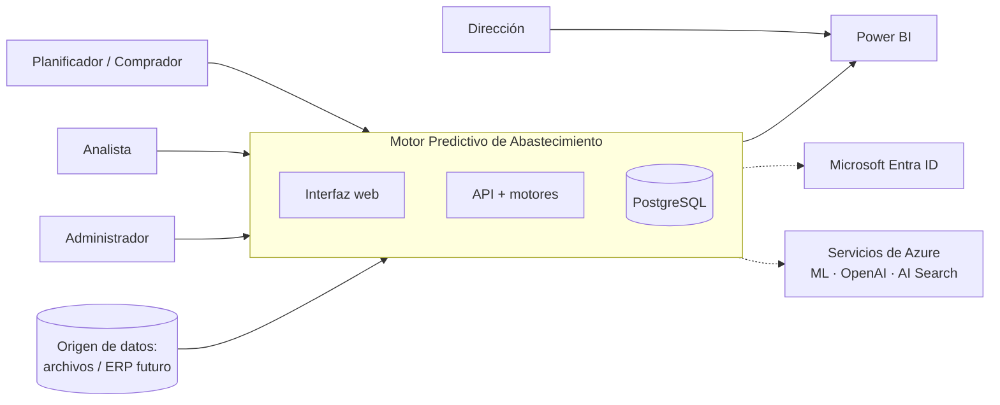
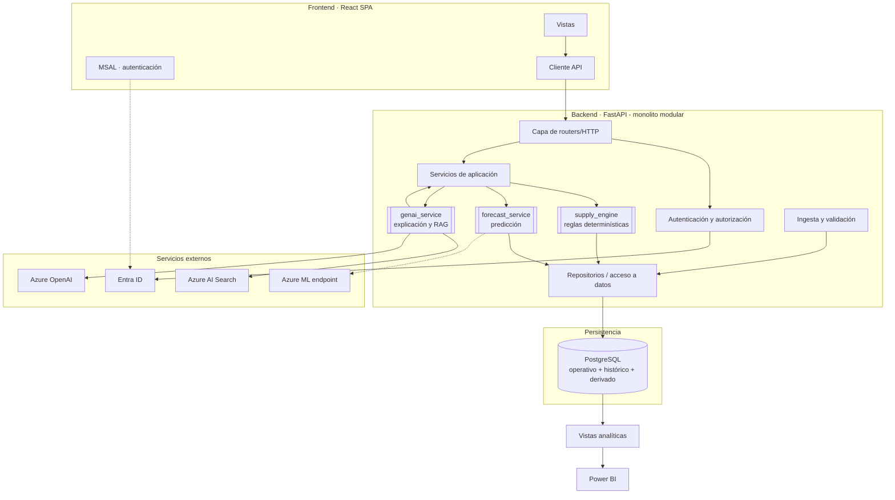
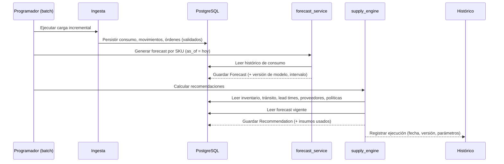
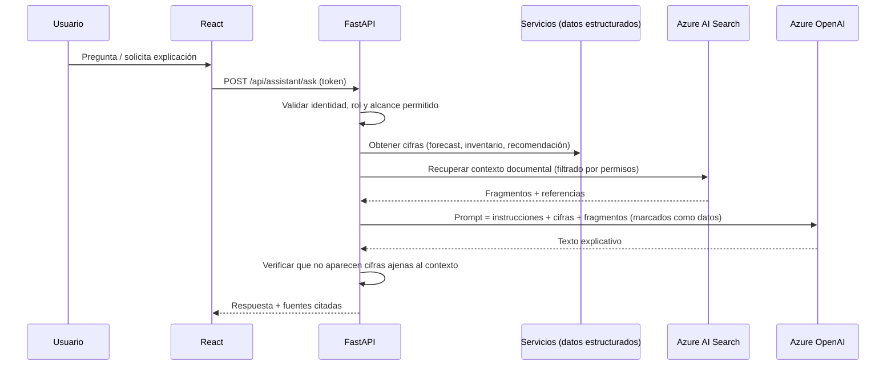
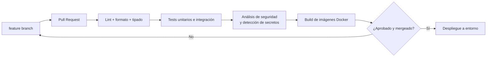

# 03 — Arquitectura

**Estado:** Versión 1.0 — Etapa 0 (diseño, no implementado) · **Fecha:** 2026-09-04 · **Versión 1.1** — revisada en la auditoría de Etapa 0.1

> Este documento describe la arquitectura **objetivo**. Nada de lo aquí descrito está implementado
> todavía. Las decisiones que lo sustentan están en `docs/15-decisiones-tecnicas.md`.

---

## 1. Principios arquitectónicos

1. **Separación de predicción, decisión y explicación.** La capa ML predice, la capa de reglas
   decide, la capa generativa explica. Nunca se invierten los papeles.
2. **Determinismo en la ruta de decisión.** Todo cálculo de abastecimiento es reproducible y auditable.
3. **Dependencias externas encapsuladas.** Azure ML, Azure OpenAI y Azure AI Search se consumen a
   través de interfaces propias con implementación sustituta local, de modo que el sistema es
   ejecutable y testeable sin nube.
4. **Degradación controlada.** La caída de un servicio externo degrada funcionalidad, no la interrumpe.
5. **Simplicidad deliberada.** Monolito modular en el backend. No se introducen microservicios,
   colas ni orquestadores mientras el alcance no lo exija (`DT-005`).
6. **El histórico es inmutable.** Movimientos, órdenes, predicciones y recomendaciones se conservan;
   las correcciones se registran como hechos nuevos.

## 2. Vista de contexto



## 3. Vista de componentes



### 3.1 Responsabilidades por componente

| Componente | Responsabilidad | Explícitamente NO hace |
|---|---|---|
| **React SPA** | Presentación, navegación, estado de UI, obtención de token | Reglas de negocio, autorización real |
| **Routers FastAPI** | Contrato HTTP, validación de entrada/salida, códigos de error | Lógica de negocio |
| **Auth** | Validar token de Entra ID, resolver identidad y roles | Emitir tokens |
| **Servicios de aplicación** | Orquestar casos de uso, transacciones | Cálculos de inventario (delega en `supply_engine`) |
| **`supply_engine`** | Stock de seguridad, punto de reorden, cantidad recomendada, riesgos — **puro y determinístico** | Acceder a HTTP, llamar a LLM, entrenar modelos |
| **`forecast_service`** | Producir predicción + incertidumbre; seleccionar modelo o baseline | Decidir cantidades de compra |
| **`genai_service`** | Construir contexto, recuperar documentos, invocar LLM, citar fuentes | Calcular cifras, escribir en la base de datos |
| **Repositorios** | Persistencia y consultas | Reglas de negocio |
| **Ingesta** | Cargar, validar y marcar origen de los datos | Transformaciones de negocio no documentadas |
| **PostgreSQL** | Verdad operativa e histórica | Lógica de aplicación compleja en la base |

**Regla de dependencia:** `supply_engine` es una biblioteca **pura**, sin dependencias de FastAPI,
base de datos ni red. Recibe estructuras de datos y devuelve estructuras de datos. Esto es lo que
permite probarlo con casos exactos y garantiza RNF-002.

## 4. Interfaces internas

Cada frontera relevante se define como una interfaz (*port*) con al menos dos implementaciones:
una real y una local/sustituta para desarrollo y pruebas.

| Interfaz | Contrato conceptual | Implementaciones |
|---|---|---|
| `ForecastProvider` | `predict(sku, horizon, as_of) -> serie estimada + incertidumbre + versión de modelo` | Local (baseline / modelo en proceso) · Azure ML endpoint |
| `DocumentRetriever` | `search(query, filtros, top_k) -> fragmentos + referencia de origen` | Local (índice en memoria/ficheros) · Azure AI Search |
| `TextGenerator` | `generate(prompt, contexto) -> texto + metadatos` | Local (plantilla determinística) · Azure OpenAI |
| `SecretProvider` | `get(nombre) -> valor` | Variables de entorno · almacén gestionado (producto sin fijar, `DT-022`) |
| `DataSource` (ingesta) | `load(origen) -> registros validados + reporte` | Archivos sintéticos · Archivos reales · (futuro) ERP |

Consecuencia práctica: el sistema arranca y funciona sin ninguna credencial de Azure. Esto es un
requisito operativo (RNF-006), no una comodidad de desarrollo.

## 5. Flujo de datos

### 5.1 Flujo principal — generación de recomendaciones (proceso por lotes)



Punto clave: el forecast se **persiste** antes de ser consumido. Así la recomendación queda anclada
a una predicción concreta e identificable, y es reconstruible meses después (RF-024).

### 5.2 Flujo de consulta interactiva

```
Usuario → React → (token) → FastAPI → validación de token y rol
       → servicio de aplicación → repositorio → PostgreSQL
       → respuesta tipada → React
```

La consulta interactiva **lee** resultados ya calculados. El recálculo bajo demanda para un producto
concreto es posible pero explícito (endpoint separado), nunca un efecto colateral de una lectura.

### 5.3 Flujo de explicación / asistente (RAG)



El LLM recibe las cifras; **no las produce**. La verificación posterior es parte del flujo, no un extra.

## 6. Autenticación

- Identidad corporativa en **Microsoft Entra ID**.
- El frontend (SPA) usa el **flujo de código de autorización con PKCE** —el recomendado para
  aplicaciones de página única— y obtiene un token de acceso para la API registrada.
- El backend expone un *scope* propio de API y **valida el token** en cada petición: firma contra las
  claves publicadas por el emisor, `iss`, `aud`, vigencia y los *scopes* o *app roles* presentes.
- El backend no acepta tokens emitidos para otra audiencia, aunque sean válidos.
- Endpoints públicos: únicamente los declarados de forma explícita (`/health`, documentación en entornos no productivos).

## 7. Autorización

Roles conceptuales iniciales (**pendientes de validación**, ver `docs/10-seguridad.md`):

| Rol | Puede |
|---|---|
| `ADMIN` | Todo, incluida configuración de políticas y gestión de usuarios/roles |
| `PLANNER` | Consultar todo el ámbito operativo, ejecutar recálculos, marcar recomendaciones como atendidas |
| `ANALYST` | Consultar y analizar; sin acciones operativas |
| `VIEWER` | Solo lectura de dashboards y listados |

Aplicación: dependencia de FastAPI que resuelve identidad y roles desde el token y los verifica
contra el permiso requerido por el endpoint. **La autorización nunca depende del frontend.** El
asistente de IA opera bajo la identidad del usuario y hereda sus restricciones (RS-004).

## 8. Comunicación entre componentes

| Origen → Destino | Protocolo | Notas |
|---|---|---|
| React → FastAPI | HTTPS / REST JSON | Contrato OpenAPI generado; CORS restringido a orígenes conocidos |
| FastAPI → PostgreSQL | TCP/TLS, pool de conexiones | Migraciones versionadas con credencial separada |
| FastAPI → Azure ML | HTTPS al endpoint del modelo | Con reintentos acotados y *timeout*; ante fallo, baseline local |
| FastAPI → Azure AI Search | HTTPS, SDK oficial | Autenticación por Entra ID preferida sobre clave |
| FastAPI → Azure OpenAI | HTTPS, SDK oficial | Autenticación por Entra ID preferida; sin datos sensibles innecesarios en el prompt |
| Power BI → PostgreSQL | Conector nativo | Solo lectura, sobre vistas analíticas dedicadas |
| Proceso batch → módulos | Invocación en proceso | Mismo código que la API; sin duplicar lógica |

Comunicación **síncrona** en toda la primera versión. No se introduce mensajería asíncrona sin una
necesidad demostrada (`DT-005`).

## 9. Almacenamiento

PostgreSQL organiza los datos en tres naturalezas, dentro de un mismo esquema lógico:

| Naturaleza | Contenido | Característica |
|---|---|---|
| **Operativa** | Productos, categorías, proveedores, relación producto–proveedor, inventario vigente, órdenes | Mutable con historial de auditoría |
| **Histórica** | Movimientos de inventario, consumo/ventas, recepciones | **Append-only**, inmutable |
| **Derivada** | Forecast, recomendaciones, métricas de proveedor, versiones de modelo | Recalculable, pero **conservada** para trazabilidad |

Los datos derivados se conservan aunque puedan recalcularse: recalcular con el modelo actual no
reproduce lo que el sistema recomendó hace tres meses.

Detalle en `docs/04-modelo-datos.md`.

## 10. Machine Learning en la arquitectura

- **Entrenamiento:** fuera de la ruta de petición, como *job* en Azure Machine Learning (o local en
  fases tempranas). Registra experimentos y métricas; el seguimiento es compatible con MLflow.
- **Registro:** cada modelo aceptado se registra con versión, métricas y datos de entrenamiento; la
  tabla `ModelVersion` refleja localmente esa referencia.
- **Inferencia:** por lotes, para todo el catálogo, en el proceso programado. Si más adelante se
  requiere inferencia en línea, se expone como *managed online endpoint* de Azure ML detrás de la
  interfaz `ForecastProvider`.
- **Monitoreo:** comparación de la predicción contra la demanda real observada y vigilancia de deriva
  de datos y de desempeño.
- **Frontera:** el modelo entrega demanda estimada e incertidumbre. Nada más. (RML-012)

## 11. IA generativa en la arquitectura

- `genai_service` es el **único** punto que habla con Azure OpenAI y Azure AI Search.
- El servicio **no tiene acceso de escritura** a la base de datos.
- Recibe siempre cifras ya calculadas; nunca consulta reglas ni recalcula.
- El contenido recuperado se inserta delimitado y marcado como datos, no como instrucciones (RS-011).
- Toda respuesta lleva trazabilidad: qué datos y qué documentos se usaron.

## 12. Observabilidad

| Señal | Contenido |
|---|---|
| **Logs estructurados** | Identificador de correlación, usuario (por id), endpoint, resultado, duración. Sin secretos ni datos personales |
| **Métricas** | Latencia y tasa de error por endpoint, duración y resultado del proceso batch, número de SKU procesados, uso de baseline vs. modelo |
| **Métricas de ML** | Error de pronóstico observado, cobertura del intervalo, indicadores de deriva |
| **Auditoría** | Acciones sensibles: cambios de política, aprobaciones, cargas de datos, cambios de rol |
| **Salud** | `/health` (proceso) y verificación de dependencias (base de datos, servicios externos) por separado |

Cada ejecución del proceso de predicción y recomendación deja un registro con fecha, alcance,
versión de modelo, parámetros y resultado.

## 13. CI/CD en la arquitectura



El acceso de GitHub Actions a Azure se realiza mediante **OpenID Connect con credenciales federadas**,
sin almacenar secretos de larga vida. Detalle en `docs/12-devops.md`.

## 14. Auditoría de proporcionalidad (revisión 0.1)

Revisión componente a componente: **responsabilidad, necesidad, dependencia, integración y si existe
una alternativa más simple**. Ninguna tecnología se descarta por ser compleja; la pregunta es si su
inclusión está justificada por el alcance declarado.

| Componente | Responsabilidad | ¿Necesario? | Depende de | Integración | ¿Alternativa más simple? |
|---|---|---|---|---|---|
| **React.js** | Interfaz web | **Sí** — alcance 15, y stack obligatorio | API | HTTPS + token | Plantillas del servidor bastarían para consulta, pero no para el estado de las listas priorizadas y el asistente. Se mantiene |
| **FastAPI** | Contrato HTTP, validación, OpenAPI | **Sí** — stack obligatorio | PostgreSQL, motores | En proceso | No. El contrato explícito es lo que permite que frontend, Power BI y asistente consuman lo mismo |
| **PostgreSQL** | Verdad operativa e histórica | **Sí** — stack obligatorio | — | TCP/TLS | Datos fuertemente relacionales con integridad transaccional. Ninguna alternativa más simple sirve |
| **Supply Engine** | Reglas determinísticas | **Sí** — alcance 12, 13, 14 | Nada (biblioteca pura) | Invocación en proceso | Ya es la forma más simple posible: funciones puras sin dependencias |
| **Machine Learning (Python)** | Predicción de demanda | **Sí** — alcance 9 | Datos históricos | `ForecastProvider` | El baseline es la alternativa más simple, y **está incluida** como nivel 0 y como respaldo permanente |
| **Azure Machine Learning** | Ciclo de vida del modelo | **Sí, con matiz** — stack obligatorio | Pipeline de ML | Endpoint / job | Alternativa más simple: entrenar en local y versionar a mano. **Se usa esa alternativa en la Fase 5**; Azure ML entra en la Fase 6, cuando hay algo que gobernar |
| **Azure OpenAI** | Explicación en lenguaje natural | **Sí** — alcance 17 | Cifras ya calculadas | `TextGenerator` | Alternativa más simple: plantilla determinística. **Se usa primero** (`DT-018`); Azure OpenAI la sustituye después tras la misma interfaz |
| **Azure AI Search** | Recuperación documental | **Condicionado** — alcance 18, pero **depende de ASSUMPTION-008** | Corpus documental | `DocumentRetriever` | Si el corpus es pequeño, una búsqueda simple bastaría. **Si no existe corpus, este componente pierde su propósito**: es el único riesgo real de sobredimensionamiento del stack |
| **Power BI** | Analítica de negocio | **Sí** — alcance 16, y stack obligatorio | Vistas de PostgreSQL | Conector nativo, solo lectura | Construir un BI propio sería más complejo, no más simple |
| **Microsoft Entra ID** | Identidad corporativa | **Sí** — alcance 19, y stack obligatorio | — | OAuth 2.0 / OIDC | Gestionar contraseñas propias sería más simple de escribir y peor en todo lo demás |
| **Docker** | Empaquetado reproducible | **Sí** — stack obligatorio | — | Imágenes | Alternativa: instalación manual. Peor: rompe la reproducibilidad exigida por el CI |
| **GitHub Actions** | Lint, pruebas, build, despliegue | **Sí** — alcance 20, y stack obligatorio | Repositorio | OIDC hacia Azure | Ejecución manual de pruebas. Contradice el alcance 20 |

### Conclusión de la auditoría de arquitectura

1. **No hay sobreingeniería estructural.** El backend es un monolito modular (`DT-002`); no hay
   microservicios, ni orquestador de contenedores, ni mensajería, ni caché distribuida, ni base de
   datos adicional. Todas ellas se descartaron explícitamente y siguen descartadas.
2. **Ninguno de los doce componentes se añadió por iniciativa propia.** Diez pertenecen al stack
   obligatorio del alcance; `supply_engine` es código propio exigido por los puntos 12, 13 y 14; y
   Azure AI Search, aunque figura en el stack obligatorio, queda **condicionado** a ASSUMPTION-008. La única tecnología ajena a esa lista que había aparecido —Azure Key Vault— se ha
   reclasificado como `PROPUESTA` en `DT-022`.
3. **El patrón que evita el sobredimensionamiento es la alternativa simple primero:** baseline antes
   que modelo, plantilla antes que LLM, entrenamiento local antes que Azure ML, `docker compose` antes
   que despliegue en la nube. En los cuatro casos la versión simple **se construye y se conserva**, no
   se salta.
4. **Único riesgo de sobredimensionamiento identificado: Azure AI Search.** Su justificación descansa
   íntegramente en que exista documentación interna indexable (ASSUMPTION-008), que **no está
   confirmada**. Si no existe, mantenerlo en el stack sería complejidad sin propósito. Está registrado
   como bloqueo explícito de la Fase 9.

## 15. Decisiones diferidas

Se documentan aquí para que no se tomen implícitamente durante la implementación:

| Tema | Se decide en | Motivo del aplazamiento |
|---|---|---|
| Servicio de cómputo en Azure (App Service / Container Apps / AKS) | Fase 12–13 | Requiere requisitos reales de carga y presupuesto |
| Inferencia en línea vs. solo por lotes | Fase 5–6 | Depende del tiempo de cálculo real y del uso |
| Particionamiento o extensión de series temporales en PostgreSQL | Fase 2, si el volumen lo exige | No justificado con el volumen de referencia |
| Caché de respuestas de la API | Cuando exista evidencia de latencia | Evitar complejidad prematura |
| Multi-ubicación / multi-almacén | Fase posterior | ASSUMPTION-006 |
| Modelo analítico dedicado para Power BI (más allá de vistas) | Fase 11 | Depende del volumen y del comportamiento del informe |
