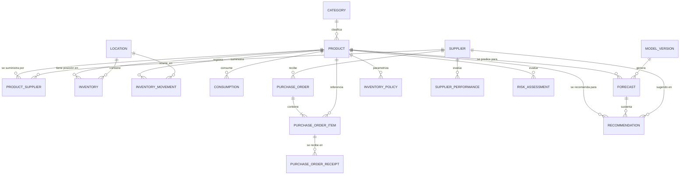
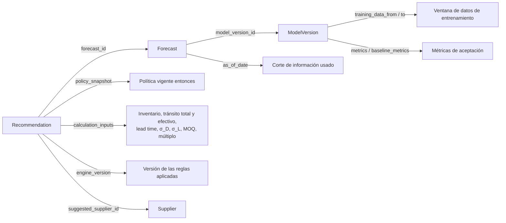

# 04 — Modelo de datos conceptual

**Estado:** Versión 1.0 — Etapa 0 (conceptual, no implementado) · **Fecha:** 2026-09-04 · **Versión 1.1** — revisada en la auditoría de Etapa 0.1 · **Versión 1.2** (2026-09-18) — `data_origin` en las entidades maestras (`DT-026`) y vigencia de `Product` (`DT-027`) · **Versión 1.3** (2026-09-24) — `data_origin` en `Inventory`, `PurchaseOrder`, `PurchaseOrderItem` y `PurchaseOrderReceipt`; semántica diaria de `is_stockout_affected` (`DT-036`); enmienda de la restricción 3 de vigencia (`DT-027`)

> Modelo **conceptual**. No define todavía tipos SQL definitivos, índices ni migraciones; eso
> corresponde a la Fase 2. Los nombres de entidad se expresan en inglés (convención de código);
> la explicación, en español.

---

## 1. Naturaleza de los datos

| Naturaleza | Entidades | Regla |
|---|---|---|
| **Maestra / operativa** | `Product`, `Category`, `Supplier`, `ProductSupplier`, `Location`, `PurchaseOrder`, `PurchaseOrderItem`, `InventoryPolicy` | Mutable, con auditoría de cambios |
| **Histórica (append-only)** | `InventoryMovement`, `Consumption`, `PurchaseOrderReceipt` | **Inmutable**: se corrige con nuevos registros, nunca modificando ni borrando |
| **Estado calculado** | `Inventory` | Derivado del histórico; se mantiene por rendimiento y debe ser reconciliable |
| **Derivada / analítica** | `Forecast`, `Recommendation`, `ModelVersion`, `SupplierPerformance`, `RiskAssessment` | Recalculable, pero **conservada** por trazabilidad |

## 2. Diagrama entidad-relación



---

## 3. Entidades

### 3.1 `Category`

Clasificación de productos para agregación y análisis.

| Atributo | Descripción |
|---|---|
| `id` | Clave primaria |
| `code` | Código único de negocio |
| `name` | Nombre |
| `parent_id` | Categoría padre (opcional). `SUPUESTO` ASSUMPTION-009: un solo nivel en la primera versión |
| `is_active` | Estado |
| `data_origin` | `SYNTHETIC` \| `REAL` (RF-023, `DT-004`, `DT-026`) |

**Restricciones:** `code` único. Una categoría con productos asociados no se elimina; se desactiva.

### 3.2 `Product`

Producto o SKU. Unidad de predicción y de decisión.

| Atributo | Descripción |
|---|---|
| `id` | Clave primaria |
| `sku` | Identificador de negocio, **único** |
| `name`, `description` | Descripción |
| `category_id` | FK → `Category` |
| `unit_of_measure` | Unidad (pieza, caja, kg…) |
| `is_active` | Producto vigente |
| `abc_class` | Clasificación de importancia (A/B/C). Derivada, opcional |
| `rotation_class` | Alta / media / baja rotación. Derivada, opcional |
| `shelf_life_days` | Vida útil, si aplica (opcional) |
| `valid_from` | **Inicio de vigencia** del producto. Fecha (`DATE`). Obligatorio |
| `valid_to` | **Fin de vigencia** del producto. Fecha (`DATE`). `NULL` = vigente sin fecha de fin prevista |
| `created_at`, `updated_at` | Auditoría **técnica** del registro. No confundir con la vigencia |
| `data_origin` | `SYNTHETIC` \| `REAL` (RF-023, `DT-004`, `DT-026`) |

**Restricciones:** `sku` único e inmutable una vez creado. Desactivar un producto **no** elimina su
histórico. La unidad de medida debe ser consistente en consumo, inventario y órdenes; un cambio de
unidad es un evento que requiere conversión explícita del histórico, no una edición silenciosa.

**Vigencia frente a auditoría** (`DT-027`). Son dos pares de fechas con propósitos distintos y no
deben sustituirse el uno por el otro:

| | Qué responde | Naturaleza |
|---|---|---|
| `valid_from` / `valid_to` | ¿Durante qué periodo **existe el producto en el negocio**? | Dato de dominio |
| `created_at` / `updated_at` | ¿Cuándo se **creó y se modificó el registro** en el sistema? | Auditoría técnica |

Es la misma distinción que §5.4 establece entre `occurred_at` y `recorded_at`: un producto puede
haberse dado de alta en el sistema mucho después de la fecha desde la que existe en el negocio, y una
carga histórica invierte los dos órdenes.

**Restricciones de vigencia:**

1. `valid_from` es obligatorio y no nulo.
2. `valid_to` es nulo o igual o posterior a `valid_from`: `valid_from ≤ valid_to`. El intervalo es
   **cerrado por ambos extremos**, de modo que un producto vigente un solo día es `valid_to = valid_from`.
3. Todo evento asociado a un producto —consumo, movimiento, línea de orden— debe ocurrir dentro de
   `[valid_from, valid_to]`, con `valid_to` abierto cuando es nulo. Es la restricción que
   `knowledge/dataset-specification.md` §20 exige poder comprobar. **Única excepción** (enmienda de
   `DT-027` del 2026-09-24): una orden emitida **dentro** de la vigencia —la emisión sí debe caer
   dentro— completa su ciclo causal, de modo que sus recepciones y los movimientos `RECEIPT`
   derivados pueden ocurrir después de `valid_to`, conservando la trazabilidad con la orden. Esa
   recepción **no** se cancela, **no** se elimina, **no** se trunca, **no** se convierte en
   `ADJUSTMENT`, y conserva su `reference_type` y su `reference_id`. La excepción **no** admite,
   después de `valid_to`: demanda · consumo · órdenes nuevas · nuevas relaciones con proveedores ·
   ningún otro movimiento arbitrario.
4. `valid_from` y `valid_to` son **inmutables hacia atrás**: corregir la vigencia de un producto con
   histórico fuera del nuevo intervalo invalidaría ese histórico, y es un incidente de datos, no una
   edición.

**Lo que estas dos fechas NO establecen:** ninguna política empresarial de altas y bajas de productos.
Cómo decide el negocio que un producto queda descontinuado, y qué relación tiene esa decisión con
`is_active`, sigue siendo la regla **propuesta** `BR-P10`, pendiente de confirmación. El modelo
ofrece los campos; el criterio para rellenarlos lo aporta el negocio.

### 3.3 `Supplier`

| Atributo | Descripción |
|---|---|
| `id` | Clave primaria |
| `code` | Código único |
| `name` | Razón social o nombre comercial |
| `contact_info` | Datos de contacto (sin información personal innecesaria) |
| `is_active` | Estado |
| `currency` | Moneda de operación (opcional) |
| `created_at`, `updated_at` | Auditoría |
| `data_origin` | `SYNTHETIC` \| `REAL` (RF-023, `DT-004`, `DT-026`) |

**Restricciones:** `code` único.

### 3.4 `ProductSupplier`

Relación N:M entre producto y proveedor, **con condiciones comerciales propias de la relación**.
Es una entidad de pleno derecho: el lead time y el MOQ no son del producto ni del proveedor por
separado, sino de la combinación.

| Atributo | Descripción |
|---|---|
| `id` | Clave primaria |
| `product_id`, `supplier_id` | FK; par único |
| `agreed_lead_time_days` | Lead time **acordado** contractualmente |
| `moq` | Cantidad mínima de pedido |
| `order_multiple` | Múltiplo de compra (empaque, pallet) |
| `unit_cost` | Costo unitario acordado |
| `is_preferred` | Proveedor preferente para este producto |
| `is_active` | Relación vigente |
| `data_origin` | `SYNTHETIC` \| `REAL` (RF-023, `DT-004`, `DT-026`) |

**Restricciones:** par (`product_id`, `supplier_id`) único. `moq ≥ 0`, `order_multiple ≥ 1`.
Como máximo un proveedor preferente activo por producto.
**Nota importante:** `agreed_lead_time_days` es un dato contractual; **no debe confundirse** con el
lead time observado, que se calcula desde `PurchaseOrderReceipt`.

### 3.5 `Location`

Ubicación de almacenamiento. Se modela desde el inicio aunque la primera versión opere con una sola
ubicación (ASSUMPTION-006), para no rediseñar el esquema después.

| Atributo | Descripción |
|---|---|
| `id`, `code`, `name` | Identificación |
| `type` | Almacén central, sucursal, etc. Vocabulario abierto en el modelo; el dataset sintético usa un conjunto cerrado (`DT-028` §6) |
| `is_active` | Estado |
| `data_origin` | `SYNTHETIC` \| `REAL` (RF-023, `DT-004`, `DT-026`) |

**Restricciones:** `code` único (§5.8).

### 3.6 `Inventory`

Posición de inventario **vigente** por producto y ubicación. Estado calculado, no fuente de verdad.

| Atributo | Descripción |
|---|---|
| `id` | Clave primaria |
| `product_id`, `location_id` | FK; par único |
| `quantity_on_hand` | Existencia física disponible |
| `quantity_reserved` | Comprometida (asignada a un pedido/consumo pendiente) |
| `quantity_in_transit` | **Tránsito total**: pedida y no recibida (derivada de órdenes vigentes). Es un hecho, no una magnitud relativa a una decisión |
| `last_movement_at` | Fecha del último movimiento aplicado |
| `updated_at` | Auditoría |
| `data_origin` | `SYNTHETIC` \| `REAL` (RF-023, `DT-026`) |

**Derivado:** `available = quantity_on_hand − quantity_reserved`
**Derivado:** `inventory_position` — tiene **dos lecturas** (`DT-012`, `docs/06` §4.2):
- *contable*: `quantity_on_hand + quantity_in_transit − quantity_reserved`
- *de decisión*: `quantity_on_hand + effective_in_transit − quantity_reserved`

`effective_in_transit` **no es una columna**: es una magnitud derivada que `supply_engine` calcula en
cada evaluación a partir de las líneas de orden pendientes y su fecha esperada, porque su valor
depende del horizonte de la decisión que se esté tomando. Almacenarla la congelaría en un valor que
sería incorrecto para casi cualquier otra pregunta.

`quantity_reserved` **PENDIENTE DE VALIDACIÓN**: el alcance actual no incluye ningún proceso que
genere compromisos (no hay órdenes de venta ni reservas), de modo que hoy el campo no tendría origen.
Se conserva en el modelo conceptual porque el cálculo de la posición de inventario lo requiere en
cuanto exista ese proceso, pero **no se implementa mientras nadie lo alimente**; hasta entonces vale 0
y la fórmula se reduce a los otros dos términos.

**Restricciones:** `quantity_on_hand ≥ 0` salvo que el negocio permita explícitamente negativos;
`quantity_reserved ≥ 0`. El valor debe ser **reconciliable** con la suma de `InventoryMovement`;
cualquier discrepancia es un incidente de datos, no un valor a corregir a mano.

### 3.7 `InventoryMovement` *(append-only)*

Todo cambio del inventario. Es la fuente de verdad histórica.

| Atributo | Descripción |
|---|---|
| `id` | Clave primaria |
| `product_id`, `location_id` | FK |
| `movement_type` | `RECEIPT`, `ISSUE`, `ADJUSTMENT`, `RETURN`, `TRANSFER_IN`, `TRANSFER_OUT`, `SCRAP` |
| `quantity` | Cantidad con signo según el tipo |
| `occurred_at` | Fecha/hora del hecho en el negocio |
| `recorded_at` | Fecha/hora de registro en el sistema |
| `reference_type`, `reference_id` | Documento origen (orden de compra, venta, ajuste) |
| `reason_code` | Motivo, sobre todo en ajustes y mermas |
| `data_origin` | `SYNTHETIC` \| `REAL` (RF-023) |
| `created_by` | Usuario o proceso |

**Restricciones:** inmutable. `quantity ≠ 0`. `occurred_at` y `recorded_at` se distinguen: un registro
tardío no debe alterar la serie temporal de la fecha equivocada.

### 3.7-bis `Demand` *(solo dataset sintético, append-only)*

**Demanda latente**: la cantidad que se habría demandado si el inventario nunca hubiera limitado la
satisfacción de la demanda. Es la contrapartida no observable de `Consumption`, y **solo existe en el
entorno sintético**, porque solo ahí es conocible: con datos reales, nadie sabe cuánto se habría
vendido de lo que no había. Decisión: `DT-034`.

| Atributo | Descripción |
|---|---|
| `id` | Clave primaria |
| `product_id`, `location_id` | FK |
| `occurred_on` | Fecha (granularidad diaria) |
| `quantity` | Demanda latente del día. Entero ≥ 0 en V1 (`DT-034`) |
| `data_origin` | `SYNTHETIC` |

**Restricciones:** clave de negocio (`product_id`, `location_id`, `occurred_on`), única. Serie densa:
una fila por día vigente, con `quantity = 0` los días sin demanda. **No lleva `is_stockout_affected`**
—esa bandera es de `Consumption`— ni `channel` ni ningún campo de escenario.

**Relación con `Consumption`:** el Componente 3 produce `Demand`; el Componente 4 la transforma en
`Consumption` según las existencias disponibles, y es él quien marca `is_stockout_affected`. La
diferencia entre ambas series **es** el sesgo por censura que `DT-011` deja pendiente de tratamiento,
y tenerla medida es lo que permitirá cerrarlo con datos en lugar de por preferencia.

> Esta entidad **no tiene equivalente con datos reales** y no debe esperarse que lo tenga. Es un
> artefacto del generador sintético, no un registro histórico de la organización. Ninguna regla de
> negocio depende de ella (`BR-007`, `DT-004`).

### 3.8 `Consumption` *(append-only)*

Consumo o venta histórica, es decir **demanda satisfecha**. **Es el insumo principal de la
predicción**, y por eso se modela aparte de los movimientos aunque muchos consumos generen también un
movimiento de tipo `ISSUE`.

| Atributo | Descripción |
|---|---|
| `id` | Clave primaria |
| `product_id`, `location_id` | FK |
| `occurred_on` | Fecha (granularidad diaria) |
| `quantity` | Cantidad consumida/vendida |
| `channel` | Canal o cliente agregado (opcional) |
| `is_stockout_affected` | Marca si el periodo estuvo afectado por desabasto |
| `data_origin` | `SYNTHETIC` \| `REAL` |

**Restricción clave — demanda vs. venta:** lo registrado es la demanda **satisfecha**. Durante un
desabasto, la demanda real fue mayor que la registrada. La bandera `is_stockout_affected` permite
tratar esos periodos como **censurados** en el entrenamiento en lugar de aprender que "la demanda
bajó". Ignorar esto sesga el modelo a la baja justo en los productos más críticos.

**Precisión de la semántica de `is_stockout_affected`** (`DT-036`, 2026-09-24). Como la granularidad
de la entidad es diaria, «el periodo» es **el día de la fila**:

```text
is_stockout_affected = true   ⟺   demand(día) > quantity(día)
```

es decir, ese día existió demanda latente que las existencias no pudieron satisfacer. Si
`demand == quantity`, la bandera es `false`. La demanda perdida es derivable —
`lost_sales = demand − quantity`, comparando con `Demand` (§3.7-bis)— y **no se almacena** como
columna: ninguna sección de la especificación la exige y `DT-034` ya deja las dos series en disco.

### 3.9 `PurchaseOrder`

| Atributo | Descripción |
|---|---|
| `id`, `order_number` | Identificación; número único |
| `supplier_id` | FK → `Supplier` |
| `location_id` | Destino |
| `status` | `DRAFT`, `ISSUED`, `PARTIALLY_RECEIVED`, `RECEIVED`, `CANCELLED` |
| `issued_at` | Fecha de emisión |
| `expected_at` | Fecha comprometida de entrega |
| `closed_at` | Fecha de cierre |
| `currency`, `total_amount` | Importe (opcional) |
| `created_by`, `created_at`, `updated_at` | Auditoría |
| `data_origin` | `SYNTHETIC` \| `REAL` (RF-023, `DT-026`) |

**Restricciones:** transiciones de estado válidas y unidireccionales salvo cancelación. Solo las
órdenes en estado `ISSUED` o `PARTIALLY_RECEIVED` aportan **inventario en tránsito**.

### 3.10 `PurchaseOrderItem`

| Atributo | Descripción |
|---|---|
| `id` | Clave primaria |
| `purchase_order_id`, `product_id` | FK |
| `quantity_ordered` | Cantidad pedida |
| `quantity_received` | Acumulado recibido |
| `unit_cost` | Costo unitario de la línea |
| `expected_at` | Fecha esperada de la línea, si difiere de la cabecera |
| `data_origin` | `SYNTHETIC` \| `REAL` (RF-023, `DT-026`) |

**Derivado:** `quantity_pending = quantity_ordered − quantity_received` (aporte al tránsito).
**Restricciones:** `quantity_ordered > 0`; `0 ≤ quantity_received`; recepciones por encima de lo
pedido requieren tolerancia declarada por el negocio (**pendiente**).

### 3.11 `PurchaseOrderReceipt` *(append-only)*

Recepciones reales. Permite calcular el **lead time observado**, distinto del acordado.

| Atributo | Descripción |
|---|---|
| `id` | Clave primaria |
| `purchase_order_item_id` | FK |
| `received_at` | Fecha real de recepción |
| `quantity_received` | Cantidad de esta recepción |
| `quality_rejected` | Cantidad rechazada por calidad (opcional) |
| `data_origin` | `SYNTHETIC` \| `REAL` (RF-023, `DT-026`) |

**Derivado:** `observed_lead_time_days = received_at − purchase_order.issued_at`.

### 3.12 `InventoryPolicy`

Parámetros de política por producto (o por categoría, como valor por defecto). **Sus valores los
define el negocio**; el sistema no los inventa.

| Atributo | Descripción |
|---|---|
| `id` | Clave primaria |
| `scope` | `PRODUCT` \| `CATEGORY` \| `GLOBAL` |
| `product_id` / `category_id` | Ámbito (según `scope`) |
| `service_level_target` | Nivel de servicio objetivo (**pendiente del negocio**) |
| `review_period_days` | Periodo de revisión |
| `min_coverage_days`, `max_coverage_days` | Umbrales de cobertura para riesgo y sobreinventario |
| `target_coverage_days` | Cobertura deseada más allá del punto de reorden (`H_cobertura` en `docs/06`) |
| `is_active`, `valid_from`, `valid_to` | Vigencia temporal |

**Restricción:** la política es **versionada en el tiempo**. Una recomendación pasada debe poder
explicarse con la política vigente en su momento, no con la actual.

### 3.13 `ModelVersion`

| Atributo | Descripción |
|---|---|
| `id` | Clave primaria |
| `name`, `version` | Identificación del modelo |
| `algorithm` | Familia/algoritmo |
| `trained_at` | Fecha de entrenamiento |
| `training_data_from`, `training_data_to` | Ventana de datos usada |
| `metrics` | Métricas de validación (estructura JSON) |
| `baseline_metrics` | Métricas del baseline en la misma evaluación |
| `hyperparameters` | Configuración |
| `status` | `TRAINING`, `EVALUATED`, `PRODUCTION`, `ARCHIVED`, `REJECTED` |
| `external_ref` | Referencia al registro de modelos de Azure ML |
| `is_baseline` | Si esta versión es el baseline |

**Restricción:** como máximo una versión en estado `PRODUCTION` por objetivo de predicción. Nunca se
elimina una versión referenciada por un `Forecast` histórico.

### 3.14 `Forecast`

Predicción de demanda. Se persiste **antes** de ser consumida por el motor.

| Atributo | Descripción |
|---|---|
| `id` | Clave primaria |
| `product_id`, `location_id` | Serie predicha |
| `model_version_id` | FK → `ModelVersion` |
| `generated_at` | Cuándo se generó |
| `as_of_date` | Fecha de corte de la información usada (**crítico** para evitar leakage) |
| `period_start`, `period_end` | Periodo predicho |
| `granularity` | `DAILY` \| `WEEKLY` \| `MONTHLY` |
| `predicted_quantity` | Estimación puntual |
| `lower_bound`, `upper_bound`, `confidence_level` | Intervalo de predicción |
| `method_used` | `MODEL` \| `BASELINE` \| `INTERMITTENT_METHOD` (RML-007) |
| `confidence_flag` | Confianza declarada (p. ej. alta/media/baja o "histórico insuficiente") |

**Restricciones:** único por (`product_id`, `location_id`, `as_of_date`, `period_start`, `granularity`,
`model_version_id`). `lower_bound ≤ predicted_quantity ≤ upper_bound`. `predicted_quantity ≥ 0`.
**Nunca se sobrescribe** un forecast anterior: una nueva ejecución crea registros nuevos con otro `as_of_date`.

### 3.15 `RiskAssessment`

Evaluación de riesgo por producto en un momento dado.

| Atributo | Descripción |
|---|---|
| `id` | Clave primaria |
| `product_id`, `location_id` | Ámbito |
| `evaluated_at` | Fecha de evaluación |
| `risk_type` | `STOCKOUT` \| `OVERSTOCK` |
| `risk_level` | `CRITICAL` \| `HIGH` \| `MEDIUM` \| `LOW`. Enumeración **propuesta** (`BR-P06`); sus umbrales están pendientes del negocio |
| `coverage_days` | Días de cobertura estimados |
| `projected_stockout_date` | Fecha estimada de agotamiento |
| `excess_quantity` | Excedente estimado (sobreinventario) |
| `inputs_snapshot` | Insumos usados (JSON) |

### 3.16 `Recommendation`

Recomendación de compra. **Debe ser autoexplicativa.**

| Atributo | Descripción |
|---|---|
| `id` | Clave primaria |
| `product_id`, `location_id` | Ámbito |
| `forecast_id` | FK → `Forecast` que la sustenta |
| `suggested_supplier_id` | FK → `Supplier` |
| `generated_at` | Fecha de generación |
| `recommended_quantity` | Cantidad sugerida (ya ajustada a MOQ y múltiplo) |
| `raw_quantity` | Cantidad antes de aplicar restricciones del proveedor |
| `suggested_order_date` | Cuándo emitir |
| `urgency` | `CRITICAL` \| `HIGH` \| `MEDIUM` \| `LOW` |
| `reorder_point`, `safety_stock` | Términos calculados |
| `lead_time_used_days`, `demand_during_lead_time` | Insumos del cálculo |
| `inventory_position_at_calc` | Posición de inventario en el momento del cálculo |
| `policy_snapshot` | Parámetros de política aplicados (JSON) |
| `calculation_inputs` | Resto de insumos y valores intermedios (JSON) |
| `engine_version` | Versión de las reglas aplicadas |
| `status` | `OPEN`, `ACKNOWLEDGED`, `CONVERTED_TO_PO`, `DISMISSED`, `EXPIRED` |
| `resolved_by`, `resolved_at`, `resolution_note` | Seguimiento de la decisión humana |

**Restricción central:** una recomendación debe poder reconstruirse íntegramente a partir de los
campos que almacena, **sin depender del estado actual del sistema** (RF-024). Por eso se guardan
`policy_snapshot`, `inventory_position_at_calc` y `engine_version`, no solo referencias.

El seguimiento de `status` y `resolution_note` es además el insumo que permitirá medir la utilidad
real del sistema: qué proporción de recomendaciones acepta el planificador y por qué descarta el resto.

### 3.17 `SupplierPerformance`

| Atributo | Descripción |
|---|---|
| `id` | Clave primaria |
| `supplier_id` | FK |
| `period_start`, `period_end` | Ventana evaluada |
| `on_time_delivery_rate` | % de entregas dentro de la fecha comprometida |
| `quantity_fulfillment_rate` | % de cantidad recibida sobre pedida. **No confundir** con el *fill rate* del glosario, que mide demanda satisfecha desde inventario |
| `avg_lead_time_days`, `stddev_lead_time_days` | Lead time observado y su variabilidad |
| `orders_count` | Número de órdenes en la ventana |
| `computed_at` | Fecha de cálculo |

### 3.18 Cadena de trazabilidad de una recomendación

*Verificada en la revisión de Etapa 0.1.* Debe ser posible responder, meses después: **¿por qué el
sistema recomendó comprar esa cantidad?**



Comprobación campo a campo:

| Pregunta | Campo que la responde | ¿Existe? |
|---|---|---|
| ¿Qué forecast se usó? | `Recommendation.forecast_id` | ✅ |
| ¿Qué modelo lo generó? | `Forecast.model_version_id` → `ModelVersion` | ✅ |
| ¿Con qué información se generó? | `Forecast.as_of_date` + `ModelVersion.training_data_from/to` | ✅ |
| ¿Fue modelo o baseline? | `Forecast.method_used` | ✅ |
| ¿Cuándo se generó la recomendación? | `Recommendation.generated_at` | ✅ |
| ¿Para qué producto? | `Recommendation.product_id`, `location_id` | ✅ |
| ¿Qué inventario se consideró? | `inventory_position_at_calc` + `calculation_inputs` (total y efectivo) | ✅ |
| ¿Qué parámetros de política regían **entonces**? | `policy_snapshot` (copia, no referencia) | ✅ |
| ¿Qué reglas se aplicaron? | `engine_version` | ✅ |
| ¿Qué valores intermedios dieron ese resultado? | `reorder_point`, `safety_stock`, `lead_time_used_days`, `demand_during_lead_time`, `raw_quantity`, `calculation_inputs` | ✅ |
| ¿Qué decidió la persona y por qué? | `status`, `resolved_by`, `resolved_at`, `resolution_note` | ✅ |

**Sin huecos.** La clave del diseño es que `policy_snapshot` y `calculation_inputs` son **copias**, no
referencias: si la política cambia mañana, la recomendación de ayer se sigue explicando con la
política de ayer. Una referencia habría bastado para el caso feliz y habría fallado exactamente en el
caso en que la trazabilidad importa.

**Añadido en la revisión 0.1:** `calculation_inputs` debe registrar además la **regla de conversión de
granularidad** aplicada (`DT-019`) y **ambos valores de tránsito**, total y efectivo (`DT-012`). Sin
ellos, dos de los términos del cálculo no serían reconstruibles.

## 4. Entidades de soporte

| Entidad | Propósito |
|---|---|
| `DataLoad` | Registro de cada carga de datos: origen, archivo, fecha, filas aceptadas/rechazadas, `data_origin` |
| `AuditLog` | Acciones sensibles: quién, qué, cuándo, sobre qué entidad (RS-009) |
| `CalculationRun` | Ejecución de un proceso batch: alcance, versión de modelo y de motor, duración, resultado |
| `AppUser` | Referencia local al usuario de Entra ID (identificador externo y rol efectivo). **No almacena contraseñas** |

## 5. Restricciones transversales

1. **Inmutabilidad del histórico.** `InventoryMovement`, `Consumption` y `PurchaseOrderReceipt` no se
   actualizan ni se borran. Toda corrección es un registro nuevo.
2. **Marca de origen.** Toda entidad con datos cargados lleva `data_origin` (`SYNTHETIC` / `REAL`).
   Ninguna regla de negocio depende de este valor; solo sirve para trazabilidad y limpieza (RF-023).
   Esto **incluye las cinco entidades maestras** —`Category`, `Product`, `Supplier`,
   `ProductSupplier` y `Location`—, cuyas fichas lo listan explícitamente desde `DT-026`, y desde el
   2026-09-24 también `Inventory` (§3.6), `PurchaseOrder` (§3.9), `PurchaseOrderItem` (§3.10) y
   `PurchaseOrderReceipt` (§3.11), que cierran el pendiente que `DT-026` dejó registrado. **No** lo
   llevan las salidas calculadas del sistema —`Forecast`, `RiskAssessment`, `Recommendation`,
   `SupplierPerformance`, `ModelVersion`— ni `InventoryPolicy`: no son datos cargados y RF-023 no las
   sustituye. La marca es **por registro**; la metadata de generación del dataset (semilla, versión
   del generador, escenarios configurados) **no** vive en las entidades, sino en `manifest.json`
   (`DT-025`).
3. **Coherencia de unidades.** Consumo, inventario y órdenes de un mismo producto comparten unidad de medida.
4. **Fechas con dos tiempos.** Se distingue cuándo ocurrió el hecho (`occurred_at`) de cuándo se
   registró (`recorded_at`). Las series temporales usan la primera.
5. **`as_of_date` obligatorio en datos derivados.** Sin él es imposible demostrar la ausencia de leakage.
6. **Sin borrado físico** de entidades maestras con histórico: se desactivan.
7. **Zona horaria** única y explícita para todo el sistema; almacenamiento en UTC, presentación en la zona del negocio.
8. **Claves de negocio** (`sku`, `code`, `order_number`) únicas y estables, además de la clave técnica.

## 6. Datos históricos, operativos y derivados

| | Histórico | Operativo | Derivado |
|---|---|---|---|
| **Ejemplos** | Movimientos, consumo, recepciones | Productos, proveedores, inventario, órdenes, políticas | Forecast, recomendaciones, riesgos, desempeño de proveedor |
| **Mutabilidad** | Nunca | Con auditoría | Se añade, no se sobrescribe |
| **Se puede regenerar** | No | No | Sí, pero el histórico se conserva |
| **Uso principal** | Entrenamiento y análisis | Operación diaria | Decisión y explicación |
| **Riesgo si se pierde** | Irrecuperable | Alto | Recalculable, pero se pierde la trazabilidad de decisiones pasadas |

## 7. Consideraciones para PostgreSQL (Fase 2)

Se anotan aquí como orientación; **no se decide nada todavía**:

- Índices previsibles: `(product_id, occurred_on)` en consumo, `(product_id, location_id)` en
  inventario, `(product_id, as_of_date)` en forecast, `(status, urgency)` en recomendaciones.
- Tipos monetarios en `numeric`, nunca en coma flotante.
- Cantidades en `numeric` si el negocio admite fracciones; en entero si no. Decidir por unidad de medida.
- Campos flexibles (`metrics`, `calculation_inputs`, `policy_snapshot`) como `jsonb`.
- Particionamiento de tablas históricas **solo** si el volumen real lo justifica.
- Vistas analíticas dedicadas para Power BI, para no exponer tablas operativas directamente.

## 8. Pendientes de definición

1. ¿Se admite inventario negativo? (afecta a `Inventory`)
2. Tolerancia de sobre-recepción en órdenes de compra.
3. ¿Hay múltiples ubicaciones desde el inicio? (ASSUMPTION-006)
4. ¿Existen productos con vida útil / lotes / caducidad que exijan trazabilidad por lote?
5. ¿Se requiere multi-moneda?
6. ¿Cómo se identifica un producto sustituto o equivalente? (afecta a la interpretación de la demanda)
7. Granularidad real disponible del histórico de consumo (diaria, semanal, por transacción).
