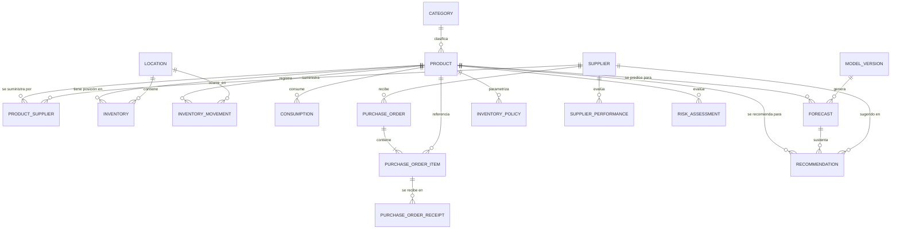
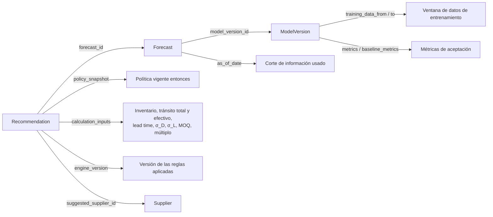
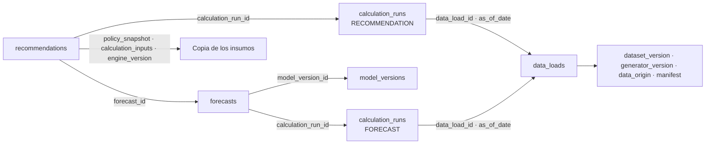

# 04 — Modelo de datos conceptual

**Estado:** Versión 1.0 — Etapa 0 (conceptual, no implementado) · **Fecha:** 2026-09-04 · **Versión 1.1** — revisada en la auditoría de Etapa 0.1 · **Versión 1.2** (2026-09-18) — `data_origin` en las entidades maestras (`DT-026`) y vigencia de `Product` (`DT-027`) · **Versión 1.3** (2026-09-24) — `data_origin` en `Inventory`, `PurchaseOrder`, `PurchaseOrderItem` y `PurchaseOrderReceipt`; semántica diaria de `is_stockout_affected` (`DT-036`); enmienda de la restricción 3 de vigencia (`DT-027`) · **Versión 1.4** (2026-09-30) — Etapa 2: §9, del dataset 0.4.0 a PostgreSQL (modelo físico mínimo, ingesta, trazabilidad), `DT-044`. §§1–8 no cambian · **Versión 1.5** (2026-10-01) — U2: `DT-044` `ACEPTADA` e implementada; §9.9, implementación (`DT-055`). §§1–8 no cambian · **Versión 1.6** (2026-10-02) — U3 autorizada: §9.10, modelo físico de U3 (`DT-057`); nota en §3.14 y §9.6 · **Versión 1.7** (2026-10-02) — §9.10 implementado (migración `0002`) · **Versión 1.8** (2026-10-03) — U4 autorizada (no implementada): §9.11, modelo físico de U4 (`DT-059` a `DT-063`); notas en §3.16, §9.6 y §9.8 · **Versión 1.9** (2026-10-03) — §9.11 implementado (migración `0003`); ninguna decisión cambia

> Modelo **conceptual**. No define todavía tipos SQL definitivos, índices ni migraciones; eso
> corresponde a la Fase 2. Los nombres de entidad se expresan en inglés (convención de código);
> la explicación, en español.

---

## 1. Naturaleza de los datos

| Naturaleza | Entidades | Regla |
|---|---|---|
| **Maestra / operativa** | `Product`, `Category`, `Supplier`, `ProductSupplier`, `Location`, `PurchaseOrder`, `PurchaseOrderItem`, `InventoryPolicy` | Mutable, con auditoría de cambios |
| **Histórica (append-only)** | `InventoryMovement`, `Consumption`, `PurchaseOrderReceipt` | **Inmutable**: se corrige con nuevos registros, nunca modificando ni borrando |
| **Estado calculado** | `Inventory` | Derivado del histórico; se mantiene por rendimiento y debe ser reconciliable |
| **Derivada / analítica** | `Forecast`, `Recommendation`, `ModelVersion`, `SupplierPerformance`, `RiskAssessment` | Recalculable, pero **conservada** por trazabilidad |

## 2. Diagrama entidad-relación



---

## 3. Entidades

### 3.1 `Category`

Clasificación de productos para agregación y análisis.

| Atributo | Descripción |
|---|---|
| `id` | Clave primaria |
| `code` | Código único de negocio |
| `name` | Nombre |
| `parent_id` | Categoría padre (opcional). `SUPUESTO` ASSUMPTION-009: un solo nivel en la primera versión |
| `is_active` | Estado |
| `data_origin` | `SYNTHETIC` \| `REAL` (RF-023, `DT-004`, `DT-026`) |

**Restricciones:** `code` único. Una categoría con productos asociados no se elimina; se desactiva.

### 3.2 `Product`

Producto o SKU. Unidad de predicción y de decisión.

| Atributo | Descripción |
|---|---|
| `id` | Clave primaria |
| `sku` | Identificador de negocio, **único** |
| `name`, `description` | Descripción |
| `category_id` | FK → `Category` |
| `unit_of_measure` | Unidad (pieza, caja, kg…) |
| `is_active` | Producto vigente |
| `abc_class` | Clasificación de importancia (A/B/C). Derivada, opcional |
| `rotation_class` | Alta / media / baja rotación. Derivada, opcional |
| `shelf_life_days` | Vida útil, si aplica (opcional) |
| `valid_from` | **Inicio de vigencia** del producto. Fecha (`DATE`). Obligatorio |
| `valid_to` | **Fin de vigencia** del producto. Fecha (`DATE`). `NULL` = vigente sin fecha de fin prevista |
| `created_at`, `updated_at` | Auditoría **técnica** del registro. No confundir con la vigencia |
| `data_origin` | `SYNTHETIC` \| `REAL` (RF-023, `DT-004`, `DT-026`) |

**Restricciones:** `sku` único e inmutable una vez creado. Desactivar un producto **no** elimina su
histórico. La unidad de medida debe ser consistente en consumo, inventario y órdenes; un cambio de
unidad es un evento que requiere conversión explícita del histórico, no una edición silenciosa.

**Vigencia frente a auditoría** (`DT-027`). Son dos pares de fechas con propósitos distintos y no
deben sustituirse el uno por el otro:

| | Qué responde | Naturaleza |
|---|---|---|
| `valid_from` / `valid_to` | ¿Durante qué periodo **existe el producto en el negocio**? | Dato de dominio |
| `created_at` / `updated_at` | ¿Cuándo se **creó y se modificó el registro** en el sistema? | Auditoría técnica |

Es la misma distinción que §5.4 establece entre `occurred_at` y `recorded_at`: un producto puede
haberse dado de alta en el sistema mucho después de la fecha desde la que existe en el negocio, y una
carga histórica invierte los dos órdenes.

**Restricciones de vigencia:**

1. `valid_from` es obligatorio y no nulo.
2. `valid_to` es nulo o igual o posterior a `valid_from`: `valid_from ≤ valid_to`. El intervalo es
   **cerrado por ambos extremos**, de modo que un producto vigente un solo día es `valid_to = valid_from`.
3. Todo evento asociado a un producto —consumo, movimiento, línea de orden— debe ocurrir dentro de
   `[valid_from, valid_to]`, con `valid_to` abierto cuando es nulo. Es la restricción que
   `knowledge/dataset-specification.md` §20 exige poder comprobar. **Única excepción** (enmienda de
   `DT-027` del 2026-09-24): una orden emitida **dentro** de la vigencia —la emisión sí debe caer
   dentro— completa su ciclo causal, de modo que sus recepciones y los movimientos `RECEIPT`
   derivados pueden ocurrir después de `valid_to`, conservando la trazabilidad con la orden. Esa
   recepción **no** se cancela, **no** se elimina, **no** se trunca, **no** se convierte en
   `ADJUSTMENT`, y conserva su `reference_type` y su `reference_id`. La excepción **no** admite,
   después de `valid_to`: demanda · consumo · órdenes nuevas · nuevas relaciones con proveedores ·
   ningún otro movimiento arbitrario.
4. `valid_from` y `valid_to` son **inmutables hacia atrás**: corregir la vigencia de un producto con
   histórico fuera del nuevo intervalo invalidaría ese histórico, y es un incidente de datos, no una
   edición.

**Lo que estas dos fechas NO establecen:** ninguna política empresarial de altas y bajas de productos.
Cómo decide el negocio que un producto queda descontinuado, y qué relación tiene esa decisión con
`is_active`, sigue siendo la regla **propuesta** `BR-P10`, pendiente de confirmación. El modelo
ofrece los campos; el criterio para rellenarlos lo aporta el negocio.

### 3.3 `Supplier`

| Atributo | Descripción |
|---|---|
| `id` | Clave primaria |
| `code` | Código único |
| `name` | Razón social o nombre comercial |
| `contact_info` | Datos de contacto (sin información personal innecesaria) |
| `is_active` | Estado |
| `currency` | Moneda de operación (opcional) |
| `created_at`, `updated_at` | Auditoría |
| `data_origin` | `SYNTHETIC` \| `REAL` (RF-023, `DT-004`, `DT-026`) |

**Restricciones:** `code` único.

### 3.4 `ProductSupplier`

Relación N:M entre producto y proveedor, **con condiciones comerciales propias de la relación**.
Es una entidad de pleno derecho: el lead time y el MOQ no son del producto ni del proveedor por
separado, sino de la combinación.

| Atributo | Descripción |
|---|---|
| `id` | Clave primaria |
| `product_id`, `supplier_id` | FK; par único |
| `agreed_lead_time_days` | Lead time **acordado** contractualmente |
| `moq` | Cantidad mínima de pedido |
| `order_multiple` | Múltiplo de compra (empaque, pallet) |
| `unit_cost` | Costo unitario acordado |
| `is_preferred` | Proveedor preferente para este producto |
| `is_active` | Relación vigente |
| `data_origin` | `SYNTHETIC` \| `REAL` (RF-023, `DT-004`, `DT-026`) |

**Restricciones:** par (`product_id`, `supplier_id`) único. `moq ≥ 0`, `order_multiple ≥ 1`.
Como máximo un proveedor preferente activo por producto.
**Nota importante:** `agreed_lead_time_days` es un dato contractual; **no debe confundirse** con el
lead time observado, que se calcula desde `PurchaseOrderReceipt`.

### 3.5 `Location`

Ubicación de almacenamiento. Se modela desde el inicio aunque la primera versión opere con una sola
ubicación (ASSUMPTION-006), para no rediseñar el esquema después.

| Atributo | Descripción |
|---|---|
| `id`, `code`, `name` | Identificación |
| `type` | Almacén central, sucursal, etc. Vocabulario abierto en el modelo; el dataset sintético usa un conjunto cerrado (`DT-028` §6) |
| `is_active` | Estado |
| `data_origin` | `SYNTHETIC` \| `REAL` (RF-023, `DT-004`, `DT-026`) |

**Restricciones:** `code` único (§5.8).

### 3.6 `Inventory`

Posición de inventario **vigente** por producto y ubicación. Estado calculado, no fuente de verdad.

| Atributo | Descripción |
|---|---|
| `id` | Clave primaria |
| `product_id`, `location_id` | FK; par único |
| `quantity_on_hand` | Existencia física disponible |
| `quantity_reserved` | Comprometida (asignada a un pedido/consumo pendiente) |
| `quantity_in_transit` | **Tránsito total**: pedida y no recibida (derivada de órdenes vigentes). Es un hecho, no una magnitud relativa a una decisión |
| `last_movement_at` | Fecha del último movimiento aplicado |
| `updated_at` | Auditoría |
| `data_origin` | `SYNTHETIC` \| `REAL` (RF-023, `DT-026`) |

**Derivado:** `available = quantity_on_hand − quantity_reserved`
**Derivado:** `inventory_position` — tiene **dos lecturas** (`DT-012`, `docs/06` §4.2):
- *contable*: `quantity_on_hand + quantity_in_transit − quantity_reserved`
- *de decisión*: `quantity_on_hand + effective_in_transit − quantity_reserved`

`effective_in_transit` **no es una columna**: es una magnitud derivada que `supply_engine` calcula en
cada evaluación a partir de las líneas de orden pendientes y su fecha esperada, porque su valor
depende del horizonte de la decisión que se esté tomando. Almacenarla la congelaría en un valor que
sería incorrecto para casi cualquier otra pregunta.

`quantity_reserved` **PENDIENTE DE VALIDACIÓN**: el alcance actual no incluye ningún proceso que
genere compromisos (no hay órdenes de venta ni reservas), de modo que hoy el campo no tendría origen.
Se conserva en el modelo conceptual porque el cálculo de la posición de inventario lo requiere en
cuanto exista ese proceso, pero **no se implementa mientras nadie lo alimente**; hasta entonces vale 0
y la fórmula se reduce a los otros dos términos.

**Restricciones:** `quantity_on_hand ≥ 0` salvo que el negocio permita explícitamente negativos;
`quantity_reserved ≥ 0`. El valor debe ser **reconciliable** con la suma de `InventoryMovement`;
cualquier discrepancia es un incidente de datos, no un valor a corregir a mano.

### 3.7 `InventoryMovement` *(append-only)*

Todo cambio del inventario. Es la fuente de verdad histórica.

| Atributo | Descripción |
|---|---|
| `id` | Clave primaria |
| `product_id`, `location_id` | FK |
| `movement_type` | `RECEIPT`, `ISSUE`, `ADJUSTMENT`, `RETURN`, `TRANSFER_IN`, `TRANSFER_OUT`, `SCRAP` |
| `quantity` | Cantidad con signo según el tipo |
| `occurred_at` | Fecha/hora del hecho en el negocio |
| `recorded_at` | Fecha/hora de registro en el sistema |
| `reference_type`, `reference_id` | Documento origen (orden de compra, venta, ajuste) |
| `reason_code` | Motivo, sobre todo en ajustes y mermas |
| `data_origin` | `SYNTHETIC` \| `REAL` (RF-023) |
| `created_by` | Usuario o proceso |

**Restricciones:** inmutable. `quantity ≠ 0`. `occurred_at` y `recorded_at` se distinguen: un registro
tardío no debe alterar la serie temporal de la fecha equivocada.

### 3.7-bis `Demand` *(solo dataset sintético, append-only)*

**Demanda latente**: la cantidad que se habría demandado si el inventario nunca hubiera limitado la
satisfacción de la demanda. Es la contrapartida no observable de `Consumption`, y **solo existe en el
entorno sintético**, porque solo ahí es conocible: con datos reales, nadie sabe cuánto se habría
vendido de lo que no había. Decisión: `DT-034`.

| Atributo | Descripción |
|---|---|
| `id` | Clave primaria |
| `product_id`, `location_id` | FK |
| `occurred_on` | Fecha (granularidad diaria) |
| `quantity` | Demanda latente del día. Entero ≥ 0 en V1 (`DT-034`) |
| `data_origin` | `SYNTHETIC` |

**Restricciones:** clave de negocio (`product_id`, `location_id`, `occurred_on`), única. Serie densa:
una fila por día vigente, con `quantity = 0` los días sin demanda. **No lleva `is_stockout_affected`**
—esa bandera es de `Consumption`— ni `channel` ni ningún campo de escenario.

**Relación con `Consumption`:** el Componente 3 produce `Demand`; el Componente 4 la transforma en
`Consumption` según las existencias disponibles, y es él quien marca `is_stockout_affected`. La
diferencia entre ambas series **es** el sesgo por censura que `DT-011` deja pendiente de tratamiento,
y tenerla medida es lo que permitirá cerrarlo con datos en lugar de por preferencia.

> Esta entidad **no tiene equivalente con datos reales** y no debe esperarse que lo tenga. Es un
> artefacto del generador sintético, no un registro histórico de la organización. Ninguna regla de
> negocio depende de ella (`BR-007`, `DT-004`).

### 3.8 `Consumption` *(append-only)*

Consumo o venta histórica, es decir **demanda satisfecha**. **Es el insumo principal de la
predicción**, y por eso se modela aparte de los movimientos aunque muchos consumos generen también un
movimiento de tipo `ISSUE`.

| Atributo | Descripción |
|---|---|
| `id` | Clave primaria |
| `product_id`, `location_id` | FK |
| `occurred_on` | Fecha (granularidad diaria) |
| `quantity` | Cantidad consumida/vendida |
| `channel` | Canal o cliente agregado (opcional) |
| `is_stockout_affected` | Marca si el periodo estuvo afectado por desabasto |
| `data_origin` | `SYNTHETIC` \| `REAL` |

**Restricción clave — demanda vs. venta:** lo registrado es la demanda **satisfecha**. Durante un
desabasto, la demanda real fue mayor que la registrada. La bandera `is_stockout_affected` permite
tratar esos periodos como **censurados** en el entrenamiento en lugar de aprender que "la demanda
bajó". Ignorar esto sesga el modelo a la baja justo en los productos más críticos.

**Precisión de la semántica de `is_stockout_affected`** (`DT-036`, 2026-09-24). Como la granularidad
de la entidad es diaria, «el periodo» es **el día de la fila**:

```text
is_stockout_affected = true   ⟺   demand(día) > quantity(día)
```

es decir, ese día existió demanda latente que las existencias no pudieron satisfacer. Si
`demand == quantity`, la bandera es `false`. La demanda perdida es derivable —
`lost_sales = demand − quantity`, comparando con `Demand` (§3.7-bis)— y **no se almacena** como
columna: ninguna sección de la especificación la exige y `DT-034` ya deja las dos series en disco.

### 3.9 `PurchaseOrder`

| Atributo | Descripción |
|---|---|
| `id`, `order_number` | Identificación; número único |
| `supplier_id` | FK → `Supplier` |
| `location_id` | Destino |
| `status` | `DRAFT`, `ISSUED`, `PARTIALLY_RECEIVED`, `RECEIVED`, `CANCELLED` |
| `issued_at` | Fecha de emisión |
| `expected_at` | Fecha comprometida de entrega |
| `closed_at` | Fecha de cierre |
| `currency`, `total_amount` | Importe (opcional) |
| `created_by`, `created_at`, `updated_at` | Auditoría |
| `data_origin` | `SYNTHETIC` \| `REAL` (RF-023, `DT-026`) |

**Restricciones:** transiciones de estado válidas y unidireccionales salvo cancelación. Solo las
órdenes en estado `ISSUED` o `PARTIALLY_RECEIVED` aportan **inventario en tránsito**.

### 3.10 `PurchaseOrderItem`

| Atributo | Descripción |
|---|---|
| `id` | Clave primaria |
| `purchase_order_id`, `product_id` | FK |
| `quantity_ordered` | Cantidad pedida |
| `quantity_received` | Acumulado recibido |
| `unit_cost` | Costo unitario de la línea |
| `expected_at` | Fecha esperada de la línea, si difiere de la cabecera |
| `data_origin` | `SYNTHETIC` \| `REAL` (RF-023, `DT-026`) |

**Derivado:** `quantity_pending = quantity_ordered − quantity_received` (aporte al tránsito).
**Restricciones:** `quantity_ordered > 0`; `0 ≤ quantity_received`; recepciones por encima de lo
pedido requieren tolerancia declarada por el negocio (**pendiente**).

### 3.11 `PurchaseOrderReceipt` *(append-only)*

Recepciones reales. Permite calcular el **lead time observado**, distinto del acordado.

| Atributo | Descripción |
|---|---|
| `id` | Clave primaria |
| `purchase_order_item_id` | FK |
| `received_at` | Fecha real de recepción |
| `quantity_received` | Cantidad de esta recepción |
| `quality_rejected` | Cantidad rechazada por calidad (opcional) |
| `data_origin` | `SYNTHETIC` \| `REAL` (RF-023, `DT-026`) |

**Derivado:** `observed_lead_time_days = received_at − purchase_order.issued_at`.

### 3.12 `InventoryPolicy`

Parámetros de política por producto (o por categoría, como valor por defecto). **Sus valores los
define el negocio**; el sistema no los inventa.

| Atributo | Descripción |
|---|---|
| `id` | Clave primaria |
| `scope` | `PRODUCT` \| `CATEGORY` \| `GLOBAL` |
| `product_id` / `category_id` | Ámbito (según `scope`) |
| `service_level_target` | Nivel de servicio objetivo (**pendiente del negocio**) |
| `review_period_days` | Periodo de revisión |
| `min_coverage_days`, `max_coverage_days` | Umbrales de cobertura para riesgo y sobreinventario |
| `target_coverage_days` | Cobertura deseada más allá del punto de reorden (`H_cobertura` en `docs/06`) |
| `is_active`, `valid_from`, `valid_to` | Vigencia temporal |

**Restricción:** la política es **versionada en el tiempo**. Una recomendación pasada debe poder
explicarse con la política vigente en su momento, no con la actual.

### 3.13 `ModelVersion`

| Atributo | Descripción |
|---|---|
| `id` | Clave primaria |
| `name`, `version` | Identificación del modelo |
| `algorithm` | Familia/algoritmo |
| `trained_at` | Fecha de entrenamiento |
| `training_data_from`, `training_data_to` | Ventana de datos usada |
| `metrics` | Métricas de validación (estructura JSON) |
| `baseline_metrics` | Métricas del baseline en la misma evaluación |
| `hyperparameters` | Configuración |
| `status` | `TRAINING`, `EVALUATED`, `PRODUCTION`, `ARCHIVED`, `REJECTED` |
| `external_ref` | Referencia al registro de modelos de Azure ML |
| `is_baseline` | Si esta versión es el baseline |

**Restricción:** como máximo una versión en estado `PRODUCTION` por objetivo de predicción. Nunca se
elimina una versión referenciada por un `Forecast` histórico.

### 3.14 `Forecast`

Predicción de demanda. Se persiste **antes** de ser consumida por el motor.

| Atributo | Descripción |
|---|---|
| `id` | Clave primaria |
| `product_id`, `location_id` | Serie predicha |
| `model_version_id` | FK → `ModelVersion` |
| `generated_at` | Cuándo se generó |
| `as_of_date` | Fecha de corte de la información usada (**crítico** para evitar leakage) |
| `period_start`, `period_end` | Periodo predicho |
| `granularity` | `DAILY` \| `WEEKLY` \| `MONTHLY` |
| `predicted_quantity` | Estimación puntual |
| `lower_bound`, `upper_bound`, `confidence_level` | Intervalo de predicción |
| `method_used` | `MODEL` \| `BASELINE` \| `INTERMITTENT_METHOD` (RML-007) |
| `confidence_flag` | Confianza declarada (p. ej. alta/media/baja o "histórico insuficiente") |

**Restricciones:** único por (`product_id`, `location_id`, `as_of_date`, `period_start`, `granularity`,
`model_version_id`). `lower_bound ≤ predicted_quantity ≤ upper_bound`. `predicted_quantity ≥ 0`.
**Nunca se sobrescribe** un forecast anterior: una nueva ejecución crea registros nuevos con otro `as_of_date`.
*(Actualización del 2026-10-02, `DT-057`: en el modelo físico la clave única pasa a ser por ejecución,
`(calculation_run_id, model_version_id, product_id, location_id, period_start)`; repetir una ejecución
con la misma configuración no escribe nada. Detalle en §9.10.)*

### 3.15 `RiskAssessment`

Evaluación de riesgo por producto en un momento dado.

| Atributo | Descripción |
|---|---|
| `id` | Clave primaria |
| `product_id`, `location_id` | Ámbito |
| `evaluated_at` | Fecha de evaluación |
| `risk_type` | `STOCKOUT` \| `OVERSTOCK` |
| `risk_level` | `CRITICAL` \| `HIGH` \| `MEDIUM` \| `LOW`. Enumeración **propuesta** (`BR-P06`); sus umbrales están pendientes del negocio |
| `coverage_days` | Días de cobertura estimados |
| `projected_stockout_date` | Fecha estimada de agotamiento |
| `excess_quantity` | Excedente estimado (sobreinventario) |
| `inputs_snapshot` | Insumos usados (JSON) |

### 3.16 `Recommendation`

Recomendación de compra. **Debe ser autoexplicativa.**

| Atributo | Descripción |
|---|---|
| `id` | Clave primaria |
| `product_id`, `location_id` | Ámbito |
| `forecast_id` | FK → `Forecast` que la sustenta |
| `suggested_supplier_id` | FK → `Supplier` |
| `generated_at` | Fecha de generación |
| `recommended_quantity` | Cantidad sugerida (ya ajustada a MOQ y múltiplo) |
| `raw_quantity` | Cantidad antes de aplicar restricciones del proveedor |
| `suggested_order_date` | Cuándo emitir |
| `urgency` | `CRITICAL` \| `HIGH` \| `MEDIUM` \| `LOW` |
| `reorder_point`, `safety_stock` | Términos calculados |
| `lead_time_used_days`, `demand_during_lead_time` | Insumos del cálculo |
| `inventory_position_at_calc` | Posición de inventario en el momento del cálculo |
| `policy_snapshot` | Parámetros de política aplicados (JSON) |
| `calculation_inputs` | Resto de insumos y valores intermedios (JSON) |
| `engine_version` | Versión de las reglas aplicadas |
| `status` | `OPEN`, `ACKNOWLEDGED`, `CONVERTED_TO_PO`, `DISMISSED`, `EXPIRED` |
| `resolved_by`, `resolved_at`, `resolution_note` | Seguimiento de la decisión humana |

**Restricción central:** una recomendación debe poder reconstruirse íntegramente a partir de los
campos que almacena, **sin depender del estado actual del sistema** (RF-024). Por eso se guardan
`policy_snapshot`, `inventory_position_at_calc` y `engine_version`, no solo referencias.

El seguimiento de `status` y `resolution_note` es además el insumo que permitirá medir la utilidad
real del sistema: qué proporción de recomendaciones acepta el planificador y por qué descarta el resto.

*Nota del 2026-10-03 (`DT-059`, `DT-060`): en el modelo físico de V1 (§9.11), `status`, `resolved_by`,
`resolved_at`, `resolution_note` y `urgency` siguen siendo **conceptuales** y no se crean: el `outcome`
es un resultado técnico inmutable y la decisión humana será un flujo separado cuando exista quien la
escriba. `forecast_id` es el `id` de la fila h=1 de la serie primaria, que ancla la serie lógica de 14
semanas; no significa que se use una sola semana.*

### 3.17 `SupplierPerformance`

| Atributo | Descripción |
|---|---|
| `id` | Clave primaria |
| `supplier_id` | FK |
| `period_start`, `period_end` | Ventana evaluada |
| `on_time_delivery_rate` | % de entregas dentro de la fecha comprometida |
| `quantity_fulfillment_rate` | % de cantidad recibida sobre pedida. **No confundir** con el *fill rate* del glosario, que mide demanda satisfecha desde inventario |
| `avg_lead_time_days`, `stddev_lead_time_days` | Lead time observado y su variabilidad |
| `orders_count` | Número de órdenes en la ventana |
| `computed_at` | Fecha de cálculo |

### 3.18 Cadena de trazabilidad de una recomendación

*Verificada en la revisión de Etapa 0.1.* Debe ser posible responder, meses después: **¿por qué el
sistema recomendó comprar esa cantidad?**



Comprobación campo a campo:

| Pregunta | Campo que la responde | ¿Existe? |
|---|---|---|
| ¿Qué forecast se usó? | `Recommendation.forecast_id` | ✅ |
| ¿Qué modelo lo generó? | `Forecast.model_version_id` → `ModelVersion` | ✅ |
| ¿Con qué información se generó? | `Forecast.as_of_date` + `ModelVersion.training_data_from/to` | ✅ |
| ¿Fue modelo o baseline? | `Forecast.method_used` | ✅ |
| ¿Cuándo se generó la recomendación? | `Recommendation.generated_at` | ✅ |
| ¿Para qué producto? | `Recommendation.product_id`, `location_id` | ✅ |
| ¿Qué inventario se consideró? | `inventory_position_at_calc` + `calculation_inputs` (total y efectivo) | ✅ |
| ¿Qué parámetros de política regían **entonces**? | `policy_snapshot` (copia, no referencia) | ✅ |
| ¿Qué reglas se aplicaron? | `engine_version` | ✅ |
| ¿Qué valores intermedios dieron ese resultado? | `reorder_point`, `safety_stock`, `lead_time_used_days`, `demand_during_lead_time`, `raw_quantity`, `calculation_inputs` | ✅ |
| ¿Qué decidió la persona y por qué? | `status`, `resolved_by`, `resolved_at`, `resolution_note` | ✅ |

**Sin huecos.** La clave del diseño es que `policy_snapshot` y `calculation_inputs` son **copias**, no
referencias: si la política cambia mañana, la recomendación de ayer se sigue explicando con la
política de ayer. Una referencia habría bastado para el caso feliz y habría fallado exactamente en el
caso en que la trazabilidad importa.

**Añadido en la revisión 0.1:** `calculation_inputs` debe registrar además la **regla de conversión de
granularidad** aplicada (`DT-019`) y **ambos valores de tránsito**, total y efectivo (`DT-012`). Sin
ellos, dos de los términos del cálculo no serían reconstruibles.

## 4. Entidades de soporte

| Entidad | Propósito |
|---|---|
| `DataLoad` | Registro de cada carga de datos: origen, archivo, fecha, filas aceptadas/rechazadas, `data_origin` |
| `AuditLog` | Acciones sensibles: quién, qué, cuándo, sobre qué entidad (RS-009) |
| `CalculationRun` | Ejecución de un proceso batch: alcance, versión de modelo y de motor, duración, resultado |
| `AppUser` | Referencia local al usuario de Entra ID (identificador externo y rol efectivo). **No almacena contraseñas** |

## 5. Restricciones transversales

1. **Inmutabilidad del histórico.** `InventoryMovement`, `Consumption` y `PurchaseOrderReceipt` no se
   actualizan ni se borran. Toda corrección es un registro nuevo.
2. **Marca de origen.** Toda entidad con datos cargados lleva `data_origin` (`SYNTHETIC` / `REAL`).
   Ninguna regla de negocio depende de este valor; solo sirve para trazabilidad y limpieza (RF-023).
   Esto **incluye las cinco entidades maestras** —`Category`, `Product`, `Supplier`,
   `ProductSupplier` y `Location`—, cuyas fichas lo listan explícitamente desde `DT-026`, y desde el
   2026-09-24 también `Inventory` (§3.6), `PurchaseOrder` (§3.9), `PurchaseOrderItem` (§3.10) y
   `PurchaseOrderReceipt` (§3.11), que cierran el pendiente que `DT-026` dejó registrado. **No** lo
   llevan las salidas calculadas del sistema —`Forecast`, `RiskAssessment`, `Recommendation`,
   `SupplierPerformance`, `ModelVersion`— ni `InventoryPolicy`: no son datos cargados y RF-023 no las
   sustituye. La marca es **por registro**; la metadata de generación del dataset (semilla, versión
   del generador, escenarios configurados) **no** vive en las entidades, sino en `manifest.json`
   (`DT-025`).
3. **Coherencia de unidades.** Consumo, inventario y órdenes de un mismo producto comparten unidad de medida.
4. **Fechas con dos tiempos.** Se distingue cuándo ocurrió el hecho (`occurred_at`) de cuándo se
   registró (`recorded_at`). Las series temporales usan la primera.
5. **`as_of_date` obligatorio en datos derivados.** Sin él es imposible demostrar la ausencia de leakage.
6. **Sin borrado físico** de entidades maestras con histórico: se desactivan.
7. **Zona horaria** única y explícita para todo el sistema; almacenamiento en UTC, presentación en la zona del negocio.
8. **Claves de negocio** (`sku`, `code`, `order_number`) únicas y estables, además de la clave técnica.

## 6. Datos históricos, operativos y derivados

| | Histórico | Operativo | Derivado |
|---|---|---|---|
| **Ejemplos** | Movimientos, consumo, recepciones | Productos, proveedores, inventario, órdenes, políticas | Forecast, recomendaciones, riesgos, desempeño de proveedor |
| **Mutabilidad** | Nunca | Con auditoría | Se añade, no se sobrescribe |
| **Se puede regenerar** | No | No | Sí, pero el histórico se conserva |
| **Uso principal** | Entrenamiento y análisis | Operación diaria | Decisión y explicación |
| **Riesgo si se pierde** | Irrecuperable | Alto | Recalculable, pero se pierde la trazabilidad de decisiones pasadas |

## 7. Consideraciones para PostgreSQL (Fase 2)

Se anotan aquí como orientación; **no se decide nada todavía**:

- Índices previsibles: `(product_id, occurred_on)` en consumo, `(product_id, location_id)` en
  inventario, `(product_id, as_of_date)` en forecast, `(status, urgency)` en recomendaciones.
- Tipos monetarios en `numeric`, nunca en coma flotante.
- Cantidades en `numeric` si el negocio admite fracciones; en entero si no. Decidir por unidad de medida.
- Campos flexibles (`metrics`, `calculation_inputs`, `policy_snapshot`) como `jsonb`.
- Particionamiento de tablas históricas **solo** si el volumen real lo justifica.
- Vistas analíticas dedicadas para Power BI, para no exponer tablas operativas directamente.

## 8. Pendientes de definición

1. ¿Se admite inventario negativo? (afecta a `Inventory`)
2. Tolerancia de sobre-recepción en órdenes de compra.
3. ¿Hay múltiples ubicaciones desde el inicio? (ASSUMPTION-006)
4. ¿Existen productos con vida útil / lotes / caducidad que exijan trazabilidad por lote?
5. ¿Se requiere multi-moneda?
6. ¿Cómo se identifica un producto sustituto o equivalente? (afecta a la interpretación de la demanda)
7. Granularidad real disponible del histórico de consumo (diaria, semanal, por transacción).

---

## 9. Etapa 2 — del dataset 0.4.0 a PostgreSQL

*Añadido el 2026-09-30 (Etapa 2, arquitectura y fundación). Decisión: `DT-044`, **`ACEPTADA` el
2026-10-01** e **implementada en U2** el mismo día (`DT-055`; detalle en §9.9). §§1–8 siguen siendo el
modelo conceptual; esta sección fija cómo se materializa la parte que el sistema necesita primero.
(Hasta el 2026-10-01 decía «`PROPUESTA` — diseñado, no implementado».)*

### 9.1 La fuente: el dataset `ds-6c8ad65b4999`

El generador es un sistema *upstream* terminado y no se modifica. La ingesta consume su **contrato**
(`DT-024`, `DT-034`, `DT-038`, `DT-039`, `DT-025`), no su código: no importa nada de
`data/synthetic/`.

| Archivo | Tabla | Naturaleza | Clave técnica / de negocio | FK | Filas (0.4.0) | Quién la consume |
|---|---|---|---|---|--:|---|
| `locations.csv` | `locations` | Maestra | `id` / `code` | — | 1 | Todos |
| `categories.csv` | `categories` | Maestra | `id` / `code` | — | 10 | API, ML (atributo), Power BI |
| `suppliers.csv` | `suppliers` | Maestra | `id` / `code` | — | 10 | API; el motor a través de la relación |
| `products.csv` | `products` | Maestra | `id` / `sku` | `category_id` | 100 | Todos |
| `product_suppliers.csv` | `product_suppliers` | Maestra (condiciones de la relación) | `id` / `(product_id, supplier_id)` | producto, proveedor | 120 | Motor (`V1-06`, `V1-09` *fallback*, `V1-10`), API |
| `purchase_orders.csv` | `purchase_orders` | Operativa | `id` / `order_number` | proveedor, ubicación | 3 705 | Motor (tránsito, lead time), API |
| `purchase_order_items.csv` | `purchase_order_items` | Operativa | `id` (una línea por orden en 0.4.0) | orden, producto | 3 705 | Motor, API |
| `purchase_order_receipts.csv` | `purchase_order_receipts` | Histórica, *append-only* | `id` | línea | 3 810 | Motor (`V1-09`), API, auditoría |
| `consumption.csv` | `consumption` | Histórica, *append-only* — **demanda satisfecha** | `id` / `(product_id, location_id, occurred_on)` | producto, ubicación | 108 235 | ML (variable objetivo), motor (`σ_H` de `V1-05`), API (histórico), Power BI |
| `inventory_movements.csv` | `inventory_movements` | Histórica, *append-only*; fuente de verdad del inventario | `id` / orden total de `DT-038` §5.4 | producto, ubicación; referencia polimórfica | 93 012 | Conciliación, auditoría, API (movimientos) |
| `inventory.csv` | `inventory` | Estado calculado — *snapshot* al corte, **no** una serie | `id` / `(product_id, location_id)` | producto, ubicación | 100 | Motor (`OH`, `RSV`, `IT_total`), API |
| `demand.csv` | `demand` | Histórica **solo sintética** — **demanda latente** | `id` / `(product_id, location_id, occurred_on)` | producto, ubicación | 108 235 | Evaluación de Nivel 2 y `DT-011` (Fase 5), incluido el nivel de servicio alcanzado que `docs/11` §9 marca como solo sintético. **Nunca** el motor, las *features* ni la API de V1 |
| `manifest.json` | `data_loads` (una fila por intento de carga, manifiesto íntegro en `jsonb`) | Soporte / auditoría | `id`; como máximo **una** carga `COMPLETED` por base (§9.4) | — | 1 | Trazabilidad de toda ejecución de cálculo |

**`demand` y `consumption` son tablas distintas y ninguna ocupa el lugar de la otra**: son dos series
que `DT-034` persiste por separado y que no deben confundirse (`CLAUDE.md` §17). Su único uso conjunto
es la **comparación explícita** de la evaluación —demanda perdida, nivel de servicio alcanzado—,
siempre etiquetada como sintética. El «histórico de demanda» que ve un usuario es `consumption` con
su bandera `is_stockout_affected` (RF-006, RF-009). `demand` no tiene equivalente con datos reales: con datos `REAL` la tabla queda
vacía, y ninguna regla la lee (`BR-007`).

### 9.2 Tablas mínimas y cuándo se crean

No se crea una tabla sin consumidor. El conjunto se materializa por unidades de implementación
(`DT-047`), no de golpe:

| Unidad | Tablas | Por qué entonces |
|---|---|---|
| U2 — Ingesta | Las doce de §9.1 + `data_loads` (+ la tabla técnica de migraciones) | Es lo que el dataset contiene y lo que la ingesta verifica |
| U3 — Pronóstico | `model_versions`, `calculation_runs`, `forecasts` | Existe el primer productor de forecast (baseline, `US-050`) |
| U4 — Recomendaciones | `recommendations` (reutiliza `calculation_runs`) | Existe la primera ejecución del motor sobre datos persistidos |

**Diferidas, con su motivo** — siguen en el modelo conceptual y no se borran:

| Entidad | Por qué no se crea todavía |
|---|---|
| `InventoryPolicy` | El dataset no la contiene (`DT-026`) y el negocio no ha aportado ninguna política. Sus campos (§3.12) **no** representan los parámetros de V1 (`z_v1` no es un nivel de servicio; `N_v1`, `N_MIN_v1` y `LT_MAX_v1` no tienen campo). En V1 esos parámetros son reglas del motor y viajan en `policy_snapshot` (`DT-045`) |
| `RiskAssessment` | Su campo central, `risk_level`, depende de `BR-X03`; V1 no clasifica riesgo (`DT-031`) |
| `SupplierPerformance` | `RF-016` es clase D; el lead time observado se calcula en cada evaluación y no se almacena (`V1-09`, pregunta 7) |
| `AuditLog`, `AppUser` | `RS-009` es clase D; `AppUser` llega con Entra ID (Fase 8). Mientras tanto, `data_loads` registra la única acción sensible que existe: la carga |

### 9.3 Mapeo y normalización

La tabla conserva **las columnas del contrato, con su nombre y su orden**; lo que cambia es el tipo.

| Del CSV | En PostgreSQL | Regla |
|---|---|---|
| Campo vacío | `NULL` | Nunca `''`, `'NULL'` ni `0` |
| `YYYY-MM-DD` | `date` | — |
| `YYYY-MM-DDTHH:MM:SSZ` | `timestamptz` | UTC (§5.7); la zona de presentación sigue pendiente |
| `true` / `false` | `boolean` | — |
| Cantidades | `numeric` sin precisión fija | **Decidido** (`DT-044`, `ACEPTADA` 2026-10-01; no `integer`): 0.4.0 solo trae enteros, pero §7 deja pendiente si alguna unidad (`KG`) admite fracciones. `numeric` sirve para ambos casos sin rediseño; `integer` obligaría a migrar |
| Importes (`unit_cost`) | `numeric` | Exacto; la ingesta valida los dos decimales de `DT-024` |
| Vocabularios cerrados (`movement_type`, `status`, `data_origin`) | `text` + `CHECK` | El `CHECK` recoge el vocabulario **del modelo** (§3), no solo el subconjunto que emite 0.4.0: `DRAFT`, `RETURN` o `SCRAP` son válidos aunque el dataset no los tenga. `Location.type` y `unit_of_measure` son vocabularios **abiertos** en el modelo (§3.5) y no llevan `CHECK` |
| `id` | `bigint`, **conservado** | En la carga de un *snapshot* el `id` del dataset es la clave primaria. Mantiene válidas las referencias polimórficas de los movimientos sin renumerar nada y hace la carga verificable fila a fila. Las secuencias se ajustan al terminar |
| `created_at`, `updated_at` (vacíos en el dataset) | `timestamptz` | Auditoría técnica: **los fija la ingesta** con el instante de la carga (`DT-024`); no son datos de dominio |
| `reference_type` + `reference_id` | `text` + `bigint`, **sin FK** | Referencia polimórfica (`DT-038` §5.2); se valida después de cargar (§9.5) |

Restricciones que el esquema declara, todas ya documentadas: claves de negocio únicas (§5.8); par
producto–proveedor único y como máximo un preferente activo por producto (§3.4, índice parcial);
`valid_from ≤ valid_to` (§3.2); `moq ≥ 0` y `order_multiple ≥ 1` (§3.4); `quantity ≠ 0` en
movimientos (§3.7); `quantity_ordered > 0` y `0 ≤ quantity_received ≤ quantity_ordered` por línea
(§3.10, `V1-12`); `quantity_on_hand ≥ 0` (`V1-13`; compatible con `BR-X09`, cerrada para V1 por `V1-13`, según se
verificó al aceptar `DT-044`; si se reabre de otro modo, es una migración); `demand.data_origin = 'SYNTHETIC'` (§3.7-bis).

### 9.4 Marca de origen y linaje

- **Por registro** (`DT-026`): las doce tablas cargadas llevan `data_origin` `NOT NULL`
  (`SYNTHETIC` | `REAL`). Las tablas derivadas (`forecasts`, `recommendations`, `model_versions`,
  `calculation_runs`) no la llevan (§5.2): llegan a ella a través de su ejecución.
- **Por carga:** cada carga es una fila de `data_loads` con `dataset_version`, `generator_version`,
  `data_origin`, `time_range`, el `manifest.json` íntegro (incluidos `scenario_assignment` y
  `quality_report`), su `sha256`, la lista de archivos con filas y `sha256`, estado e instantes.
  La metadata de generación vive **aquí y solo aquí**, nunca en una entidad de negocio (§19 de la
  especificación, `DT-025`).
- **Un linaje por base de datos** (`DT-044`): una base PostgreSQL contiene **un solo** *snapshot* de
  dataset. Cargar otro `dataset_version` —otra versión del generador, otra semilla, o datos `REAL`— es
  otra base. Consecuencias: SYNTHETIC y REAL **no pueden** convivir en la misma base, las claves de
  negocio siguen siendo globalmente únicas como exige §5.8, y «¿con qué datos se calculó?» tiene una
  respuesta única por base. La ingesta **nunca** borra ni sustituye datos: si la base ya tiene otro
  linaje, se niega. Las cargas **incrementales** de datos reales (RF-022 a futuro) añadirían filas al
  mismo linaje; su diseño se hará cuando exista una fuente real.

### 9.5 Ingesta

```text
dataset (directorio publicado por W1)
  │ 1. bloqueo: una sola carga a la vez sobre la base
  │ 2. detección: ¿qué contiene ya data_loads?                  → no-op o rechazo (tabla)
  │ 3. validación previa, sin tocar la base
  │ 4. mapeo fila a fila, acumulando TODOS los errores          → si hay alguno, rechazo
  │ 5. carga en UNA transacción, en orden de claves foráneas
  │ 6. validación posterior, dentro de la misma transacción     → si falla, rollback
  ▼ 7. commit + data_loads COMPLETED   (si algo falla: rollback y data_loads FAILED en otra transacción)
dataset disponible
```

**Detección e idempotencia:**

| La base contiene | Resultado |
|---|---|
| Ninguna carga `COMPLETED` | Se carga |
| Carga `COMPLETED` del mismo `dataset_version` con los mismos `sha256` | **No-op** (`ALREADY_LOADED`): no se escribe nada y termina bien |
| Carga `COMPLETED` del mismo `dataset_version` con `sha256` distintos | **Rechazo** (`INTEGRITY_CONFLICT`): incidente de datos |
| Carga `COMPLETED` de otro `dataset_version` | **Rechazo** (`LINEAGE_CONFLICT`): requiere otra base |
| Solo cargas `FAILED` | Se carga: una carga fallida no deja filas |

**Validación previa** (3): `manifest.json` legible con sus once campos; `quality_report.result =
PASS` con `failed = 0` y `executed = passed`; el conjunto de archivos coincide con `files[]`; cada
archivo coincide en `sha256` y número de filas; cada cabecera coincide exactamente con su contrato.
Un dataset que no supere su propio validador no entra.

**Mapeo** (4): tipos de §9.3 y vocabularios. **Todo o nada**: una fila inválida rechaza la carga
entera y el informe enumera cada fila rechazada con su motivo (RF-022, `US-011`). Cargar «lo válido»
dejaría el inventario irreconciliable con sus movimientos, que es justo el estado inconsistente que
RF-022 prohíbe.

**Orden de carga** (5): `locations` → `categories` → `suppliers` → `products` →
`product_suppliers` → `purchase_orders` → `purchase_order_items` → `purchase_order_receipts` →
`demand` → `consumption` → `inventory_movements` → `inventory`.

**Validación posterior** (6) — solo las invariantes de las que dependen el sistema y su
trazabilidad; **no** se repite el validador del generador:

1. Filas por tabla = `files[].rows` del manifiesto.
2. `inventory.quantity_on_hand` = Σ de los movimientos del par (§3.6, `US-021`, criterio de la Fase 2).
3. `inventory.quantity_in_transit` = Σ pendiente de las líneas `ISSUED` o `PARTIALLY_RECEIVED` (§3.9).
4. `purchase_order_items.quantity_received` = Σ de sus recepciones (§3.10, `V1-12`).
5. Toda referencia polimórfica resuelve: `CONSUMPTION` → `consumption.id`,
   `PURCHASE_ORDER_RECEIPT` → `purchase_order_receipts.id`, `INITIAL_INVENTORY` → vacía.
6. `data_origin` de todas las filas = el de la carga.

Las claves, los `CHECK` y las FK las garantiza la propia base al cargar.

**Lo que la ingesta no hace:** no repara, no recalcula, no genera, no importa el código del
generador, no carga `InventoryPolicy` (no existe en el dataset) y no borra nunca.

### 9.6 Trazabilidad



**¿Con qué datos se calculó esta recomendación?** `recommendations.calculation_run_id` →
`calculation_runs.data_load_id` + `as_of_date` → `data_loads.dataset_version`. Sin consultar al LLM
y sin depender del estado actual de las tablas (§3.18).

**Campos añadidos a entidades ya definidas** (se confirman al implementar U3 y U4; son propuestas):
`forecasts.calculation_run_id`; `recommendations.calculation_run_id`, `outcome`
(`RECOMMEND` · `NO_NEED` · `NOT_CALCULABLE`, `DT-P18`) y `policy_set`; `calculation_runs`
= la entidad `CalculationRun` de §4 con `run_type` (`FORECAST` · `RECOMMENDATION`), `status`,
`as_of_date`, `data_load_id`; en las de forecast, `model_version_id`; en las de recomendación,
`forecast_run_id` y `engine_version`. **No
se crean** `ForecastRun` ni `RecommendationRun` como tablas separadas: §4 ya define `CalculationRun`.

*Actualización del 2026-10-02 (`DT-057`): para U3 se confirman `forecasts.calculation_run_id` y las columnas
de `calculation_runs`; en las ejecuciones de forecast, `model_version_id` se sustituye por
`reference_model_version_id`, porque una ejecución produce varias series y cada fila de `forecasts` lleva
su propia versión. Detalle en §9.10. Las columnas de U4 siguen siendo propuestas.*

*Actualización del 2026-10-03 (`DT-059` a `DT-062`): se confirman para U4 `recommendations.calculation_run_id`,
`outcome` y `policy_set`, y en `calculation_runs` las columnas `forecast_run_id` y `engine_version`. Detalle en §9.11.*

### 9.7 Lo que el dataset 0.4.0 **no** contiene, y no se inventa

| Ausente | Consecuencia |
|---|---|
| Políticas de inventario (`InventoryPolicy`) y todos los parámetros de `BR-X01`…`BR-X13` | El motor usa las reglas V1 de `DT-031`, marcadas como provisionales |
| Costos de faltante y de mantener inventario (`BR-X04`) | Sin métricas monetarias de Nivel 2 |
| `channel`, `currency`, `total_amount`, `created_by`, `contact_info`, `description`, `abc_class`, `rotation_class`, `shelf_life_days`, `quality_rejected`, `parent_id`, `expected_at` de línea | Columnas presentes y siempre `NULL`. La fecha esperada de una línea es la de su cabecera |
| Comprometido (`quantity_reserved`) | Siempre 0 (§3.6) |
| `DRAFT`, `RETURN`, `TRANSFER_IN`, `TRANSFER_OUT`, `SCRAP`; registro tardío (`recorded_at` ≠ `occurred_at`) | El esquema los admite; el dataset no los ejercita |
| Calendario laboral y zona horaria del negocio (`BR-X06`) | Días naturales, UTC |
| Más de una ubicación | Una sola (`ASSUMPTION-006`, `DT-029`) |

### 9.8 Pendiente

`DT-P13` (mutabilidad de las órdenes: `RNF-013` frente a `DT-006` y §1). *`DT-P18` (persistencia de
las evaluaciones sin recomendación) quedó cerrada el 2026-10-03 por `DT-059` (§9.11).* *Las autorizaciones que requería U2 —el controlador de PostgreSQL
y el entorno local de base de datos (`DT-043`)— se concedieron el 2026-10-01: `DT-055`.*

### 9.9 Implementación (U2, 2026-10-01)

*Decisiones: `DT-044` (modelo y flujo) y `DT-055` (entorno). Nada de lo anterior cambia; esta sección
dice dónde está cada pieza y las decisiones menores tomadas al implementar.*

| Pieza | Dónde |
|---|---|
| Esquema: las doce tablas y `data_loads` | `backend/db/migrations/0001_dataset_tables.sql` |
| Ejecutor de migraciones (`schema_migrations` con `sha256`) | `backend/app/db/migrations.py` · `python -m app.db migrate` |
| Conexión (`DATABASE_URL`, nunca en el repositorio) | `backend/app/db/connection.py` |
| Contrato de columnas que consume la ingesta | `backend/app/ingestion/contract.py` |
| Validación previa (paso 3) y mapeo (paso 4), solo biblioteca estándar | `backend/app/ingestion/dataset.py`, `mapping.py` |
| Carga, detección, validación posterior y `data_loads` (pasos 1, 2, 5–7) | `backend/app/ingestion/loader.py` · `python -m app.ingestion <directorio>` |
| PostgreSQL 16 local | `infra/docker-compose.yml` |

**Uso**, desde `backend/` con `DATABASE_URL` definida: `python -m app.db migrate` y después
`python -m app.ingestion ../data/synthetic/output`. Termina con 0 en `COMPLETED` y `ALREADY_LOADED`, y con
1 en cualquier rechazo o fallo, enumerando los errores.

**Resultados de la ingesta** (`LoadOutcome`) y su rastro en `data_loads`:

| Resultado | Cuándo | `data_loads` |
|---|---|---|
| `COMPLETED` | Carga y validación posterior correctas | Una fila `COMPLETED`, en la misma transacción que los datos |
| `ALREADY_LOADED` | Mismo `dataset_version`, mismo `sha256` del manifiesto y de cada archivo en disco | Nada |
| `INTEGRITY_CONFLICT` · `LINEAGE_CONFLICT` | Tabla de detección de §9.5 | Una fila `FAILED` |
| `INVALID_DATASET` | Falla la validación previa o el mapeo | Una fila `FAILED` con cada error (archivo, línea, columna, motivo) |
| `LOAD_FAILED` | La base rechaza una fila (clave, `CHECK`, FK) | Una fila `FAILED`; *rollback* de todo |
| `POST_VALIDATION_FAILED` | Falla una invariante del paso 6 | Una fila `FAILED`; *rollback* de todo |

Con el manifiesto ilegible o sin `dataset_version` no hay a qué atribuir el intento y no se escribe fila.
`data_loads.status` es `COMPLETED` o `FAILED`; `outcome` guarda el resultado preciso. Se guardan como
máximo 1 000 errores por intento; el resultado devuelto los conserva todos.

**Decisiones menores de implementación:**

- **Bloqueo:** *advisory lock* de sesión de PostgreSQL con una clave fija; una sola carga a la vez por base.
  Además, un índice único parcial sobre `data_loads` impide una segunda fila `COMPLETED`.
- **Detección:** compara el `sha256` del `manifest.json` y el de cada archivo **tal como está en disco**,
  no solo el declarado: un archivo alterado bajo el mismo manifiesto es `INTEGRITY_CONFLICT`.
- **Validación previa:** además de §9.5, exige UTF-8 sin BOM, fin de línea LF, número de campos por fila, un
  `data_origin` del vocabulario y `time_range` con `start_date < end_date`. Rechaza cualquier archivo del
  directorio que el manifiesto no liste.
- **Mapeo:** cantidades como `Decimal` (enteras o con decimales: `numeric`, `DT-044`); importes con exactamente
  dos decimales; instantes `YYYY-MM-DDTHH:MM:SSZ` en UTC. Comprueba por fila las restricciones de §9.3 que no
  dependen de otras filas (`valid_from ≤ valid_to`, `order_multiple ≥ 1`, `quantity_received ≤
  quantity_ordered`, `demand` solo `SYNTHETIC`, dominios de cada cantidad); claves y FK quedan a la base.
- **Carga:** `COPY` por tabla en el orden de §9.5; las columnas técnicas `created_at` / `updated_at` reciben
  el instante de la transacción (`transaction_timestamp()`), igual en todas las filas de la carga; las
  secuencias de identidad se ajustan al `id` máximo cargado.
- **Validación posterior:** pendiente de las líneas abiertas = `quantity_ordered − quantity_received`, por
  producto y por la ubicación de la orden; un par de inventario sin movimientos o sin líneas abiertas se
  compara con 0, y un par con movimientos o tránsito pero sin fila de inventario es un error. Se informan
  hasta 20 filas por comprobación.
- **`time_range`** se guarda como `daterange` `[start_date, end_date)`: `end_date` es exclusivo: el periodo dura `end_date − start_date` días (`DatasetConfig`) y la última fecha del
  dataset 0.4.0 es 2025-12-31.

**Pruebas** (`docs/13` §14): `backend/tests/ingestion` (sin base, en la suite por defecto) y
`backend/tests/db` (PostgreSQL real, suite explícita que exige `U2_TEST_ADMIN_DSN`; cada prueba trabaja en
una base temporal propia y en copias temporales del dataset). Comandos en `backend/pyproject.toml`.

**Validación (2026-10-01):** U2 se validó contra **dos instancias de PostgreSQL 16**:

1. **PostgreSQL 16.13 instalado localmente** en el entorno de trabajo: primera carga `COMPLETED`, idempotencia,
   conflictos, *rollback* y reintento; suite de integración 43/43.
2. **El entorno Docker de `infra/docker-compose.yml`**, en la máquina del responsable (Docker Desktop 4.93.0,
   Engine 29.8.1, Compose v5.5.1): `docker compose -f infra/docker-compose.yml up -d --wait` descargó
   `postgres:16-alpine` (PostgreSQL 16.15) y dejó el contenedor `healthy` en `127.0.0.1:5432`, con la base
   `inventory` y autenticación `trust`, sin contraseña. Desde un contenedor `python:3.11-slim` en la red del
   compose y con el repositorio montado en solo lectura: `python -m app.db migrate` aplicó `0001` y la
   repetición no aplicó nada; la primera carga dio `COMPLETED` con las 321 043 filas y la segunda,
   `ALREADY_LOADED`; suite de integración 43/43 y suite por defecto 181/181.

*(Hasta este cierre, el entorno Docker figuraba como verificación pendiente: el contenedor de trabajo no podía
descargar la imagen.)*

### 9.10 Modelo físico de U3 (`DT-057`, implementado el 2026-10-02)

*Aceptado el 2026-10-02 al autorizar U3 e implementado ese mismo día en
`backend/db/migrations/0002_forecast_tables.sql` (detalle de la implementación: `docs/05` §19.10). Confirma y concreta las
propuestas de §9.6 para U3; las columnas de U4 se deciden con U4.*

| Tabla | Columnas y restricciones |
|---|---|
| `model_versions` | `id` (identidad), `name`, `version` (único `(name, version)`), `algorithm`, `trained_at`, `training_data_from`, `training_data_to`, `metrics`, `baseline_metrics`, `hyperparameters` (`jsonb`, obligatorio), `status`, `external_ref`, `is_baseline`, `created_at`. En los baselines, `trained_at`, ventana, métricas, `status` y `external_ref` son `NULL` (no hay entrenamiento ni evaluación); CHECK `is_baseline = (status IS NULL)` |
| `calculation_runs` | `id`, `run_type` (`FORECAST` · `RECOMMENDATION`), `status` (`COMPLETED` · `FAILED`), `as_of_date`, `data_load_id` (FK → `data_loads`), `reference_model_version_id` (FK → `model_versions`, obligatoria en `FORECAST`), `config_sha256`, `summary` (`jsonb`), `error` (solo en `FAILED`), `started_at`, `finished_at`. Único parcial `(run_type, as_of_date, data_load_id, config_sha256) WHERE status = 'COMPLETED'` |
| `forecasts` | `id`, `calculation_run_id` (FK), `product_id`, `location_id`, `model_version_id` (FK), `as_of_date`, `generated_at`, `period_start`, `period_end` (`= period_start + 7`), `granularity`, `predicted_quantity`, `lower_bound`, `upper_bound` (`numeric`; `0 ≤ lower ≤ predicted ≤ upper`; escala `≤ 6`), `confidence_level` (`0 < c < 1`, nominal), `method_used`, `confidence_flag` (`STANDARD` · `INSUFFICIENT_HISTORY`), `is_primary`. Único `(calculation_run_id, model_version_id, product_id, location_id, period_start)`; único parcial `(calculation_run_id, product_id, location_id, period_start) WHERE is_primary` |

`forecasts` y `calculation_runs` son inmutables: un *trigger* rechaza `UPDATE` y `DELETE`. Ninguna de las
tres tablas lleva `data_origin` (§5.2): llegan al origen a través de `calculation_runs.data_load_id`.
Repetir una ejecución con la misma configuración da `ALREADY_COMPUTED` sin escribir (`DT-057`).

### 9.11 Modelo físico de U4 (`DT-059` a `DT-063`, implementado el 2026-10-03)

*Aceptado el 2026-10-03 al autorizar U4 e implementado ese mismo día en
`backend/db/migrations/0003_recommendation_tables.sql` (detalle de la implementación: `docs/06` §16.13.5).
Confirma y concreta las propuestas de §9.6 para U4. Reglas de lectura y representación: `docs/06` §16.13.
(Hasta la implementación esta nota decía «U4 no está implementada».)*

| Tabla | Columnas y restricciones |
|---|---|
| `calculation_runs` (columnas añadidas por `0003`) | `forecast_run_id` (`bigint`, FK → `calculation_runs`), obligatoria si y solo si `run_type = 'RECOMMENDATION'`: la ejecución `FORECAST` `COMPLETED` con el mismo `as_of_date`, el mismo `data_load_id` y el `config_sha256` de U3 vigente (`DT-061`; coherencia verificada en código y en pruebas). `engine_version` (`text`, `MAJOR.MINOR.PATCH`), obligatoria si y solo si `RECOMMENDATION`: la constante `ENGINE_VERSION` de U1 (`DT-062`). En `RECOMMENDATION`, `reference_model_version_id` es nulo. Añadir columnas nulables no reescribe filas ni dispara el *trigger* de inmutabilidad |
| `recommendations` | `id`, `calculation_run_id` (FK), `product_id`, `location_id` (FK; único `(calculation_run_id, product_id, location_id)`), `as_of_date`, `outcome` (`RECOMMEND` · `NO_NEED` · `NOT_CALCULABLE`), `reasons`, `flags`, `missing_policy_parameters` (`text[]` en el orden canónico de U1), `forecast_id` (FK → `forecasts`; nulo si y solo si `FORECAST_MISSING ∈ reasons`), `suggested_supplier_id` (FK → `suppliers`), `suggested_order_date` (`= as_of_date` si y solo si `RECOMMEND`), `recommended_quantity` (`q_final`; no nulo y `> 0` si y solo si `RECOMMEND`), `raw_quantity` (`raw_need`: `> 0` en `RECOMMEND`, `= 0` en `NO_NEED`, nulo en `NOT_CALCULABLE`), `reorder_point` (`S`), `safety_stock`, `lead_time_used_days`, `demand_during_lead_time`, `inventory_position_at_calc` (`IP_decisión`), `policy_set` (`CHECK (policy_set = 'V1_PROVISIONAL')`), `policy_snapshot`, `calculation_inputs` (`jsonb`), `engine_version`, `generated_at` (`transaction_timestamp()`) |

**Una fila por evaluación** (`DT-059`): los tres `outcome` se persisten. `NO_NEED` es una fila con
`raw_quantity = 0`, no la ausencia de fila; `NOT_CALCULABLE` es una evaluación válida con `reasons` y
`NULL` en lo que U1 no calculó (`DT-053`). Un fallo de la ejecución es `calculation_runs.status =
'FAILED'` y no deja recomendaciones: `NOT_CALCULABLE ≠ FAILED`. Otras restricciones: `outcome =
'NOT_CALCULABLE'` si y solo si `reasons` no está vacío; `missing_policy_parameters` no vacío si y solo
si contiene `MISSING_POLICY_PARAMETER`; `MOQ_APPLIED` y `ORDER_MULTIPLE_ROUNDING` solo con
`RECOMMEND`; vocabularios cerrados de U1; *trigger* que rechaza `UPDATE` y `DELETE`.

**No se crean** `status`, `resolved_by`, `resolved_at`, `resolution_note`, `urgency` ni `data_origin`
(§3.16, §5.2, `DT-045`).

**`forecast_id`** (`DT-060`): el `id` de la fila h=1 (`period_start = as_of_date + 1`) de la serie
primaria `(forecast_run_id, product_id, location_id)`, que ancla la serie lógica de 14 semanas. Es el
mismo valor que recibe U1 en `Forecast.forecast_id`.

**`policy_set` y `policy_snapshot`** (`DT-062`): único valor `V1_PROVISIONAL`, tomado de
`V1_PROVISIONAL_PARAMETERS` de U1; `policy_snapshot` =
`{"policy_set":"V1_PROVISIONAL","R":7,"z":"1.65","N":12,"N_MIN":3,"LT_MAX":90}`. Sin `policy_version`.

**`calculation_inputs`** (`DT-059`): desglose completo de U1 con sus nombres; bloque `forecast`
(`forecast_run_id`, `forecast_id`, modelo `{name, version}`, `method_used`, `confidence_flag`,
`start_date` y las 14 cantidades copiadas); e `input_sha256`.

**`input_sha256`** es el SHA-256 de la representación JSON canónica y normalizada de `EvaluationInput`
utilizada para persistencia. Las identidades técnicas autogeneradas de U3 (`forecast_id`,
`model_version_id`) se representan por la identidad semántica del modelo (`name`, `version`), de modo
que la huella verifica las entradas semánticas utilizadas y no depende de IDs técnicos generados por la
base. La huella **verifica** que las entradas releídas son las mismas; la **reconstrucción** del
contexto se hace desde la carga inmutable, las reglas de lectura versionadas (`input_rules_version`) y
`calculation_inputs`, no desde la huella por sí sola.

**Trazabilidad** (§9.6): `recommendations.calculation_run_id` → `calculation_runs` (`RECOMMENDATION`:
`config_sha256`, `engine_version`, `summary`) → `forecast_run_id` → `calculation_runs` (`FORECAST`) →
`data_load_id` + `as_of_date` → `data_loads` (`dataset_version`, `generator_version`, `data_origin`,
`manifest`); `recommendations.forecast_id` → fila h=1 → `model_version_id`; y en la propia fila,
`engine_version`, `policy_set`, `policy_snapshot`, `calculation_inputs` e `input_sha256`. Las tablas
derivadas son inmutables y la carga tiene un solo linaje por base (`DT-044`).

**Implementación (2026-10-03).** La migración `0003` añade a `calculation_runs` las dos columnas
nulables y cuatro `CHECK` (`forecast_run_id` y `engine_version` obligatorias si y solo si
`RECOMMENDATION`, formato `MAJOR.MINOR.PATCH` y `reference_model_version_id` nulo en `RECOMMENDATION`); las
filas `FORECAST` existentes siguen siendo válidas sin reescribirse. Crea `recommendations` con la clave
única `(calculation_run_id, product_id, location_id)`, los vocabularios cerrados de U1 sobre `reasons`,
`flags` y `missing_policy_parameters`, los invariantes por `outcome` descritos arriba y el *trigger*
`recommendations_immutable`, que reutiliza `reject_immutable_change()` de `0002`. Se aplica sobre `0001` +
`0002` con datos ya cargados y un forecast persistido, y repetirla no hace nada (sha guardado en
`schema_migrations`). Validada en un PostgreSQL 16 local y en el contenedor `postgres:16-alpine` de
`infra/docker-compose.yml`: con `ds-6c8ad65b4999` y corte `2025-12-31`, la ejecución `RECOMMENDATION` 2
consume la ejecución `FORECAST` 1 y persiste 100 filas (50 `RECOMMEND`, 40 `NO_NEED`, 10 `NOT_CALCULABLE`;
95 con `forecast_id`).
