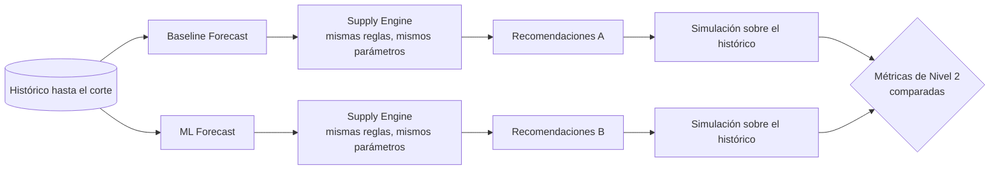
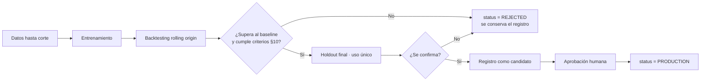

# 05 — Motor predictivo (estrategia de Machine Learning)

**Estado:** Versión 1.0 — Etapa 0 (estrategia, no implementada) · **Fecha:** 2026-09-04 · **Versión 1.1** — revisada en la auditoría de Etapa 0.1

> **No se implementa ningún modelo en esta etapa.** Este documento fija la estrategia, las reglas de
> evaluación y los criterios de aceptación **antes** de entrenar, para que la evaluación no se ajuste
> después al resultado obtenido.

---

## 1. Qué se predice

**Demanda futura por producto (SKU).** Nada más.

El motor predictivo **no** predice cuánto comprar, ni cuándo, ni a quién. Esa es la responsabilidad
del motor de abastecimiento (`docs/06-motor-abastecimiento.md`). Esta frontera es un requisito
arquitectónico (RML-012, RNF-001), no una preferencia de diseño.

## 2. Definición formal del problema

| Elemento | Definición |
|---|---|
| **Variable objetivo** | Cantidad demandada del producto en el periodo, en su unidad de medida |
| **Identificador de serie** | `(product_id, location_id)`. Con ubicación única (ASSUMPTION-006) equivale a `product_id` |
| **Unidad temporal** | Diaria como granularidad de almacenamiento; **semanal** como granularidad de modelado por defecto (ver §3) |
| **Horizonte** | Debe cubrir al menos *lead time + periodo de revisión*. **PENDIENTE DE VALIDACIÓN**: su valor depende de los lead times reales y de la política de revisión (`BR-X02`), ninguno definido. Valor de trabajo provisional: 8–12 semanas (ASSUMPTION-002) |
| **Frecuencia de generación** | Semanal para todo el catálogo; bajo demanda para un producto concreto. El **recálculo de recomendaciones es diario** y consume el forecast vigente (`docs/06`) |
| **Tipo de problema** | Pronóstico de series temporales, multiserie, con incertidumbre |
| **Salida** | Estimación puntual + intervalo de predicción + método usado + versión de modelo + `as_of_date` |

### Demanda, no venta

Lo que el histórico registra es **demanda satisfecha**. En periodos de desabasto, la demanda real fue
mayor. Si se entrena directamente sobre la venta observada, el modelo aprende que "la demanda cayó"
justo en los productos que más importan, y el sistema recomendará comprar de menos precisamente
donde ya falló.

Tratamiento: los periodos marcados con `is_stockout_affected` se consideran **censurados**. Opciones
a evaluar en la Fase 5 (decisión pendiente, `DT-011`): excluirlos de la métrica, imputarlos, o tratar
la observación como cota inferior. Sea cual sea la elegida, debe documentarse y ser explícita.

## 3. Granularidad

**Propuesta:** almacenar en diario, **modelar en semanal**.

Razones:
- La decisión de compra opera en escala de semanas (lead times de días a semanas), no de horas.
- La demanda diaria a nivel de SKU suele tener muchos ceros; agregar a semana reduce ruido sin
  perder la señal relevante para la decisión.
- Se conserva el detalle diario en la base para poder cambiar de granularidad sin volver a cargar datos.

**Excepción:** productos de muy alta rotación con lead time corto pueden justificar modelado diario.
Se evaluará con datos, no por adelantado. Estado: `PROPUESTA` (`DT-008`).

### 3.1 Conversión entre el pronóstico semanal y un lead time en días

Modelar en semanas y registrar los lead times en días crea un hueco que **debe cerrarse
explícitamente**: un lead time de 10 días no equivale a un número entero de semanas.

```
Lead time = 10 días        Forecast = F₁, F₂, F₃, … (semanal)
¿Cuál es la demanda esperada durante esos 10 días?
```

Si esta regla no está escrita, dos personas implementarán dos fórmulas y el sistema dará dos cifras
para la misma pregunta. Las alternativas, su comparación y la recomendación están en **`DT-019`**.

Resumen operativo:

- **Recomendación provisional:** prorrateo uniforme — semanas completas más la fracción proporcional
  de la siguiente. Con `L = 10 días`: `F₁ + (3/7)·F₂`.
- **Supuesto que introduce:** demanda uniforme dentro de la semana (`ASSUMPTION-019`). Si el negocio
  no opera todos los días, o el histórico diario muestra un perfil intra-semanal marcado, esta regla
  sesga y debe sustituirse por el prorrateo según ese perfil.
- **Estado:** `PENDIENTE DE VALIDACIÓN`, dependiente del calendario laboral (`BR-X06`).
- **Regla de implementación no negociable:** la conversión vive en **una sola función** del
  `supply_engine`. Ningún otro módulo, consulta ni informe la reimplementa.

## 4. Segmentación del catálogo

No todos los SKU admiten el mismo tratamiento. Antes de modelar se clasifica cada serie:

| Segmento | Criterio orientativo | Tratamiento previsto |
|---|---|---|
| **Regular** | Histórico suficiente, demanda frecuente, variabilidad moderada | Modelo principal |
| **Estacional** | Patrón estacional detectable | Modelo con componente estacional |
| **Intermitente** | Alta proporción de periodos con demanda cero | Métodos específicos para demanda intermitente (p. ej. Croston y variantes) — evaluar en Fase 5 |
| **Errático** | Frecuente pero con coeficiente de variación muy alto | Baseline robusto + intervalos amplios; confianza declarada baja |
| **Nuevo / histórico corto** | Menos de N periodos (N a definir con datos) | Analogía por categoría o baseline; confianza declarada baja |
| **Descontinuado** | Sin demanda reciente y producto inactivo | Excluido de la predicción |

Esta clasificación es en sí misma información útil para el planificador, y va en la salida.
La clasificación cuantitativa habitual en la literatura combina la frecuencia de la demanda con su
variabilidad; los umbrales concretos se calibrarán con datos reales, no se fijan aquí.

## 5. Variables potenciales y features

### 5.1 Disponibles desde el inicio

| Grupo | Ejemplos |
|---|---|
| **Rezagos (lags)** | Demanda de los periodos anteriores (1, 2, 4, 8, 52 semanas) |
| **Ventanas móviles** | Media, mediana, desviación y máximo de las últimas *k* semanas |
| **Tendencia** | Pendiente reciente, ratio entre ventanas corta y larga |
| **Calendario** | Semana del año, mes, trimestre, número de días hábiles, festivos (**pendiente**: calendario del negocio) |
| **Estacionalidad** | Índices estacionales, codificación cíclica (seno/coseno) |
| **Atributos del producto** | Categoría, clase de rotación, clase ABC, unidad de medida |
| **Contexto de disponibilidad** | Indicador de desabasto en el periodo (para censura, **no** como predictor directo del futuro) |

### 5.2 Deseables, sujetas a disponibilidad

Precio y promociones, eventos comerciales, cartera de pedidos, información de clientes, indicadores
externos. **Ninguna se asume disponible.** Si el negocio no las aporta, no se inventan.

### 5.3 Variables conocidas antes y después del momento de predicción

Distinción imprescindible para evitar fuga temporal. Una variable solo puede usarse como *feature* si
su valor está disponible **en el instante en que se genera la predicción**.

| Tipo | Definición | Ejemplos | Uso como feature |
|---|---|---|---|
| **Conocidas de antemano** (*known future*) | Su valor futuro se conoce con certeza en el momento de predecir | Calendario, día de la semana, mes, festivos declarados, promociones ya planificadas y comunicadas | ✅ Sí, incluso para periodos futuros |
| **Observadas hasta el corte** (*past observed*) | Solo se conocen hasta `as_of_date`; su valor futuro es desconocido | Demanda pasada, inventario, rezagos, medias móviles, lead times observados | ✅ Sí, pero **solo con valores anteriores al corte** |
| **Conocidas únicamente a posteriori** | Su valor se conoce después del periodo que se quiere predecir | Demanda realizada del periodo, si hubo desabasto en ese periodo, venta final, recepciones posteriores | ❌ **Nunca** como predictor |

**Trampa frecuente en este dominio:** el indicador de desabasto del periodo *t* pertenece a la tercera
categoría. Es legítimo usarlo para **tratar la observación de entrenamiento** como censurada
(`DT-011`), pero **no** como variable explicativa del futuro: en el momento de predecir no se sabe si
habrá desabasto. Confundir ambos usos produce un modelo excelente en evaluación e inútil en producción.

### 5.4 Reglas de construcción de features (RML-004)

1. Toda feature en el instante *t* usa exclusivamente información disponible **hasta** *t*.
2. Las ventanas móviles se calculan desplazadas: nunca incluyen el periodo que se predice.
3. Las agregaciones por categoría o global se calculan **dentro** de cada partición de entrenamiento,
   nunca sobre el dataset completo.
4. Toda normalización o escalado se ajusta solo con datos de entrenamiento.
5. Existe una prueba automatizada que verifica el alineamiento temporal. Si falla, no hay entrenamiento.

Regla práctica: si una feature no podría calcularse el lunes por la mañana con la información
existente ese lunes, no puede usarse.

### 5.5 Precaución de uso del dataset sintético — warm-up del generador

*Aplica **solo** al dataset sintético de la Fase 1. No es una regla de negocio ni un requisito nuevo
de ML: es una característica declarada del generador. Decisión: `DT-036` §5.*

El generador de inventario dimensiona el saldo de apertura de cada producto y su demanda reciente con
una **ventana congelada de los primeros `W = 28` días** de la serie. Durante esa ventana, y solo
durante ella, los eventos de abastecimiento del producto dependen de demanda posterior al día
simulado.

**Consecuencia práctica:** al entrenar sobre este dataset, **excluir los primeros `W` días de la serie
de cada producto** cuando se utilicen features derivadas de:

- órdenes de compra,
- inventario,
- tránsito,
- abastecimiento en general.

Fuera de esa ventana no aplica. Y **no aplica en ningún caso** a las features derivadas de la demanda
o del consumo: ambas series se generan sin mirar hacia delante, y no están afectadas.

Con datos reales esta precaución desaparece, porque desaparece el generador.

## 6. Baseline

**Obligatorio y permanente.** No es un trámite: es la referencia contra la que se juzga todo lo demás
y el mecanismo de respaldo cuando el modelo no está disponible (RNF-010).

Baselines a implementar:

| Baseline | Definición |
|---|---|
| **Naïve** | La demanda del próximo periodo es la del último |
| **Naïve estacional** | La demanda es la del mismo periodo del ciclo anterior |
| **Media móvil** | Media de las últimas *k* semanas |
| **Suavizado exponencial simple** | Ponderación decreciente del histórico |

El baseline de referencia oficial se elige entre estos según su desempeño global, y queda registrado
en `ModelVersion` con `is_baseline = true`.

## 7. Modelos candidatos

Orden de exploración deliberadamente incremental (`DT-009`):

| Nivel | Familia | Cuándo considerarlo |
|---|---|---|
| 0 | Baselines (§6) | Siempre. Punto de partida y respaldo |
| 1 | Suavizado exponencial / ETS, ARIMA estacional | Series regulares con tendencia y estacionalidad claras |
| 2 | Métodos para demanda intermitente (Croston y variantes) | Segmento intermitente |
| 3 | Modelos de regresión global sobre features tabulares (árboles con boosting) | Cuando conviene un modelo único multiserie que aproveche atributos de producto |
| 4 | Modelos secuenciales / redes neuronales | **Solo** si los niveles anteriores se agotan y hay volumen de datos que lo justifique |

Criterio de parada: **si el nivel N no aporta mejora medible sobre el nivel N−1, no se avanza.**
La complejidad se paga en mantenimiento, tiempo de entrenamiento, explicabilidad y riesgo operativo.

Nota sobre el enfoque global: un único modelo entrenado sobre todas las series con el producto como
característica suele comportarse mejor que miles de modelos individuales cuando hay muchos SKU con
histórico corto, y es mucho más barato de operar. Es la dirección preferida para el nivel 3, pero
debe demostrarse contra el nivel 1, no asumirse.

## 8. Estrategia de validación temporal

**Partición aleatoria prohibida** (RML-003).

Esquema: **rolling origin / backtesting con ventana deslizante**.

```
Corte 1: entrena [t0 ................ T1] → evalúa (T1, T1+h]
Corte 2: entrena [t0 ................... T2] → evalúa (T2, T2+h]
Corte 3: entrena [t0 ...................... T3] → evalúa (T3, T3+h]
                                                   ...
```

Reglas:

1. Mínimo 3–5 cortes; el número final se fija con la longitud real del histórico.
2. Entre entrenamiento y evaluación se respeta un **gap** igual al horizonte, para simular la
   disponibilidad real de la información.
3. La métrica reportada es la agregación sobre todos los cortes, **con su dispersión**. Un promedio
   sin dispersión oculta modelos inestables.
4. El último tramo del histórico se reserva como **holdout final**, usado una sola vez, al cerrar la
   selección de modelo. Si se usa para decidir, deja de ser holdout.
5. El mismo esquema se aplica al baseline y a todos los candidatos, sin excepción.
6. **La evaluación se realiza también al horizonte del intervalo de protección** (`L`, o `L + R`), no
   solo a un paso. Es el horizonte del que depende el stock de seguridad (`DT-010`), y el error
   acumulado sobre él no se deduce del error a un paso sin supuestos que hay que comprobar.

## 9. Métricas y evaluación

Declaradas **antes** de entrenar (RML-005).

La evaluación se organiza en **dos niveles** (`DT-020`). El Nivel 1 mide si el pronóstico acierta; el
Nivel 2 mide si produce **mejores decisiones de abastecimiento**. El Nivel 2 es el decisorio: es la
pregunta que el proyecto existe para responder.

### 9.1 Nivel 1 — calidad del pronóstico

| Métrica | Para qué sirve | Justificación de su inclusión |
|---|---|---|
| **MAE** | Error absoluto medio por serie | Interpretable en las unidades del producto; es lo que entiende un planificador |
| **RMSE** | Penaliza más los errores grandes | Un error grande aislado puede costar un desabasto; MAE lo diluye |
| **MASE** | Error escalado frente a un baseline ingenuo | Comparable entre series de escalas distintas y **definida cuando la demanda es cero**. Su valor frente a 1 dice directamente si el modelo supera al baseline |
| **RMSSE** | Variante escalada basada en el error cuadrático | Misma comparabilidad que MASE, penalizando más los errores grandes |
| **WAPE** | Error agregado ponderado por volumen | Refleja el impacto conjunto sobre el negocio, no el promedio entre SKU |
| **Sesgo (Bias / MPE)** | Error **con signo**, acumulado | **Imprescindible.** Un sesgo persistente a la baja produce desabastos crónicos aunque el error absoluto sea bajo. No lo detecta ninguna métrica de error absoluto |
| **Cobertura del intervalo** | % de observaciones dentro del intervalo declarado | Valida la incertidumbre, que es exactamente lo que consume el stock de seguridad (`DT-010`) |
| MAPE | Solo informativo | **Descartada como métrica de decisión** (`DT-021`): indefinida con demanda cero y asimétrica entre sobre y subestimación |

**Métrica primaria: PENDIENTE** (`DT-021`). No se fija aquí. Elegirla antes de conocer la composición
real del catálogo —qué proporción es intermitente, qué dispersión de escalas hay— sería fijar un
criterio de aceptación sin la información que lo justifica. `DT-021` define los cinco criterios que
deberá cumplir y las candidatas que los satisfacen (MASE, RMSSE, WAPE agregada).

Hasta esa decisión, el informe de evaluación reporta **el conjunto completo** y ninguna métrica se
presenta como criterio único.

### 9.2 Reporte obligatorio de Nivel 1

1. Todas las métricas de §9.1, con su **dispersión entre cortes** (un promedio sin dispersión oculta
   modelos inestables).
2. **Desglose por segmento** (§4). Un modelo puede ser excelente en alta rotación e inútil en los SKU
   críticos, y el promedio global lo esconde.
3. El resultado del **baseline** en la misma evaluación, siempre.
4. Métricas al horizonte de un paso **y** al horizonte del intervalo de protección (§8, regla 6).

### 9.3 Por qué el Nivel 1 no basta

Un modelo puede reducir el error de pronóstico y **empeorar** el abastecimiento. Tres formas de que
ocurra, todas plausibles:

- Mejora el promedio pero introduce sesgo a la baja en los SKU críticos: menos error, más desabastos.
- Reduce el error puntual a costa de una incertidumbre peor calibrada; como el stock de seguridad se
  calcula a partir de esa incertidumbre, el resultado empeora.
- Mejora en los SKU de bajo valor, que son mayoría y dominan el promedio, y empeora en los pocos que
  concentran el impacto económico.

Si solo se mide el Nivel 1, estos casos pasan inadvertidos y se promueve un modelo peor.

### 9.4 Nivel 2 — calidad de la decisión de abastecimiento

Se miden sobre las recomendaciones que el motor produce a partir del forecast, en **simulación
retrospectiva** sobre el histórico.

| Métrica | Definición |
|---|---|
| **Tasa de desabasto** (*stockout rate*) | Proporción de SKU-periodo con demanda y sin existencia |
| **Nivel de servicio alcanzado** | Demanda satisfecha ÷ demanda total. Se reporta también, por separado, la proporción de ciclos sin agotamiento |
| **Inventario medio** | Existencia media a lo largo del periodo simulado, en unidades y en valor |
| **Exceso de inventario** | Inventario por encima del umbral de cobertura de política |
| **Rotación** | Consumo del periodo ÷ inventario medio |
| **Órdenes urgentes** | Órdenes que habrían tenido que emitirse con lead time inferior al normal |
| **Costo de inventario** | Requiere el costo de mantener inventario (`BR-X04`, pendiente) |
| **Costo de faltante** | Requiere el costo de faltante (`BR-X04`, pendiente) |

> **No se fija ningún valor objetivo.** El negocio no ha proporcionado ninguno, y este documento **no
> establece** metas del tipo "desabasto < 5 %" ni "nivel de servicio ≥ 95 %". Aquí se define
> **qué medir**, no cuánto hay que alcanzar. Los objetivos son `BR-X01` y siguientes, pendientes.
>
> Las dos últimas métricas solo son calculables cuando el negocio aporte los costos. Hasta entonces la
> comparación se hace en unidades físicas y en incidencias, que ya permiten decidir.

### 9.5 Comparación end-to-end: baseline frente a ML

Ningún modelo se promueve sin esta comparación (`DT-020`, criterio 9 de §10):



Condiciones para que la comparación sea válida:

1. **Lo único que cambia es el forecast.** Mismas reglas, mismos parámetros de política, mismos datos
   de inventario y lead time, misma versión del motor. Cualquier otra diferencia invalida la conclusión.
2. Ambas ramas se ejecutan sobre los **mismos cortes temporales** del backtesting.
3. Se reporta la diferencia **por segmento**, no solo agregada.
4. Se declara explícitamente si la mejora de Nivel 1 se traduce o no en mejora de Nivel 2. **Cuando no
   se traduce, ese hallazgo se documenta**: es información valiosa sobre el sistema, no un fracaso que
   ocultar.

Requisito de diseño que esto impone: `supply_engine` debe poder ejecutarse en modo simulación con un
proveedor de forecast intercambiable. Está contemplado en `DT-003` (interfaz `ForecastProvider`) y en
`DT-020`, y es la razón de que el motor sea una biblioteca pura.

## 10. Criterios de aceptación de un modelo

Un modelo pasa a producción **solo si cumple todo lo siguiente**:

1. Supera al baseline en la métrica primaria, de forma consistente en la mayoría de los cortes.
2. No degrada de manera significativa ningún segmento relevante frente al baseline.
3. El sesgo se mantiene dentro de la banda declarada (sin sesgo sistemático).
4. La cobertura del intervalo se aproxima al nivel nominal declarado.
5. Supera las pruebas de ausencia de leakage (RML-004).
6. Su entrenamiento es reproducible (RML-009).
7. Su tiempo de inferencia para todo el catálogo cabe en la ventana operativa del proceso batch.
8. Está registrado con versión, métricas, ventana de datos e hiperparámetros.
9. **Supera al baseline también en la evaluación de Nivel 2** (§9.4–9.5): produce decisiones de
   abastecimiento mejores o equivalentes, y no empeora ninguna métrica de Nivel 2 de forma
   significativa. Un modelo que mejora el error de pronóstico y empeora el servicio **no se promueve**.

Los **umbrales numéricos concretos** (p. ej. "MASE < X") **no se fijan aquí**, ni en Nivel 1 ni en
Nivel 2: fijarlos sin datos sería inventar un requisito. Se establecerán al cerrar la Fase 1 con el
dataset disponible y se registrarán como decisión (`PENDIENTE`, ver `DT-P04` y `DT-021`).

El criterio 9 no exige alcanzar un valor absoluto, sino **superar o igualar al baseline** en las
mismas condiciones. Es una comparación relativa, que sí puede evaluarse sin objetivos del negocio.

## 11. Entrenamiento

- **Dónde:** local en fases tempranas; como *job* en Azure Machine Learning cuando el proyecto llegue
  a la Fase 6. La lógica de entrenamiento es la misma; cambia el ejecutor.
- **Reproducibilidad:** semilla fija, versión de datos, versión de código (commit), hiperparámetros y
  entorno registrados en cada ejecución.
- **Seguimiento:** experimentos y métricas registrados con MLflow. **No es una tecnología añadida al
  stack:** es el mecanismo de seguimiento nativo de Azure Machine Learning, que sí figura en el stack
  obligatorio, y por eso no requiere ADR propio. El seguimiento es el mecanismo de seguimiento
  soportado nativamente por Azure Machine Learning.
- **Datos:** solo información anterior al corte de entrenamiento. Prohibido reentrenar sobre el holdout.
- **Frecuencia inicial propuesta:** mensual, o por disparo ante deriva (§15).

## 12. Evaluación y promoción



La promoción a producción **requiere aprobación humana**. No hay promoción automática por métrica en
la primera versión: el costo de un modelo malo en producción (desabastos) supera al de una revisión manual.

## 13. Versionado

- Cada modelo entrenado genera un registro `ModelVersion` (`docs/04-modelo-datos.md`).
- Cada `Forecast` referencia la versión que lo generó. Una versión referenciada **nunca se elimina**.
- El registro local se sincroniza con el registro de modelos de Azure ML mediante `external_ref`.
- Estados: `TRAINING` → `EVALUATED` → (`PRODUCTION` | `REJECTED`) → `ARCHIVED`.
- Como máximo un modelo en `PRODUCTION` por objetivo de predicción.

## 14. Despliegue

- **Modo principal: inferencia por lotes.** El proceso programado genera las predicciones de todo el
  catálogo y las persiste. Es lo que la decisión de compra necesita: no requiere latencia baja.
- **Inferencia en línea:** solo si aparece una necesidad real (recálculo interactivo). Se expondría
  como *managed online endpoint* de Azure ML, detrás de la interfaz `ForecastProvider`.
- **Respaldo obligatorio:** si el modelo no está disponible o su calidad cae bajo el umbral, se usa el
  baseline y la salida lo indica con `method_used = BASELINE` (RNF-010). El sistema nunca se queda
  sin predicción, y nunca finge que la predicción degradada es normal.

## 15. Monitoreo

| Qué se vigila | Cómo |
|---|---|
| **Desempeño real** | Error de la predicción contra la demanda efectivamente observada, por segmento |
| **Sesgo acumulado** | Tendencia del error con signo a lo largo del tiempo |
| **Deriva de datos** | Cambio en la distribución de las features de entrada respecto a la ventana de entrenamiento |
| **Deriva de predicción** | Cambio en la distribución de las salidas |
| **Salud operativa** | Ejecuciones fallidas, SKU sin predicción, proporción de uso del baseline |
| **Cobertura del intervalo** | Proporción real de observaciones dentro del intervalo declarado |

Azure Machine Learning ofrece monitoreo de modelos en producción con señales de deriva de datos y de
degradación de desempeño; se usará esa capacidad en lugar de construir una propia. La verificación
de su configuración concreta se hará contra la documentación oficial vigente en la Fase 6.

**Alertas:** cuando una métrica supera su umbral, se notifica y se registra. Ninguna alerta dispara
por sí sola un cambio de modelo en producción.

## 16. Reentrenamiento

Disparadores:

1. **Programado:** frecuencia inicial propuesta mensual, ajustable con evidencia.
2. **Por deriva:** al superarse un umbral de deriva de datos o de degradación de desempeño.
3. **Por cambio estructural del negocio:** nuevas líneas de producto, cambio de proveedor relevante,
   cambio de política. Decisión humana.

El modelo reentrenado **no sustituye automáticamente** al vigente: pasa por la misma evaluación
(§12) y debe superar tanto al baseline como al modelo en producción (RML-011).

## 17. Riesgos específicos del componente predictivo

| Riesgo | Mitigación |
|---|---|
| Sobreajuste al dataset sintético | El dataset sintético no decide la arquitectura definitiva; revalidación obligatoria con datos reales |
| Fuga temporal que infla las métricas | Prueba automatizada de alineamiento; gap en el backtesting; holdout de uso único |
| Sesgo por desabasto (demanda censurada) | Marca `is_stockout_affected` y tratamiento explícito (§2) |
| Métricas engañosas en demanda intermitente | Métrica primaria robusta ante ceros; desglose por segmento |
| Modelo excelente en promedio e inútil en los SKU críticos | Evaluación por segmento obligatoria |
| Complejidad injustificada | Criterio de parada por nivel (§7) |
| Deterioro silencioso en producción | Monitoreo continuo y respaldo automático al baseline |

## 18. Fuera del alcance de este componente

- Predicción de precios o costos.
- Predicción de lead time (se trata estadísticamente en el motor de abastecimiento, no con ML, hasta
  que haya evidencia de que lo requiere).
- Optimización de la decisión de compra.
- Detección de anomalías como producto independiente (se usa internamente para limpiar el histórico).
