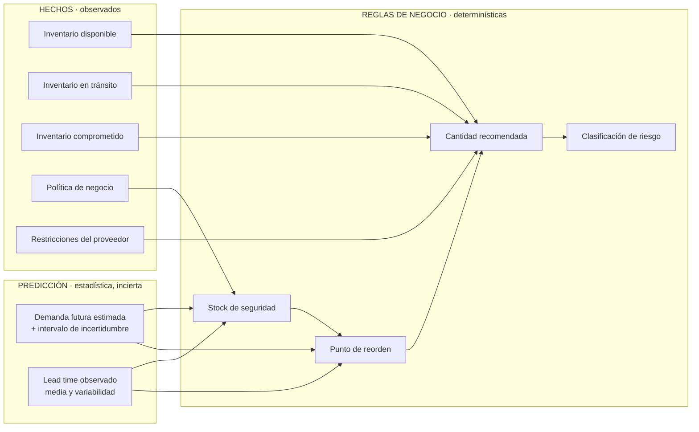

# 06 — Motor de abastecimiento (reglas de negocio)

**Estado:** Versión 1.0 — Etapa 0 (lógica conceptual, no implementada) · **Fecha:** 2026-09-04 · **Versión 1.1** — revisada en la auditoría de Etapa 0.1 · **Versión 1.2** (2026-09-30) — §16, contrato de implementación del motor V1 para la Etapa 2 (`DT-045`); §§1–15 no cambian · **Versión 1.3** (2026-10-01) — cierre de `DT-P14`: estimador de `σ_H`, histórico insuficiente y evaluación exacta B3 (§16.3, §16.5, §16.6, §16.9, §16.10); ninguna fórmula V1 cambia · **Versión 1.4** (2026-10-01) — cierre del contrato de U1: `DT-048` a `DT-052` (§16.3, §16.4, §16.5, §16.6 punto 7, §16.8 y §16.11, nueva); ninguna fórmula V1 cambia · **Versión 1.5** (2026-10-01) — cierre de `DT-P22`: `PRODUCT_OUT_OF_VALIDITY` cubre también la vigencia que termina dentro del horizonte (§16.5, §16.11, §16.11.2, §16.11.4); ninguna fórmula V1 cambia · **Versión 1.6** (2026-10-01) — `DT-053` (frontera de la salida parcial, §16.11.6) y `DT-054` (sin monotonía global de `S` frente a `L` en V1, §16.11.7; §16.8); decisiones de alcance e interpretación, ninguna fórmula cambia · **Versión 1.7** (2026-10-01) — §16.12, implementación de U1 · **Versión 1.8** (2026-10-03) — §16.13, ejecución de recomendaciones de U4 (autorizada, no implementada; `DT-058` a `DT-063`); nota en §16.3; ninguna regla V1 cambia · **Versión 1.9** (2026-10-03) — §16.13.5, implementación de U4; ninguna regla V1 ni decisión cambia

> Este documento define **reglas determinísticas**, no un modelo. Todo lo aquí descrito debe poder
> calcularse a mano, verificarse con casos exactos y explicarse a un comprador.

---

## 1. La frontera: predicción vs. reglas de negocio



| | Predicción | Reglas de negocio |
|---|---|---|
| **Naturaleza** | Estadística, con error | Aritmética, exacta |
| **Salida** | Demanda estimada + incertidumbre | Cantidades, fechas, niveles de riesgo |
| **Reproducible** | Sí, con la misma versión de modelo y datos | Siempre, sin excepción |
| **Cambia con** | Reentrenamiento, nuevos datos | Cambio de política, aprobado por el negocio |
| **Se prueba con** | Backtesting y métricas de error | Casos exactos calculados a mano |
| **Se explica** | Con métricas e intervalos | Término a término |

**Consecuencia de diseño:** el módulo `supply_engine` es una biblioteca **pura**. Recibe números,
devuelve números. No accede a la base de datos, no llama a servicios, no usa aleatoriedad y no
consulta ningún LLM. Es lo que permite garantizar RNF-002.

## 2. Advertencia metodológica

Las fórmulas de esta sección proceden de la literatura estándar de gestión de inventarios (ver §12).
Son **puntos de partida verificables**, no fórmulas empresariales definitivas de esta organización.

Todavía **no existen datos suficientes** para afirmar que estas fórmulas son las adecuadas para el
negocio real. Concretamente, están **pendientes de definición por el negocio**:

- el nivel de servicio objetivo,
- el costo de faltante y el costo de mantener inventario,
- la política de revisión (continua o periódica) y su frecuencia,
- los umbrales de clasificación de riesgo,
- el criterio de selección entre varios proveedores.

Mientras no se definan, el sistema los expone como **configuración obligatoria** y **no los sustituye
por valores inventados**. Un parámetro faltante produce una recomendación marcada como no calculable,
no una recomendación con un valor supuesto.

## 3. Notación

| Símbolo | Significado | Origen |
|---|---|---|
| `D̂` | Demanda estimada por periodo | Forecast (ML) |
| `σ_D` | Desviación estándar de la demanda por periodo | Histórico e incertidumbre del forecast |
| `L` | Lead time medio, en periodos | Observado desde `PurchaseOrderReceipt` |
| `σ_L` | Desviación estándar del lead time | Observado |
| `R` | Periodo de revisión | Política |
| `SL` | Nivel de servicio objetivo (probabilidad de no agotar durante el ciclo) | **Política — pendiente del negocio** |
| `z` | Factor de servicio asociado a `SL` | Derivado de `SL` |
| `SS` | Stock de seguridad | Calculado |
| `ROP` | Punto de reorden | Calculado |
| `OH` | Existencia física (on hand) | Inventario |
| `IT_total` | Tránsito total: todo lo pedido y no recibido | Órdenes vigentes (almacenado) |
| `IT_efectivo` | Tránsito que llega dentro del intervalo de protección | Derivado en el cálculo (`DT-012`) |
| `RSV` | Inventario comprometido/reservado | Inventario |
| `IP_decisión` | Posición de inventario de decisión: `OH + IT_efectivo − RSV` | Calculado. **Es la que se compara con el ROP** |
| `IP_contable` | `OH + IT_total − RSV` | Calculado. Para informes y valoración |
| `MOQ` | Cantidad mínima de pedido | Proveedor |
| `M` | Múltiplo de compra | Proveedor |

Todas las cantidades comparten la unidad de medida del producto; todos los tiempos, la misma unidad
temporal (la del forecast).

## 4. Posición de inventario

```
IP_decisión = OH + IT_efectivo − RSV      ← se compara con el punto de reorden
IP_contable = OH + IT_total    − RSV      ← informes y valoración
```

**Este es el error más común en sistemas de reabastecimiento**: comparar el punto de reorden contra
la existencia física en lugar de contra la posición de inventario. El resultado es pedir de nuevo
algo que ya viene en camino, y generar sobreinventario justo en los productos que más se vigilan.

### 4.1 Dos conceptos de tránsito, no uno

`DT-012` distingue dos magnitudes que no deben mezclarse:

| Concepto | Definición | Naturaleza | Dónde vive |
|---|---|---|---|
| **`total_in_transit`** | Todo lo pedido y aún no recibido:<br/>`Σ (quantity_ordered − quantity_received)` sobre líneas de órdenes en estado `ISSUED` o `PARTIALLY_RECEIVED` | **Hecho** sobre el mundo, independiente de cualquier decisión | Almacenado en `Inventory.quantity_in_transit` |
| **`effective_in_transit`** | La parte de ese tránsito que se espera recibir **dentro del intervalo de protección de la decisión que se evalúa** | **Relativa a una decisión**: depende del horizonte de quien pregunta | **Derivado**, calculado por `supply_engine` en cada evaluación. **No es una columna** |

La misma orden es efectiva para un producto con lead time largo y no efectiva para otro con lead time
corto, y puede dejar de serlo mañana sin que nada cambie en la orden. Un valor que depende de la
pregunta no es un estado del inventario, y por eso no se almacena.

### 4.2 Cuál se usa en cada caso

```
IP_contable  = OH + total_in_transit     − RSV     ← qué hay comprometido en total
IP_decisión  = OH + effective_in_transit − RSV     ← qué habrá disponible a tiempo
```

**La comparación con el punto de reorden usa `IP_decisión`.** Usar el total produce un fallo
silencioso y grave: el sistema no recomienda comprar porque "ya viene en camino" algo que llegará
tarde. Ese es exactamente el escenario que causa un desabasto con una orden abierta en el sistema.

`IP_contable` se usa para informes de inventario y valoración, donde la pregunta es qué hay
comprometido, no qué llegará a tiempo.

**Ambos valores se almacenan en `calculation_inputs` de la recomendación**, junto con la diferencia,
para que el planificador vea que hay tránsito no contado y por qué. Ocultar esa diferencia sería
justamente el tipo de opacidad que este sistema trata de eliminar.

**Pendiente de definir en la Fase 4** (`DT-P11`): la fecha de corte exacta y el tratamiento de las
órdenes ya vencidas y no recibidas — ¿una orden atrasada cuenta como efectiva? Requiere criterio de
negocio; no se decide aquí.

## 5. Demanda durante el lead time

```
DDLT = D̂ × L
```

Con demanda variable por periodo (forecast no constante), se usa la **suma del forecast** sobre los
periodos que cubre el lead time, que es más fiel que multiplicar por una media:

```
DDLT = Σ  D̂ₜ   para t en el intervalo del lead time
```

Bajo **revisión periódica**, el intervalo de protección es `L + R`, no solo `L`: entre dos revisiones
no hay oportunidad de reaccionar.

```
DDLT_periódica = Σ D̂ₜ   para t en (L + R)
```

**Decisión pendiente:** si la política será de revisión continua o periódica. Afecta directamente a
esta fórmula y al punto de reorden. Registrada en `knowledge/business-rules.md` como pendiente
(`BR-X02`).

### 5.1 Conversión entre el pronóstico semanal y un lead time en días

El pronóstico se produce en semanas (`DT-008`) y el lead time se registra en días. `L = 10 días` no
son dos semanas ni una y media: **hace falta una regla explícita**, o dos personas implementarán dos
fórmulas distintas y el sistema dará dos cifras para la misma pregunta.

La regla, sus alternativas y su estado están en **`DT-019`** y en `docs/05-motor-predictivo.md` §3.1.
Resumen:

- **Recomendación provisional:** prorrateo uniforme. Con `L = 10 días` y forecast semanal `F₁, F₂`:
  `DDLT = F₁ + (3/7)·F₂`.
- **Qué `L` usa V1:** el **lead time observado**, calculado como la mediana de las últimas
  observaciones válidas del par producto–proveedor, con **fallback al acordado** cuando no hay
  histórico suficiente (`DT-031` §V1-09). Adopta la dirección de `BR-P01`, que sigue siendo regla
  propuesta. El acordado **no se retira del modelo**: es el fallback y la referencia contra la que se
  mide la desviación del proveedor.
- **Supuesto que introduce:** demanda uniforme dentro de la semana (`ASSUMPTION-019`).
- **Estado:** `PENDIENTE DE VALIDACIÓN` — depende del calendario laboral (`BR-X06`).

**Regla de implementación no negociable:** esta conversión vive en **una única función** del
`supply_engine` —conceptualmente `demand_over_horizon(forecast, start_date, days)`— que es el único
punto del sistema autorizado a traducir entre granularidades. Ningún otro módulo, consulta SQL,
informe de Power BI ni pantalla la reimplementa. La regla aplicada y el valor obtenido se registran en
`calculation_inputs`.

## 6. Stock de seguridad

El stock de seguridad cubre la **variabilidad**, no la demanda esperada. Existen dos fuentes de
variabilidad y ambas importan.

### 6.1 Caso base — variabilidad de la demanda

```
SS = z × σ_D × √L
```

### 6.2 Caso completo — variabilidad de demanda y de lead time

Formulación estándar en la literatura de gestión de inventarios:

```
SS = z × √( L × σ_D²  +  D̂² × σ_L² )
```

El segundo término suele dominar cuando el proveedor es poco confiable. En esos casos, el problema no
se resuelve comprando más: **se resuelve con el proveedor**. El sistema debe hacer visible qué parte
del stock de seguridad se debe a la variabilidad del proveedor, porque esa es una palanca de gestión
distinta.

### 6.3 Sobre `z` y el nivel de servicio

`z` deriva del nivel de servicio objetivo bajo un supuesto de distribución (normalmente normal). Dos
advertencias que deben quedar documentadas y no olvidarse en la implementación:

1. El supuesto de normalidad **no se sostiene** en demanda intermitente ni muy asimétrica. Para esos
   segmentos hay que evaluar alternativas (distribuciones adecuadas o métodos empíricos basados en la
   distribución observada del error de pronóstico).
2. Existen dos definiciones distintas de "nivel de servicio" —probabilidad de no agotar en un ciclo
   (*cycle service level*) y proporción de demanda satisfecha (*fill rate*)— y **no son
   intercambiables**. El negocio debe indicar cuál usa. Mientras no lo haga, queda pendiente.

### 6.4 Qué incertidumbre debe cubrir `σ_D` — PENDIENTE

**Aquí conviven cuatro conceptos distintos que no deben confundirse** (`DT-010`):

| # | Concepto | Qué mide | Origen |
|---|---|---|---|
| 1 | Variabilidad de la demanda | Cuánto varía el fenómeno | Serie histórica |
| 2 | Error de pronóstico | Cuánto nos equivocamos al anticiparlo, **a un horizonte dado** | Residuos del backtesting |
| 3 | Incertidumbre declarada por el modelo | Cuánto **cree** el modelo que se equivoca | Intervalo de predicción; puede estar mal calibrado |
| 4 | Variabilidad del lead time (`σ_L`) | Cuánto varía el tiempo de entrega | Histórico de recepciones |

(1) y (2) no son lo mismo: si el modelo predice bien una demanda muy variable, usar (1) sobreestima el
stock necesario. (2) y (3) tampoco: lo que el modelo cree equivocarse solo coincide con lo que se
equivoca si el intervalo está calibrado, y eso hay que comprobarlo. (4) es independiente de las tres.

**Punto técnico determinante.** Lo que hay que cubrir es el error **acumulado sobre el intervalo de
protección** (`L`, o `L + R`), no el error a un paso. Escalar el error de un paso por `√L` **no es una
identidad general**: esa relación se deriva para el método naïve **bajo residuos no correlacionados y
varianza constante**, supuestos que los errores multi-horizonte suelen incumplir. Aplicarla sin
verificarla subestimaría el stock de seguridad precisamente donde más cuesta.

**Estado: `PENDIENTE DE VALIDACIÓN`.** El error de pronóstico es la fuente de información más
pertinente, pero la metodología exacta —error acumulado por backtesting al horizonte, cuantiles
empíricos no paramétricos, o intervalo del modelo previa verificación de calibración— **se decidirá en
la Fase 5 con datos**, comparando su efecto sobre las métricas de **Nivel 2** (`DT-020`): desabastos,
nivel de servicio e inventario medio. Una fuente que reduce el error de pronóstico pero empeora el
servicio no es la correcta.

Mientras tanto, las fórmulas de §6.1 y §6.2 son un **punto de partida verificable**, no la fórmula
oficial del proyecto.

## 7. Punto de reorden

**Revisión continua:**
```
ROP = DDLT + SS
```

**Revisión periódica** (nivel objetivo, *order-up-to level*):
```
S = DDLT_periódica + SS        donde DDLT_periódica = Σ D̂ₜ sobre (L + R)
```
Se usa la **suma del forecast** sobre el intervalo de protección, coherente con §5. Multiplicar por
una media (`D̂ × (L + R)`) solo equivale a esto cuando el forecast es constante, que es justo el caso
que no interesa.

**Señal de reposición:** se recomienda pedir cuando `IP ≤ ROP` (o, en revisión periódica, en cada
revisión hasta alcanzar `S`).

## 8. Cantidad recomendada

Cálculo en tres pasos, todos visibles en la salida:

**Paso 1 — Necesidad bruta**
```
Q_bruta = max(0, (ROP + D̂ × H_cobertura) − IP)
```
donde `IP` es **`IP_decisión`** (§4.2, con `effective_in_transit`) y `H_cobertura` es la cobertura
adicional deseada más allá del punto de reorden (**parámetro de política pendiente del negocio**,
`BR-X13`). En revisión periódica: `Q_bruta = max(0, S − IP_decisión)`.

**Unidades:** `H_cobertura` se almacena en **días** (`InventoryPolicy.target_coverage_days`) y el
forecast está en semanas, de modo que este término **también atraviesa la conversión de granularidad**
y usa la misma función única de `DT-019` que el lead time. `D̂ × H_cobertura` es notación abreviada de
`demand_over_horizon(forecast, fecha, target_coverage_days)`. No hay una segunda regla de conversión.

**Paso 2 — Restricciones del proveedor**
```
Q_moq      = max(Q_bruta, MOQ)                    si Q_bruta > 0
Q_final    = ceil(Q_moq / M) × M                  ajuste al múltiplo de compra
```

**Paso 3 — Verificación de sensatez**
Si `Q_final` genera una cobertura superior al umbral de sobreinventario, se **señala el conflicto**
(típicamente, un MOQ desproporcionado para un producto de baja rotación). El sistema no oculta la
contradicción: la muestra para que el comprador decida, porque puede haber razones comerciales que
el sistema desconoce.

**Restricciones no incluidas en la primera versión** (fuera de alcance, documentado para que no se
implementen por inercia): optimización de lote económico con costos reales, consolidación de órdenes
por proveedor, restricciones de presupuesto y de capacidad de almacén, descuentos por volumen.

## 9. Riesgo de desabasto

Indicadores calculados:

| Indicador | Definición |
|---|---|
| **Cobertura (días)** | `IP / demanda diaria estimada` |
| **Fecha estimada de agotamiento** | Fecha en la que el consumo acumulado previsto agota `IP` |
| **Déficit frente al ROP** | `max(0, ROP − IP)` |
| **Margen frente al lead time** | Días de cobertura − lead time necesario |

Clasificación propuesta (**umbrales pendientes de validación**, no son requisito):

| Nivel | Condición conceptual |
|---|---|
| `CRITICAL` | La cobertura es menor que el lead time: aun pidiendo hoy, habrá desabasto |
| `HIGH` | `IP` por debajo del `ROP` y sin tránsito suficiente que llegue a tiempo |
| `MEDIUM` | `IP` por debajo del `ROP` pero con tránsito que llega dentro del margen |
| `LOW` | `IP` por encima del `ROP` |

La condición de `CRITICAL` es la más importante del sistema: identifica el caso en que **la decisión
óptima ya no existe** y lo que procede es una acción excepcional (proveedor alternativo, envío
urgente, sustitución del producto). Es información distinta de "hay que comprar".

## 10. Riesgo de sobreinventario

| Indicador | Definición |
|---|---|
| **Cobertura excesiva** | Cobertura en días por encima del umbral máximo de política |
| **Cantidad excedente** | `max(0, IP − (demanda prevista en el horizonte de política + SS))` |
| **Capital inmovilizado** | Cantidad excedente × costo unitario (requiere costo registrado) |
| **Riesgo de obsolescencia** | Relevante si el producto tiene vida útil y la cobertura la supera |

Señales adicionales de interés para el planificador: productos sin movimiento en N periodos con
existencia positiva, y productos cuya demanda decrece de forma sostenida mientras el inventario se
mantiene o crece.

## 11. Riesgo asociado al proveedor

Insumos: `SupplierPerformance` (`docs/04-modelo-datos.md`).

| Indicador | Definición |
|---|---|
| **Cumplimiento en tiempo** | % de recepciones dentro de la fecha comprometida |
| **Cumplimiento en cantidad** | % de cantidad recibida sobre pedida |
| **Variabilidad del lead time** | `σ_L` observado |
| **Desviación acordado vs. observado** | `L_observado − L_acordado` |

Uso en las reglas:

1. En el cálculo se usa el **lead time observado**, no el acordado. Usar el contractual cuando el
   proveedor entrega sistemáticamente tarde genera desabastos previsibles y evitables.
2. La variabilidad del proveedor entra en `SS` (§6.2), encareciendo el inventario. Ese sobrecosto es
   atribuible al proveedor y debe poder mostrarse como tal.
3. Cuando hay varios proveedores para un producto, el criterio de selección **está pendiente de
   definición por el negocio** (costo vs. lead time vs. confiabilidad). Mientras tanto, el sistema
   sugiere el proveedor preferente marcado y **muestra las alternativas con sus indicadores** para que
   el comprador decida. No se inventa una función de puntuación.

## 12. Origen y justificación de las fórmulas

Las expresiones de §5–§8 son formulaciones estándar de la teoría de control de inventarios,
ampliamente documentadas en la literatura de referencia del área (entre otras, *Inventory and
Production Management in Supply Chains*, de Silver, Pyke & Thomas; y los tratamientos habituales de
gestión de operaciones y cadena de suministro). La combinación de variabilidad de demanda y de
lead time en el stock de seguridad (§6.2) es la formulación clásica para lead time estocástico.

Ninguna de estas fórmulas ha sido validada todavía **contra datos de esta organización**. Su estado
es `PROPUESTA` hasta que:

1. exista un histórico real o sintético representativo,
2. una **simulación retrospectiva** muestre su comportamiento medido con las métricas de **Nivel 2**
   (`DT-020`, `docs/05-motor-predictivo.md` §9.4): desabastos, nivel de servicio, inventario medio,
   exceso y órdenes urgentes,
3. el negocio confirme los parámetros de política.

**Cualquier fórmula específica de la empresa que aparezca más adelante sustituirá a estas**, y se
registrará con su origen en `knowledge/business-rules.md`.

> **Sobre `DT-031` y este estado.** Que `DT-031` esté `ACEPTADA` desde el 2026-09-21 **no levanta
> ninguna de las tres condiciones de arriba**. Lo aceptado allí es que esas fórmulas, con parámetros
> provisionales declarados, son **las reglas de V1**; no que hayan sido validadas contra datos de esta
> organización ni que el negocio haya confirmado sus parámetros. Las tres condiciones siguen abiertas
> y este estado `PROPUESTA` sigue siendo el correcto para las fórmulas como tales.

## 13. Explicabilidad obligatoria

Toda recomendación debe exponer, además del resultado:

```
Producto · Proveedor sugerido · Cantidad recomendada · Fecha sugerida · Urgencia
├─ Forecast utilizado (id, versión de modelo, as_of_date, método)
├─ Demanda durante lead time         = ...
├─ Lead time aplicado (observado)    = ...  (acordado: ...)
├─ Variabilidad de demanda σ_D       = ...
├─ Variabilidad de lead time σ_L     = ...
├─ Nivel de servicio objetivo / z    = ...
├─ Stock de seguridad                = ...
├─ Punto de reorden                  = ...
├─ Posición de inventario (decisión) = OH ... + IT_efectivo ... − RSV ...
├─ Tránsito total / efectivo         = ... / ...   (diferencia: ...)
├─ Cantidad bruta                    = ...
├─ Ajustes aplicados (MOQ, múltiplo) = ...
└─ Versión del motor de reglas       = ...
```

Este desglose es un **requisito**, no una función de depuración. Sin él, el planificador no puede
confiar en la recomendación (riesgo R-08), el sistema no es auditable y una recomendación pasada no
puede reconstruirse (RF-024).

## 14. Casos límite de prueba obligatorios

| Caso | Comportamiento esperado |
|---|---|
| Demanda estimada cero | No recomienda compra; señala posible producto sin rotación |
| Inventario cero y demanda positiva | Riesgo `CRITICAL`; recomienda con máxima urgencia |
| Lead time cero | Fórmulas estables; `DDLT = 0`, `SS` solo por variabilidad del lead time (`z × D̂ × σ_L`) |
| `σ_D = 0` y `σ_L = 0` | `SS = 0`; `ROP = DDLT` |
| Tránsito **efectivo** superior al ROP | No recomienda compra |
| Tránsito total superior al ROP pero **efectivo** insuficiente (la orden llega tarde) | **Sí recomienda**, y señala el tránsito no contado. Caso central de `DT-012` |
| Lead time no múltiplo de 7 días con forecast semanal | Aplica la conversión de §5.1 y registra la regla usada |
| MOQ mayor que la necesidad | Recomienda **al menos** el MOQ, ajustado al múltiplo según el Paso 2 de §8, y **señala** la sobrecobertura. Con `MOQ = 25` y `M = 10` la cantidad es **30**, no 25: cuando el MOQ no es múltiplo del múltiplo de compra, el mínimo pedible real es `⌈MOQ/M⌉·M`. El desglose debe distinguir cuánto impone el MOQ y cuánto el redondeo (`DT-031` §V1-06) |
| Múltiplo de compra grande | Redondeo hacia arriba correcto |
| Producto sin proveedor activo | No recomienda; señala el dato faltante. V1 exige además que el proveedor sea el **preferente activo**: si el producto tiene proveedores pero ninguno preferente, tampoco recomienda (`DT-031` §V1-10) |
| Nivel de servicio no definido | **No calcula** `SS`; marca la recomendación como no calculable, indicando el parámetro que falta (`BR-009`). **V1 puentea este caso** con `z_v1 = 1,65` **solo dentro del entorno sintético** (`DT-031` §V1-05): fuera de él, la fila sigue rigiendo sin excepción |
| Sin forecast disponible | Usa baseline y lo declara; si tampoco hay, no recomienda |
| Producto inactivo o descontinuado | Excluido del cálculo |
| Cantidades negativas de inventario | Rechazado como inconsistencia de datos, no calculado. V1 no genera el caso: el dataset mantiene `on_hand ≥ 0` (`DT-031` §V1-13). No confundir con `IP_decisión`, que **sí** puede ser negativo de forma legítima |

Cada uno de estos casos tendrá una prueba unitaria con resultado esperado calculado a mano.

> **Resultado en V1 de «demanda estimada cero», «lead time cero» y «`σ = 0`»:** ver §16.10 (`DT-P20`).
>
> **Reglas provisionales de V1.** Mientras los parámetros de §15 sigan pendientes, `DT-031` define
> **trece reglas provisionales** que hacen calculable esta cadena sobre el dataset sintético:
> necesidad bruta, posición de inventario, horizonte de cobertura, demanda sobre el horizonte, stock
> de seguridad, MOQ y múltiplo, escenarios mínimos, alcance del validador, lead time observado,
> elección de proveedor, y tres reglas de alcance que acotan el dataset — **sin diferenciación ABC**
> (`V1-11`), **sin sobre-recepción** (`V1-12`) y **sin inventario negativo** (`V1-13`).
>
> Las trece quedaron confirmadas por el responsable el 2026-09-21. **Siguen sin ser políticas de la
> organización** y su salida no puede presentarse como una recomendación de negocio: `BR-009` sigue
> rigiendo fuera del entorno sintético.

## 15. Parámetros pendientes de definición por el negocio

Bloquean la parametrización definitiva. Registrados también en `knowledge/business-rules.md`:

1. Nivel de servicio objetivo, y **qué definición** de nivel de servicio se usa (§6.3).
2. Política de revisión: continua o periódica; si periódica, con qué frecuencia.
3. Horizonte de cobertura deseado más allá del punto de reorden (`H_cobertura`) — `BR-X13`.
4. Umbrales de clasificación de riesgo de desabasto y de sobreinventario.
5. Costo de faltante y costo de mantener inventario.
6. Criterio de selección entre proveedores alternativos (`BR-X05`; en V1 se usa el preferente activo, `DT-031` §V1-10, sin puntuación ni ranking).
7. Calendario laboral y festivos (afecta a la conversión entre días naturales y hábiles).
8. Diferenciación de política por clase ABC o por categoría, si aplica (`BR-X07`; V1 aplica **política única**, `DT-031` §V1-11, porque `abc_class` queda nulo por `DT-029`).
9. Calendario laboral, para fijar la regla de conversión entre pronóstico semanal y lead time en días
   (`BR-X06`, `DT-019`).
10. Tratamiento de las órdenes vencidas y no recibidas en el cálculo del tránsito efectivo
    (`DT-P11`, `DT-012`).

## 16. Contrato de implementación del motor V1 (Etapa 2)

*Añadido el 2026-09-30. Decisión: `DT-045` (`ACEPTADA` el 2026-09-30, al autorizar U1). **Implementado en U1 el
2026-10-01** (`backend/app/supply_engine`, §16.12). Esta
sección no cambia ninguna regla: fija las **entradas, salidas y responsabilidades** con las que se
implementan las trece reglas de `DT-031` y los casos de §14. Donde una regla deja un detalle abierto,
se marca como decisión pendiente en lugar de rellenarlo.*

### 16.1 Qué es y qué no es

`supply_engine` es una biblioteca **pura** (§1): recibe estructuras de datos, devuelve estructuras de
datos. Sin base de datos, sin HTTP, sin LLM, sin reloj, sin aleatoriedad, sin configuración global.
Su único punto de entrada es **una evaluación por par producto–ubicación y fecha de corte**. Quién
lee la base, quién pide el forecast y quién persiste el resultado es otro componente (la ejecución
de recomendaciones, `docs/03` §16), no el motor.

```text
Forecast (ML o baseline) ─┐
Inventario al corte ──────┤
Órdenes abiertas ─────────┤                                    ┌─ outcome + razones + marcas
Observaciones de LT ──────┼──►  supply_engine.evaluate(...)  ──┤
Consumo histórico ────────┤        (determinista, puro)        └─ desglose completo (§13)
Relaciones proveedor ─────┤
Parámetros de política ───┘   ← en V1: el conjunto V1_PROVISIONAL de DT-031
```

**Nunca:** `LLM → recomendación`. Ninguna cifra de la salida procede de un servicio generativo, y el
motor no ofrece ninguna operación que la IA pueda invocar para alterarla (`RS-010`).

### 16.2 Tiempo: una fecha de corte explícita

**`DT-P15` — CERRADA el 2026-09-30.** Todo sale de reglas ya aceptadas; no se introduce ningún
parámetro.

| Término | Definición | Evidencia |
|---|---|---|
| `as_of_date` — **fecha de corte y fecha de la decisión** | Último día cuya información se conoce, **incluido**. La evaluación ocurre **al cierre** de ese día: el inventario de entrada es el saldo tras todos sus hechos | `DT-031` §`V1-03` y §`V1-09` llaman a `as_of_date` «la fecha de la decisión» y filtran `received_at <= as_of_date`; `docs/05` §5.3 y §20 de la especificación: solo información «hasta» el corte; `DT-038` §3 y §6: el saldo del día es posterior a su consumo |
| Entra | Consumo con `occurred_on ≤ as_of_date`; observaciones de lead time con última recepción `≤ as_of_date`; inventario al cierre de `as_of_date`; líneas abiertas al cierre de `as_of_date` | `V1-05`, `V1-09`, `V1-02` |
| Queda fuera | Cualquier hecho con fecha `> as_of_date`, y la demanda del propio `as_of_date` como demanda **futura** (ya está consumida en el saldo) | RML-004; `docs/05` §5.4 |
| `horizon_start` | `as_of_date + 1`: primer día cuya demanda es desconocida. **No es otra fecha de decisión**: la propuesta anterior lo llamaba `review_date` y lo usaba como fecha sugerida de emisión, lo que contradecía a `DT-031`; se corrige aquí | Necesario para no contar dos veces la demanda del día de corte |
| Horizonte de cobertura | Los `H` días `[horizon_start, horizon_start + H)`, es decir `as_of_date + 1 … as_of_date + H`, con `H = L + R_v1` | `V1-03`; `V1-04` suma `H` días desde el inicio |
| Tránsito efectivo | Líneas abiertas con `as_of_date < expected_on ≤ as_of_date + H`. Una línea abierta con `expected_on ≤ as_of_date` está **vencida** y queda fuera (`OVERDUE_ORDERS_EXCLUDED`) | `V1-02`: «su fecha esperada ya pasó»; `DT-P11` sigue abierto |
| Fecha sugerida de emisión | `as_of_date` | Es la fecha de la decisión (`DT-031`) |
| Periodo `k` del forecast | `[horizon_start + 7(k−1), horizon_start + 7k)`: semanas ancladas en el primer día del horizonte, no semanas de calendario | `DT-046`; lectura literal de `V1-04` |

El motor **nunca** usa la fecha del sistema. Para el dataset 0.4.0, cuyo periodo es
`[2023-01-01, 2026-01-01)`, la evaluación «actual» es `as_of_date = 2025-12-31` y el horizonte empieza
el `2026-01-01`. La misma regla sirve a la validación temporal de la Fase 5: una evaluación
retrospectiva con corte `t` solo ve hechos con fecha `≤ t`.

### 16.3 Entradas

| Entrada | Contenido | De dónde la obtiene el llamador | Regla |
|---|---|---|---|
| Producto | `product_id`, `location_id`, `is_active`, `valid_from`, `valid_to`. **Sin** `abc_class` ni `rotation_class` (`DT-051`, aclaración A-2) | `products` | §14 (inactivo o fuera de vigencia → excluido); vigencia y horizonte: §16.11.2 (`DT-049`) |
| Relaciones proveedor | **Todas** las del producto: `supplier_id`, `is_active`, `is_preferred`, `moq`, `order_multiple`, `agreed_lead_time_days` | `product_suppliers` | La **selección** (`V1-10`) la hace el motor, en un solo sitio |
| Inventario al corte | `on_hand`, `reserved`, `total_in_transit` | `inventory` si `as_of_date` es el corte del dataset; reconstruido desde `inventory_movements` y las órdenes en una simulación retrospectiva | `V1-02`, `V1-13` |
| Líneas abiertas al corte | Por línea: `purchase_order_id`, `item_id`, `supplier_id`, `expected_on`, `quantity_pending` | `purchase_orders` + `purchase_order_items` en `ISSUED` o `PARTIALLY_RECEIVED`; `expected_on` = fecha esperada de la línea o, si es nula, la de la cabecera | `V1-02`, `DT-012` |
| Observaciones de lead time | Por línea **completamente recibida**: `supplier_id`, `issued_on`, `completed_on` (su última recepción) | `purchase_orders`, `purchase_order_items`, `purchase_order_receipts` | `V1-09`: el motor filtra por proveedor elegido y por `completed_on ≤ as_of_date` |
| Consumo histórico | Serie **diaria y densa** de `consumption.quantity` hasta `as_of_date`: fecha de inicio + cantidades de días consecutivos (`DT-052`) | `consumption` (demanda **satisfecha**; nunca `demand`) | `V1-05` |
| Forecast | Serie semanal anclada en `horizon_start`: `start_date` (= `horizon_start`, obligatorio) + valores semanales `F_1 … F_m`, con `forecast_id`, versión de modelo y `method_used` | `forecasts` (`docs/05` §19) | `V1-04`; cobertura: §16.11.1 (`DT-048`) |
| Parámetros de política | `policy_set` + `R`, `z`, `N`, `N_MIN`, `LT_MAX` | En V1, el conjunto `V1_PROVISIONAL` (`R_v1 = 7`, `z_v1 = 1,65`, `N_v1 = 12`, `N_MIN_v1 = 3`, `LT_MAX_v1 = 90`) | `DT-031`, `V1-11` (uno solo para todo el catálogo) |

**Entradas numéricas** (`DT-P14`, cerrada). Toda cantidad, valor del forecast, `moq` y
`order_multiple` llega como **entero, decimal finito o racional exacto**, y se convierte a racional
sin pérdida. Se **rechazan** `float`, NaN e infinito con el error explícito que `docs/13` §3.1 exige
para las entradas inválidas; no hay un código de error nuevo. Ese error es `InvalidInputError`
(§16.11.5, `DT-052`); los tipos públicos están en §16.11.4 (`DT-051`).

**Parámetros V1 como reglas del motor, no como políticas.** Viven con el código y con
`engine_version`; cambiarlos exige un ADR nuevo (`DT-031`). No se almacenan en `InventoryPolicy`
(`docs/04` §9.2). Cada resultado los copia en `policy_snapshot` con `policy_set = V1_PROVISIONAL`.

*Nota del 2026-10-03 (`DT-058`):* en V1, la ejecución de recomendaciones (U4) solo usa el corte del
dataset, donde el inventario es la fila de `inventory`; la reconstrucción retrospectiva desde
`inventory_movements` queda para la Fase 5. Reglas de lectura de U4: §16.13.2.

### 16.4 Una función por regla

| Función (conceptual) | Regla | Qué devuelve |
|---|---|---|
| `select_supplier` | `V1-10` | La relación activa y preferente, o ninguna |
| `observed_lead_time` | `V1-09`, `V1-09.1`, `V1-09.2` | Días, procedencia (`OBSERVED` / `AGREED_FALLBACK`), `n`, valor sin topar, marca `LEAD_TIME_CAPPED`. Orden de las observaciones `(completed_on ↓, issued_on ↑)` (`DT-050`); el techo se aplica sea cual sea la procedencia (aclaración A-1) — §16.11.3 |
| `coverage_horizon` | `V1-03` | `H = L + R` en días |
| `demand_over_horizon` | `V1-04` | Demanda del forecast sobre `[inicio, inicio + días)`. **Único punto del sistema que convierte entre granularidades** (§5.1, `DT-019`). Usa `F_1 … F_K(días)`, `K = ⌈días/7⌉` (`DT-048`, §16.11.1) |
| `effective_in_transit` | `V1-02` | Pendiente de las líneas con `expected_on` dentro del horizonte; las vencidas (`expected_on ≤ as_of_date`) quedan fuera y se señalan (`DT-P11` sigue abierto) |
| `sigma_over_horizon` | `V1-05` | `σ_H` sobre ventanas móviles de `H` días del consumo |
| `safety_stock` | `V1-05` | `z × σ_H` |
| `raw_need` | `V1-01` | `max(0, DDH + SS − IP_decisión)` |
| `apply_supplier_constraints` | `V1-06` | `Q_moq`, `Q_final`, y cuánto impone cada restricción |
| `evaluate` | Composición | El resultado de §16.5 |

`V1-11` no es una función: es la **ausencia** de cualquier lectura de `abc_class`, `rotation_class` o
un segmento. Como la entrada no contiene esos campos (§16.3), el caso 11 de `DT-031` se verifica de
forma **estructural** (aclaración A-2 de `DT-051`, §16.11.4): ningún tipo de entrada los tiene y el
paquete no los nombra. *(Hasta el 2026-10-01 decía «se prueba con dos entradas idénticas salvo esos
campos», algo que el contrato de entrada no permite construir.)*

### 16.5 Salida

| Campo | Contenido |
|---|---|
| `outcome` | `RECOMMEND` (hay `Q_final > 0`) · `NO_NEED` (`raw_need ≤ 0`, guarda de `V1-06`) · `NOT_CALCULABLE`. También es `NOT_CALCULABLE`, con `PRODUCT_OUT_OF_VALIDITY`, el producto vigente en `as_of_date` cuyo horizonte cruza `valid_to` (`DT-049`, `DT-P22`, §16.11.2) |
| `reasons` | Solo con `NOT_CALCULABLE`: `PRODUCT_INACTIVE`, `PRODUCT_OUT_OF_VALIDITY` (el producto no es válido durante todo el periodo requerido, de `as_of_date` a `as_of_date + H`; `DT-P22`), `NO_ACTIVE_PREFERRED_SUPPLIER`, `NEGATIVE_ON_HAND` (incidente de datos, `V1-13`), `FORECAST_MISSING`, `FORECAST_TOO_SHORT` (no cubre `H`), `INSUFFICIENT_HISTORY` (ninguna ventana completa para `σ_H`), `MISSING_POLICY_PARAMETER` (`BR-009`). Se acumulan todas las que puedan evaluarse, **en el orden canónico de esta lista**, sin duplicados (`DT-051`). Lista cerrada: el `NOT_CALCULABLE` por horizonte que cruza `valid_to` no crea una razón nueva; lo acompaña `PRODUCT_OUT_OF_VALIDITY` (`DT-049`, `DT-P22`) |
| `missing_policy_parameters` | Parámetros que faltan, en el orden `R`, `z`, `N`, `N_MIN`, `LT_MAX`. Vacío si y solo si `MISSING_POLICY_PARAMETER` no está en `reasons` (`DT-051`, `BR-009`) |
| `flags` | `LEAD_TIME_AGREED_FALLBACK`, `LEAD_TIME_CAPPED`, `MOQ_APPLIED`, `ORDER_MULTIPLE_ROUNDING`, `UNCOUNTED_TRANSIT` (tránsito total > efectivo), `OVERDUE_ORDERS_EXCLUDED`, `ZERO_FORECAST_DEMAND` (§14: posible producto sin rotación). Orden canónico: el de esta lista; condición exacta de cada una en §16.11.4 (`DT-051`) |
| Desglose | Todos los términos de §13: proveedor, `L` (valor, procedencia, `n`, valor sin topar), `R`, `H`, demanda sobre el lead time y sobre `H` con la regla de conversión aplicada, `σ_H` y número de ventanas, `z`, `SS`, `S = DDH + SS`, `OH`, `RSV`, `IT_total`, `IT_efectivo` y las líneas que lo componen, `IP_decisión`, `IP_contable`, `raw_need`, `MOQ`, `M`, `Q_moq`, `Q_final`, `as_of_date`, `horizon_start`. Además, los **componentes exactos** de la evaluación B3 (§16.6): `n`, `S1`, `S2`, `A`, `B`, `D` y `P`, con los que cualquier valor informado puede reconstruirse. Con `NOT_CALCULABLE` se conservan los términos que pudieron calcularse; los demás valen `None` (`DT-051`) |
| Identidad | `forecast_id`, `policy_set`, `engine_version` (`"0.1.0"` en U1, `DT-051`) |

**Correspondencia con `Recommendation`** (`docs/04` §3.16): `recommended_quantity = Q_final`,
`raw_quantity = raw_need`, `safety_stock = SS`, `lead_time_used_days = L`, `suggested_order_date =
as_of_date`, `inventory_position_at_calc = IP_decisión`, `demand_during_lead_time` = demanda sobre
`L`, y **`reorder_point` = `S`, el nivel objetivo** de la revisión periódica (§7), que es lo que V1
compara con la posición. `calculation_inputs` guarda el resto del desglose, incluidas **ambas**
lecturas del tránsito (`DT-012`) y la regla de conversión (`DT-019`). **`urgency` queda nula en V1**:
su escala depende de `BR-X03` y V1 no clasifica riesgo (`DT-031`).

### 16.6 Determinismo y aritmética

Misma entrada → misma salida, byte a byte, en cualquier plataforma (RNF-002). Aritmética **exacta**
(racional o decimal) en todos los términos; `σ_H` exige una raíz cuadrada, que se calcula en decimal
con precisión fija y declarada. Sin coma flotante binaria en ninguna cifra persistida.

**Regla normativa — `DT-P14`, cerrada el 2026-10-01 (estrategia B3).** Desarrolla el párrafo anterior
sin cambiar ninguna fórmula V1: es la forma de **evaluar exactamente** `V1-01`, `V1-04`, `V1-05`,
`V1-06` y `V1-09`, no una regla nueva.

**1. Exacto para decidir.** Se calculan como enteros o racionales exactos, sin `float` y sin ningún
contexto decimal finito: la mediana de los lead times y su `ceil`, el techo de 90 días, `L`, `H`,
`divmod(H, 7)`, `DDH` y `DDLT` —con `(r · F[q+1]) / 7` como racional: `(1 · 14) / 7 = 2`
exactamente—, el tránsito total y efectivo, las posiciones de inventario, `W_i`, `n`, `S1`, `S2`, la
media, la varianza, `A`, `z_v1 = 33/20` (el literal `1,65` de `V1-05`, exacto), `MOQ`, `M`, todas las
comparaciones, `Q_moq` y `Q_final`.

**2. `σ_H` (`V1-05`, estimador poblacional).** Con `W_i` la suma del consumo de la ventana `i` (§16.9),
`n` el número de ventanas completas, `S1 = Σ W_i` y `S2 = Σ W_i²`:

```text
A        = n·S2 − S1²          (entero ≥ 0)
varianza = A / n²              (racional exacto)
σ_H      = √A / n

n = 0  →  NOT_CALCULABLE, razón INSUFFICIENT_HISTORY   (nunca σ_H = 0)
n = 1  →  σ_H = 0                                       (A = 0)
n ≥ 1  →  cálculo normal
```

No se usan ventanas más cortas que `H` ni el estimador muestral (÷ n − 1).

**3. Forma exacta de la necesidad.** Con

```text
B = 1089 · A        D = 20 · n        P = DDH − IP      (B, D enteros; P racional)
SS = z_v1 · σ_H = √B / D
x  = DDH + SS − IP = P + √B / D
```

`raw_need = max(0, x)` (`V1-01`) y `Q_final = ceil(max(raw_need, MOQ) / M) · M` (`V1-06`), sin cambios.

**4. Comparación exacta `x ≤ N`** (`N` racional):

```text
R = N − P
si R < 0:   x ≤ N es FALSO                     (√B / D ≥ 0 > R; no se eleva al cuadrado)
si R ≥ 0:   x ≤ N  ⇔  B ≤ (D · R)²             (ambos lados ≥ 0: el cuadrado conserva el orden)
```

El cuadrado se aplica **solo después** de comprobar el signo. `x = N` solo puede darse si `B` es un
cuadrado perfecto (`s² = B`, con `s = isqrt(B)`) y `P + s/D = N`.

**5. `ceil(x / M)` exacto** (`M ≥ 1`):

```text
s = isqrt(B)                         # raíz entera exacta: s ≤ √B < s + 1
si s² = B:
    resultado = ceil((P + s/D) / M)  # todo racional; ceil racional exacto
si no:
    y = P + s/D                      # racional
    k = ceil(y / M)                  # ceil racional exacto
    resultado = k      si x ≤ k·M    # comparación del punto 4
                k + 1  en otro caso
```

Es exacto porque, si `B` no es cuadrado perfecto, `y < x < y + 1/D`, y como `D · M ≥ 20 > 1`,
`ceil(x / M)` solo puede valer `k` o `k + 1`; la comparación del punto 4 decide cuál. Con `A = 0`
(`B = 0`) y con `A` cuadrado perfecto, todo el cálculo es racional.

**6. Cadena de decisión** (`V1-06`):

```text
si x ≤ 0:          NO_NEED                        (raw_need = 0)
si no:             raw_need = x
    si x ≤ MOQ:    base = MOQ  → Q_final = ceil(MOQ / M) · M        (racional)
    si no:         base = x    → Q_final = ceil(x / M) · M          (punto 5)
    RECOMMEND
MOQ_APPLIED              ⇔  MOQ > raw_need   (x < MOQ: x ≤ MOQ y x ≠ MOQ)
ORDER_MULTIPLE_ROUNDING  ⇔  Q_final ≠ base   (comparación exacta)
```

**Sin ninguna tolerancia.** Ninguna decisión —`RECOMMEND` / `NO_NEED`, `Q_moq`, `ceil`, `Q_final`,
marcas— usa una aproximación de la raíz.

**7. Aproximado solo para informar.** Cuando `A` no es un cuadrado perfecto, `σ_H`, `SS`, `S = DDH + SS`,
`raw_need` y `Q_moq` cuando vale `raw_need` se informan como decimales de **28 cifras significativas** (no 28
decimales), **correctamente redondeados con `ROUND_HALF_EVEN` desde su propio valor exacto**, nunca a
partir de otro valor ya redondeado. `P = 28` es una **regla de representación del motor**, declarada
aquí; **no interviene en ninguna decisión**, y cambiarlo no altera ningún `outcome` ni ningún
`Q_final`. Con `A` cero o cuadrado perfecto, esos valores son racionales y se informan exactos. El
desglose incluye los componentes exactos `n`, `S1`, `S2`, `A`, `B`, `D` y `P` (§16.5).

*Precisión del 2026-10-01 (`DT-051`).* `S` se añade a esta lista: es un término del desglose (§16.5)
que se persiste como `reorder_point` y, como `SS`, contiene `√B / D`; el punto lo omitía. Se calcula
exacto, y su decimal se obtiene directamente de su valor exacto. Ninguna fórmula ni ninguna decisión
cambia. La frontera entre `Fraction` (cálculo y decisión) y `Decimal` (solo representación) está en
§16.11.4.

### 16.7 Lo que el motor V1 no hace

No clasifica riesgo ni urgencia (`BR-X03`); no calcula sobreinventario (§10 necesita un umbral de
política); no usa `σ_L` (`BR-P02`); no puntúa proveedores (`BR-X05`); no aplica calendario laboral
(`BR-X06`); no trata la demanda censurada (`DT-011`: `σ_H` se mide sobre el consumo tal cual, que es
una limitación declarada de V1); no persiste nada; no produce forecast; no lee `data_origin` (`BR-007`).

### 16.8 Casos de prueba de la primera unidad

- Los **once** casos del motor de `DT-031` (1 a 11), con resultado calculado a mano. El caso 11 se
  verifica de forma estructural (aclaración A-2 de `DT-051`, §16.4).
- Los casos de §14, con su resultado esperado **calculado con las reglas V1**, que en tres casos no
  coincide con el enunciado de §14 porque §14 está escrito para revisión continua:
  - Coinciden: tránsito efectivo > nivel, tránsito total > nivel con efectivo insuficiente, lead time
    no múltiplo de 7, MOQ > necesidad (= 30 con `MOQ 25` y `M 10`), múltiplo grande, sin proveedor
    activo, sin forecast, producto inactivo, inventario negativo.
  - Coinciden **en parte**: «inventario cero» recomienda pero no marca `CRITICAL` (`BR-X03`); «nivel
    de servicio no definido» se prueba con un conjunto de parámetros sin `z` y devuelve
    `MISSING_POLICY_PARAMETER`.
  - **Difieren**, y rige V1 (**`DT-P20`, CERRADA el 2026-09-30**, ver §16.10): «demanda estimada
    cero», «lead time cero» y «`σ = 0`».
- Propiedades (`docs/13` §3.1): no negatividad, determinismo y monotonía de `SS` frente a `σ_H`. La
  monotonía global de `S` frente a `L` **no es una propiedad de V1** y no se prueba (`DT-054`, §16.11.7);
  en su lugar se prueban `H = L + R` y `H ≥ 7`. *(Hasta el 2026-10-01 esta línea pedía «monotonía de `S`
  frente a `L` y a `σ_H`».)*
- Los casos de las decisiones de cierre del contrato (§16.11): cobertura del forecast (`DT-048`),
  vigencia y horizonte (`DT-049`), orden y techo del lead time (`DT-050`, A-1), tipos, orden de
  `reasons` y `flags`, `missing_policy_parameters`, salida parcial y `engine_version` (`DT-051`), y el
  catálogo de `InvalidInputError` (`DT-052`). Las pruebas mínimas de cada una están en su entrada de
  `docs/15`.

### 16.9 `DT-P14` — `σ_H`: cerrada el 2026-10-01

**`DT-P14` — CERRADA.** Los cinco primeros elementos se resolvieron desde la documentación el
2026-09-30; los tres últimos, por decisión del responsable el 2026-10-01 (regla normativa en §16.6):

| Elemento | Estado | Evidencia |
|---|---|---|
| Qué es `σ_H` | **Resuelto**: desviación estándar de las sumas del consumo diario sobre ventanas móviles de `H` días | `DT-031` §`V1-05` |
| Serie | **Resuelto**: `consumption` (demanda satisfecha), sin tratamiento de la censura | `V1-05` («serie histórica de consumo»); `DT-011` fuera de V1 |
| Ventanas | **Resuelto**: todas las ventanas de `H` días consecutivos contenidas en el histórico, avanzando de día en día, con `occurred_on ≤ as_of_date` | «ventanas móviles» sobre una serie diaria; `DT-P15` |
| Extensión del histórico | **Resuelto**: todo el histórico disponible hasta el corte. `V1-05` no fija ningún límite, y ponerlo sería inventar un parámetro | `V1-05` |
| Dónde se usa | **Resuelto**: `SS = z_v1 × σ_H` (`V1-05`) → `raw_need` (`V1-01`) | `DT-031` |
| Estimador | **Cerrado: poblacional (÷ n)**. `σ_H` describe la variabilidad de **todas** las ventanas disponibles hasta el corte, no una estimación inferencial sobre una muestra | Decisión del responsable (2026-10-01). La diferencia con ÷ n − 1 en el dataset 0.4.0 (+0,046 % a +0,048 %) es solo evidencia de impacto, no el fundamento; `pstdev` en una prueba del generador tampoco lo es |
| Histórico insuficiente | **Cerrado**: `n = 0` → `NOT_CALCULABLE` con `INSUFFICIENT_HISTORY`; `n = 1` → `σ_H = 0`. Nunca `σ_H = 0` por falta de datos ni ventanas más cortas que `H` | Decisión del responsable (2026-10-01); coherente con la razón ya listada en §16.5 |
| Precisión | **Cerrado: B3**. Decisiones exactas (racionales y comparación algebraica de la raíz); 28 cifras significativas con `ROUND_HALF_EVEN` solo para informar | Decisión del responsable (2026-10-01); §16.6 |

*Historial:* hasta el 2026-10-01 esta sección se titulaba «Pendiente antes de implementar» y declaraba
`DT-P14` abierta en sus tres últimos puntos.

### 16.10 Tres casos límite: comportamiento explícito de V1 (`DT-P20`, cerrada)

Cerrada el 2026-09-30 por instrucción del responsable: **rige V1**, aplicando `V1-01` a `V1-06` sin
reglas añadidas. Los tres casos quedan **sujetos a revisión** si el negocio cierra `BR-X02` con
revisión continua, o `BR-X01` y `DT-010` con otra fórmula de stock de seguridad. Mientras tanto, lo
que dice §14 para ellos describe la revisión continua, no V1.

| Caso | Qué calcula V1 | Resultado |
|---|---|---|
| **Demanda estimada = 0** (todo el forecast del horizonte es 0) | `DDH = 0`; `S = SS = z_v1·σ_H`; `raw_need = max(0, z_v1·σ_H − IP)` | Con al menos una ventana (`n ≥ 1`; con `n = 0` rige `INSUFFICIENT_HISTORY`, §16.6): `NO_NEED` si `IP ≥ z_v1·σ_H` —en particular siempre que el histórico también sea nulo, porque entonces `σ_H = 0`—; `RECOMMEND` si `IP < z_v1·σ_H`, con `Q_final` por `V1-06`. En ambos casos se marca `ZERO_FORECAST_DEMAND` (§14: «posible producto sin rotación») |
| **Lead time = 0** (mediana observada 0, o acordado 0 como *fallback*) | `H = 0 + R_v1 = 7`; `DDH` = la primera semana del forecast; `σ_H` sobre ventanas de 7 días; tránsito efectivo con `expected_on` en `as_of_date + 1 … as_of_date + 7`. Sin `σ_L` (`BR-P02` fuera de V1) | El que dé `raw_need`: `RECOMMEND` o `NO_NEED` |
| **`σ = 0`** (todas las ventanas suman lo mismo: demanda constante o nula) | `σ_H = 0` ⇒ `SS = 0` ⇒ `S = DDH` sobre `L + R`; `raw_need = max(0, DDH − IP)` | `RECOMMEND` si `DDH > IP`; `NO_NEED` en otro caso |

Ninguno de los tres dependía del estimador, que `DT-P14` cerró después (poblacional): con `σ_H = 0`
ambos estimadores dan 0, y los otros dos casos solo fijan la estructura del cálculo. Los tres
presuponen `n ≥ 1`; con `n = 0` el resultado es `NOT_CALCULABLE` (`INSUFFICIENT_HISTORY`), y sus
cantidades se deciden con la evaluación exacta de §16.6.

### 16.11 Contrato cerrado de U1 (`DT-048` a `DT-052`)

*Añadido el 2026-10-01 por decisión del responsable. Cierra los detalles que §16.3 a §16.5 dejaban
abiertos. **Ninguna fórmula V1 (`V1-01` a `V1-13`) ni ninguna regla de B3 (§16.6) cambia**: `H = L + R`
sigue siendo `V1-03`, y `DDH` sigue siendo `V1-04`. Sin decisiones pendientes: el último punto abierto,
la razón del horizonte que cruza `valid_to`, se cerró con `DT-P22` (§16.11.2).*

#### 16.11.1 Cobertura del forecast (`DT-048`)

```text
q, r = divmod(H, 7)
K(H) = q + (1 si r > 0, si no 0) = ⌈H / 7⌉

forecast ausente            → NOT_CALCULABLE, FORECAST_MISSING
forecast con m < K(H)       → NOT_CALCULABLE, FORECAST_TOO_SHORT        (también con m = 0)
forecast con m ≥ K(H)       → DDH por V1-04 con F_1 … F_K(H); F_K(H)+1 … F_m no influyen
```

- Con `r = 0`, `F_{q+1}` **no se exige**: su peso en `V1-04` es `0/7`, de modo que el valor es el mismo.
- La demanda sobre `L` usa `F_1 … F_K(L)`, y `K(L) ≤ K(H)`.
- **No** se trunca `H`, **no** se extrapola y **no** se rellena con ceros (`BR-009`). El *fallback* al
  baseline es del llamador (§14, `docs/05` §19).
- `forecast.start_date = as_of_date + 1` es **obligatorio**; el periodo `k` es
  `[start_date + 7(k−1), start_date + 7k)` (§16.2). Un `start_date` distinto —una semana mal alineada—
  es `InvalidInputError` (§16.11.5). Una semana parcial no es representable.
- `FORECAST_MISSING` y `FORECAST_TOO_SHORT` son excluyentes; `FORECAST_TOO_SHORT` solo se evalúa si `H`
  es calculable (§16.11.4).

*Ejemplos.* `H = 37` → `K = 6`; con `F = (10, 10, 10, 10, 10, 14)`, `DDH = 50 + (2/7)·14 = 54`; con 5
semanas (35 días) o con 3 (21 días) → `FORECAST_TOO_SHORT`. `H = 35` → `K = 5`: basta con 5 semanas.
`H = 17` con `F = (40, 40, 40)` → `680/7`. `H = 97` → `K = 14`, el horizonte derivado en `docs/05` §19.2.

#### 16.11.2 Vigencia y horizonte (`DT-049`)

**`PRODUCT_OUT_OF_VALIDITY` significa que el producto no es válido durante todo el periodo que exige
la evaluación U1**, de `as_of_date` a `as_of_date + H` (`DT-P22`, aceptada el 2026-10-01). Cubre dos
casos:

```text
vigente(as_of) ⇔ valid_from ≤ as_of_date ∧ (valid_to es nulo ∨ as_of_date ≤ valid_to)

is_active = false                                   → PRODUCT_INACTIVE

Caso A — as_of_date fuera de vigencia:
  as_of_date < valid_from
  ∨ (valid_to no nulo ∧ as_of_date > valid_to)      → NOT_CALCULABLE, PRODUCT_OUT_OF_VALIDITY

Caso B — la vigencia termina dentro del horizonte requerido:
  valid_to no nulo
  ∧ as_of_date ≤ valid_to
  ∧ valid_to < as_of_date + H                       → NOT_CALCULABLE, PRODUCT_OUT_OF_VALIDITY
```

- `valid_to` se usa para **dos** cosas: determinar la vigencia en `as_of_date` (caso A) y detectar si
  termina antes del final del horizonte (caso B). No es cierto que «`valid_to` no afecte al cálculo».
- **Caso B, sin adaptación del horizonte.** Ocurre cuando algún día de `as_of_date + 1 … as_of_date + H`
  queda después de `valid_to`. **No** se recorta ni se modifica `H` (`H = L + R`, `V1-03`), **no** se
  modifica `L` ni `DDH`, **no** se recorta el forecast ni se recalcula `DDH` con un horizonte menor, **no**
  se extrapola ni se rellena el periodo faltante, **no** se calcula una recomendación parcial y el caso
  **no** pasa a ser calculable. Fundamento: después de `valid_to` no hay demanda ni consumo (`docs/04`
  §3.2, restricción 3; especificación §34), y un horizonte que la cruza sumaría demanda que el modelo de
  datos excluye.
- **Una sola razón, sin razones nuevas.** La causa de los dos casos es exclusivamente
  `PRODUCT_OUT_OF_VALIDITY`; no se crea otra razón ni se usa otra existente. Si se cumplen los dos casos
  a la vez, la razón aparece una sola vez (§16.5: sin duplicados).
- **Evaluabilidad.** El caso A se evalúa siempre. El caso B necesita `H`, y solo se evalúa si `H` es
  calculable (§16.11.4).
- `PRODUCT_INACTIVE` y `PRODUCT_OUT_OF_VALIDITY` son **independientes**: no tienen prioridad y pueden
  coexistir. `DT-027` deja deliberadamente sin definir la relación entre `is_active` y la vigencia, y
  `BR-P10` sigue propuesta; el motor no deriva una de la otra.
- `valid_to < valid_from` → `InvalidInputError` (§16.11.5).

*Ejemplo normativo (caso B):* `valid_to = 2025-03-31`, `as_of_date = 2025-03-20`, `H = 37`. Como
`as_of_date + H = 2025-04-26 > valid_to`, el producto no es válido durante todo el horizonte requerido:
`outcome = NOT_CALCULABLE`, `reasons = (PRODUCT_OUT_OF_VALIDITY,)`. **No** se usa un horizonte reducido de
11 días ni se recalcula el forecast.

*Más ejemplos* (`valid_from = 2023-01-01`, `valid_to = 2025-04-02`, `H = 20`): `as_of = 2022-12-31` →
`PRODUCT_OUT_OF_VALIDITY` (caso A); `2023-01-01` → se calcula; `2025-03-13` → se calcula (el último día
del horizonte es `valid_to`); `2025-03-14` y `2025-04-02` → `PRODUCT_OUT_OF_VALIDITY` (caso B);
`2025-04-03` → `PRODUCT_OUT_OF_VALIDITY` (caso A). Con `valid_to` nulo nunca hay caso B. Los cinco
productos inactivos del dataset 0.4.0 en `2025-12-31` → `PRODUCT_INACTIVE` y `PRODUCT_OUT_OF_VALIDITY`.

#### 16.11.3 Lead time: orden de las observaciones y techo (`DT-050`, aclaración A-1)

```text
observaciones = las del proveedor elegido con completed_on ≤ as_of_date        (V1-09)
orden         = completed_on DESC, issued_on ASC                                (DT-050)
ventana       = las N primeras                                                  (V1-09.1)
L_source      = ceil(mediana(ventana))       si n ≥ N_MIN    → OBSERVED
                agreed_lead_time_days        si no           → AGREED_FALLBACK  (V1-09)
L             = min(L_source, LT_MAX)        sea cual sea la procedencia        (V1-09.2, A-1)
```

- Un empate total (misma `completed_on` y misma `issued_on`) da el mismo lead time: el conjunto de
  valores elegido y `L` son los mismos, sin tercer criterio. El resultado no depende del orden de la
  entrada.
- `completed_on < issued_on` → `InvalidInputError`.
- `LEAD_TIME_AGREED_FALLBACK` y `LEAD_TIME_CAPPED` pueden coexistir; el valor sin topar es `L_source`.
- `DT-031` no se modifica: su pseudocódigo ya aplica el techo después de las dos ramas; A-1 lo hace
  explícito.

*Ejemplos.* Las 11 observaciones más recientes valen 10 × 5 y 20 × 6; en la posición 12 empatan por
`completed_on` A (emitida antes, 21 días) y B (10 días): entra A y `L = 20` (con B sería 15). Acordado
120 con observaciones insuficientes: `L_source = 120`, `L = 90`, `H = 97`, marcas
`LEAD_TIME_AGREED_FALLBACK` y `LEAD_TIME_CAPPED`.

#### 16.11.4 Contrato técnico (`DT-051`, aclaración A-2)

**Tipos públicos** (Python ≥ 3.11, solo biblioteca estándar):

| Elemento | Tipo |
|---|---|
| Fechas | `datetime.date`; se rechaza `datetime.datetime` |
| Identificadores | `int`, opacos: solo se comparan y se devuelven |
| Booleanos | `bool` estricto |
| Cantidades de entrada | `int` · `decimal.Decimal` finito · `fractions.Fraction`; se rechazan `float`, NaN, infinito, `bool` y `str` |
| Días y enteros de política (`agreed_lead_time_days`, `R`, `N`, `N_MIN`, `LT_MAX`) | `int` |
| `z` | Cantidad exacta |
| Colecciones | `tuple`; las líneas del desglose, en orden `(purchase_order_id, item_id)` |
| Enumeraciones | `StrEnum`: `outcome`, razones, marcas, procedencia del lead time, parámetros de política, `method_used` |
| Salida | Dataclasses congeladas |

Bloques de entrada, en este orden: `as_of_date`, `product`, `supplier_relations`, `inventory`,
`open_lines`, `lead_time_observations`, `consumption`, `forecast`, `policy`. En `policy`, un parámetro
ausente significa que falta (`MISSING_POLICY_PARAMETER`).

**Aritmética: `Fraction` decide, `Decimal` solo representa.**

```text
entrada → Fraction (sin pérdida) → cálculo exacto (int, Fraction, isqrt) → decisión
                                                                         → Decimal, solo para representar
```

`Fraction` es la representación canónica del cálculo exacto. `Decimal` solo representa los valores que
§16.6 punto 7 manda informar con 28 cifras significativas (`σ_H`, `SS`, `S`, `raw_need` y `Q_moq` cuando
vale `raw_need`, si `A` no es un cuadrado perfecto); se obtiene directamente del valor exacto, nunca de
otro valor redondeado, **no participa en ninguna decisión** y nunca vuelve a entrar en un cálculo. Nunca
`Decimal → cálculo B3 → decisión`. Sin `float`. En la salida, `int` o `Fraction` significa exacto, y
`Decimal`, aproximado.

**`missing_policy_parameters`.** `tuple[PolicyParameter, ...]` con valores `R`, `z`, `N`, `N_MIN`,
`LT_MAX`, en ese orden. Siempre presente; vacío si y solo si `MISSING_POLICY_PARAMETER` no está en
`reasons`. Si faltan varios: una sola razón y todos en la tupla. `policy_set` no forma parte de ella.
No es un código de error.

**Orden canónico de `reasons`:** `PRODUCT_INACTIVE`, `PRODUCT_OUT_OF_VALIDITY`,
`NO_ACTIVE_PREFERRED_SUPPLIER`, `NEGATIVE_ON_HAND`, `FORECAST_MISSING`, `FORECAST_TOO_SHORT`,
`INSUFFICIENT_HISTORY`, `MISSING_POLICY_PARAMETER`. No depende del orden en que se descubren.
`FORECAST_TOO_SHORT`, `INSUFFICIENT_HISTORY` y el caso B de `PRODUCT_OUT_OF_VALIDITY` (§16.11.2) necesitan
`H`, y `H` necesita el proveedor elegido y `R`, `N`, `N_MIN` y `LT_MAX`; las demás —y el caso A— se
evalúan siempre.

**Orden canónico y condición de `flags`:**

| Marca | Condición |
|---|---|
| `LEAD_TIME_AGREED_FALLBACK` | procedencia = `AGREED_FALLBACK` |
| `LEAD_TIME_CAPPED` | `L_source > LT_MAX` |
| `MOQ_APPLIED` | `RECOMMEND` ∧ `MOQ > raw_need` |
| `ORDER_MULTIPLE_ROUNDING` | `RECOMMEND` ∧ `Q_final ≠ base` |
| `UNCOUNTED_TRANSIT` | `total_in_transit > effective_in_transit` |
| `OVERDUE_ORDERS_EXCLUDED` | existe una línea abierta con `expected_on ≤ as_of_date` |
| `ZERO_FORECAST_DEMAND` | `DDH = 0` |

**Salida con `NOT_CALCULABLE`.** Se conservan los términos del desglose y las marcas que pudieron
calcularse válidamente; lo que no pudo calcularse vale `None`. No se vacía el desglose ni se inventan
valores. La frontera exacta —qué magnitudes se conservan y cuáles nunca existen con `NOT_CALCULABLE`—
está en §16.11.6 (`DT-053`).

**Determinismo.** Entradas iguales producen resultados iguales, sin depender del orden de las colecciones
de entrada. La serialización byte a byte de §16.6 corresponde a quien persiste (U4).

**`engine_version` = `"0.1.0"`.** Constante, en formato `MAJOR.MINOR.PATCH`, sin fechas, *timestamps*,
*hash* de Git, identificadores de ejecución ni datos de la máquina. **PATCH**: ninguna salida
observable cambia. **MINOR**: alguna entrada válida puede producir una salida distinta, sin romper el
contrato. **MAJOR**: cambio incompatible del contrato o de los tipos. Mismo criterio de «versión de la
salida observable» que `generator_version` (`DT-033`).

**Aclaración A-2 — `abc_class`.** La entrada **no** contiene `abc_class` ni `rotation_class`, y no se
añaden campos opcionales para ignorarlos. `V1-11` se cumple de forma estructural y el caso 11 de
`DT-031` se verifica así: ningún tipo de entrada tiene esos atributos y el paquete `supply_engine` no
contiene esos identificadores.

#### 16.11.5 Entrada inválida (`DT-052`)

`InvalidInputError(ValueError)` es la **única** excepción del contrato.

- `field: str` es la ruta en el contrato de entrada —`inventory.reserved`,
  `open_lines[2].quantity_pending`, `forecast.start_date`—, con índices de posición y nunca
  identificadores.
- El mensaje, en inglés, describe la regla incumplida. Puede nombrar el **tipo** recibido; nunca incluye
  el **valor** recibido ni identificadores. `str(error)` = `"<field>: <mensaje>"`. Sin código de error.

| Concepto | Significado |
|---|---|
| Entrada inválida | La entrada viola este contrato: se lanza `InvalidInputError` y no hay resultado |
| `NOT_CALCULABLE` | Entrada válida que no permite recomendar: se devuelve un resultado |
| Razones | La lista cerrada de §16.5, solo dentro de un resultado |

**Orden de validación.** Todo se valida antes de calcular y solo se lanza el **primer** error según
este orden; no hay acumulador de errores.

1. **Fase 1 — tipo, finitud y signo**, por bloques en el orden de §16.11.4, por campos en el orden de
   §16.3 y por índice dentro de las colecciones: tipos prohibidos; negativos en `reserved`,
   `quantity_pending`, consumo, forecast y `moq`; `agreed_lead_time_days < 0`; `order_multiple < 1`
   (precondición `M ≥ 1` de §16.6 punto 5); parámetros presentes de tipo incorrecto.
2. **Fase 2 — coherencia**, en este orden:
   a) `valid_to ≥ valid_from`;
   b) como máximo una relación activa y preferente (`DT-024`);
   c) `(purchase_order_id, item_id)` únicos;
   d) `Σ quantity_pending = total_in_transit` (`docs/06` §4.1); la conciliación con la base es de U2;
   e) `completed_on ≥ issued_on`;
   f) consumo: `start_date ≥ valid_from` y, si la serie no está vacía, su último día es
      `min(as_of_date, valid_to)` (con `valid_to` nulo, `as_of_date`);
   g) `forecast.start_date = as_of_date + 1`;
   h) `policy_set = V1_PROVISIONAL` y todo valor presente igual al de `DT-031`.

**Consumo.** La serie es densa (`DT-038` §4: la misma rejilla que `Demand`, `docs/04` §3.7-bis): un día ausente **nunca** vale 0, y como
la entrada es fecha de inicio + días consecutivos, un hueco no es representable. Una serie válida pero
corta da `INSUFFICIENT_HISTORY`.

**Excepción normativa: `on_hand < 0`.** **No** es entrada inválida: da `NOT_CALCULABLE` con
`NEGATIVE_ON_HAND` (`V1-13`, §16.5, caso 13 de `DT-031`). El resto de cantidades negativas sí lo son.
`docs/13` §3.1 recoge la excepción.

*Ejemplos.* `reserved = −3` → `"inventory.reserved: must be >= 0"`. Un `float` en
`open_lines[0].quantity_pending` → `"open_lines[0].quantity_pending: float is not accepted"`.
`total_in_transit = 50` con líneas de 30 y 10 → error en `inventory.total_in_transit`. `on_hand = −3` →
resultado `NOT_CALCULABLE`. Serie de 36 días con `H = 37` → `INSUFFICIENT_HISTORY`.

#### 16.11.6 Frontera de la salida parcial (`DT-053`)

*Decisión de alcance del contrato, no un cambio de fórmula (2026-10-01).* Con `NOT_CALCULABLE`, U1
conserva las magnitudes derivadas que se calcularon **válidamente** antes de la frontera que impide
emitir la decisión, y nada más.

| Clase | Magnitudes | Con `NOT_CALCULABLE` |
|---|---|---|
| Descriptivas | `L` (y su procedencia, `n` y valor sin topar), `H`, tránsito efectivo, posiciones de inventario, `DDLT`, `DDH`, `σ_H`, `SS`, `S`, componentes exactos de B3 | Se conservan si sus precondiciones se cumplen y el cálculo **no** reinterpreta, recorta ni modifica el horizonte; si no, `None` |
| De decisión | `raw_need`, `Q_moq`, `Q_final` | **Siempre `None`**: solo existen con `reasons == ()` |
| Marcas de decisión | `MOQ_APPLIED`, `ORDER_MULTIPLE_ROUNDING` | No se emiten: solo existen con `RECOMMEND` |

Nunca hay una «recomendación parcial» expresada como cantidad de pedido.

| Razón | Frontera |
|---|---|
| `PRODUCT_INACTIVE` | El producto queda **excluido del cálculo operativo**: no se producen `H`, `DDH`, `σ_H`, `SS`, `S` ni ninguna otra magnitud del producto, y tampoco las marcas que dependen de ellas |
| `PRODUCT_OUT_OF_VALIDITY`, caso A | La razón se registra sin `H`; igual que con `PRODUCT_INACTIVE`, no se fabrica ninguna evaluación parcial del producto fuera de vigencia en el corte |
| `PRODUCT_OUT_OF_VALIDITY`, caso B | `H` sigue siendo exactamente `L + R`; se conservan `H`, `DDH`, `σ_H`, `SS` y `S` calculados sobre el horizonte **completo**, sin recortar el forecast ni recalcular `DDH` para excluir días fuera de vigencia |
| `NEGATIVE_ON_HAND` | No es un error de validación. Continúa el cálculo de las magnitudes independientes de la decisión (`H`, `DDH`, `σ_H`, `SS`, `S`); las posiciones de inventario y `P`, que dependen de `on_hand`, **no** se producen, porque su precondición quedó invalidada (`V1-13`) |
| Cualquier otra | Se conserva lo calculable con las precondiciones disponibles |

**Consecuencia derivada (evaluabilidad).** Con exclusión —`PRODUCT_INACTIVE` o caso A— no se produce
`H`, de modo que las razones que lo necesitan (caso B, `FORECAST_TOO_SHORT`, `INSUFFICIENT_HISTORY`)
no son evaluables (§16.11.4); las que no lo necesitan (`NO_ACTIVE_PREFERRED_SUPPLIER`,
`NEGATIVE_ON_HAND`, `FORECAST_MISSING`, `MISSING_POLICY_PARAMETER`) se evalúan siempre. Las entradas
de inventario y de proveedor tampoco se reflejan en el desglose. La identidad (`forecast_id`,
`policy_set`, `engine_version`), `as_of_date` y `horizon_start` se informan siempre.

#### 16.11.7 Sin monotonía global de `S` frente a `L` en V1 (`DT-054`)

*Decisión de alcance del contrato, no un cambio de fórmula (2026-10-01).* La propiedad global
«`L₂ ≥ L₁ ⇒ S₂ ≥ S₁`» **se retira para V1**. `H = L + R` y `σ_H` se recalcula sobre ventanas de `H`
días, de modo que aumentar `L` también cambia `σ_H`, y las fórmulas V1 no garantizan que `σ_H` sea
monótona en `H`.

*Contraejemplo auditado:* consumo alternante `0, 2, 0, 2, …` y forecast `(10, 0, …)`. Con `L: 0 → 1`,
`H: 7 → 8`, `σ_H: 1 → 0` y `S: 11,65 → 10`.

Se prueban en su lugar la propiedad estructural `H = L + R` —con `R = 7`, `H ≥ 7`— y las dependencias
que se desprenden directamente de las fórmulas. **No cambia** `V1-03`, `V1-04`, `V1-05`, B3, `DDH`,
`σ_H`, `SS` ni `S`.

### 16.12 Implementación (U1)

*Añadido el 2026-10-01 al cerrar U1. Describe dónde vive el contrato; no cambia ninguna regla.*

| Módulo (`backend/app/supply_engine/`) | Contenido |
|---|---|
| `contract.py` | Tipos públicos de entrada y salida, enumeraciones en orden canónico, `ENGINE_VERSION = "0.1.0"`, `V1_PROVISIONAL_PARAMETERS`, `InvalidInputError` |
| `validation.py` | Fases 1 y 2 de §16.11.5; primer error |
| `exact.py` | B3 (§16.6): `Surd` = `u + √b/d`, comparación con signo antes del cuadrado, `ceil` con `isqrt`, 28 cifras correctamente redondeadas |
| `rules.py` | Una función por regla (§16.4) |
| `engine.py` | `evaluate`, único punto de entrada; razones, evaluabilidad y frontera de `DT-053` |

**Nombres públicos** (código en inglés, `CLAUDE.md` §6.9). En el desglose: `lead_time_days` = `L`,
`lead_time_observation_count` = `n` de `V1-09`, `uncapped_lead_time_days` = valor sin topar,
`review_period_days` = `R`, `coverage_horizon_days` = `H`, `demand_over_lead_time` = DDLT,
`demand_over_horizon` = `DDH`, `demand_conversion_rule` = regla de conversión (`"V1-04"`),
`sigma_window_count` = `n` de B3, `sigma_h` = `σ_H`, `safety_stock` = `SS`, `target_level` = `S`,
`inventory_position_decision` / `_accounting` = `IP_decisión` / `IP_contable`, `order_multiple` = `M`,
`s1`, `s2`, `a`, `b`, `d` y `p` = componentes de B3. En la política: `r`, `z`, `n`, `n_min` y `lt_max`.

**Pruebas:** `cd backend && python3 -m unittest discover -s tests -t .` (Python ≥ 3.11; 146 pruebas).

**Interpretaciones de implementación — ratificadas por el responsable el 2026-10-01.** Fijan cómo se
lee el contrato en dos puntos ya contemplados en §16.3; no cambian ninguna regla ni ninguna fórmula y no
constituyen una decisión técnica nueva.

1. **Cantidades racionales.** El contrato acepta `int`, `Decimal` finito y `Fraction` (§16.3, `DT-051`),
   y U1 normaliza toda la evaluación a `Fraction` de forma exacta, sin `float` en ningún punto. B3
   (§16.6) declara `A`, `B` y `D` enteros porque el consumo es entero (`DT-038`): con entradas enteras
   el comportamiento es exactamente el normativo de §16.6. Con consumo no entero, la misma evaluación
   exacta trabaja sobre racionales (`isqrt` de `⌊B⌋`, que conserva `s ≤ √B < s + 1`) y `S1`, `S2`, `A`
   y `B` se informan como `Fraction`. Ninguna fórmula de B3 cambia, y el dataset sintético, cuyo consumo
   es entero, no se ve afectado.
2. **`model_version`.** Es un **identificador entero opaco**: se valida como `int` (`DT-051`,
   «identificadores `int`, opacos») y U1 no interpreta su significado, no calcula con él, no lo usa
   para alterar ninguna regla y no lo devuelve en el resultado. Corresponde a `model_version_id` de
   `docs/04` §3.14. Que `ModelVersion` (`docs/04` §3.13) tenga además un atributo `version` no afecta
   al motor: U1 no introduce ninguna semántica de versionado de modelos.

*`NO_NEED` no es una interpretación:* `raw_need = 0` está fijado en §16.6 punto 6 y la ausencia de
`Q_moq`, `Q_final`, `MOQ_APPLIED` y `ORDER_MULTIPLE_ROUNDING` se sigue de `V1-06` («no hay
recomendación»).

### 16.13 Ejecución de recomendaciones (U4): adaptador, representación y criterios de cierre

*Añadido el 2026-10-03 al autorizar U4 (`DT-058` a `DT-063`) e **implementado y validado** el mismo día
(§16.13.5). No cambia ninguna regla V1 ni el contrato de U1: U4 lee PostgreSQL, construye
`EvaluationInput`, llama a `evaluate` y persiste el resultado (`docs/04` §9.11). (Hasta la implementación
esta nota decía «U4 está autorizada para implementación y no está implementada».)*

#### 16.13.1 Ejecución

- **Comando:** `python -m app.runs recommend --as-of AAAA-MM-DD`, explícito; no lanza el forecast
  (`DT-058`). Secuencia: `forecast --as-of t` y después `recommend --as-of t`.
- **Corte:** en V1, `as_of_date = upper(time_range) − 1` de la carga `COMPLETED` (`2025-12-31` para
  `ds-6c8ad65b4999`); otro corte se rechaza sin escribir (`DT-058`).
- **Origen:** solo cargas con `data_loads.data_origin = 'SYNTHETIC'`; cualquier otro valor, incluido
  `NULL`, se rechaza sin escribir (`DT-063`). El motor sigue sin leer `data_origin`. `DT-P16` sigue
  abierta.
- **Forecast:** la ejecución `FORECAST` `COMPLETED` con el mismo `as_of_date`, el mismo
  `data_load_id` y el `config_sha256` de U3 vigente; si no existe, rechazo sin escribir (`DT-061`).
  Serie primaria de 14 filas desde `as_of_date + 1`; `forecast_id` = fila h=1, ancla de la serie
  lógica (`DT-060`). Sin serie primaria: `forecast = None` → `FORECAST_MISSING`.
- **Población:** `products × locations`, sin filtrado previo: U1 decide sobre inactivos y fuera de
  vigencia (US-046).
- **Política:** `V1_PROVISIONAL_PARAMETERS` de U1, consumida sin redefinirla; `policy_set =
  "V1_PROVISIONAL"` (`DT-062`).
- **Idempotencia, concurrencia y atomicidad:** `config_sha256` de `DT-062`, bloqueo *advisory*, una
  transacción; ante cualquier fallo, incluido `InvalidInputError`, *rollback* y fila `FAILED`
  (`NOT_CALCULABLE ≠ FAILED`).

#### 16.13.2 Reglas de lectura U2/U3 → U1 (`input_rules_version = "1.0.0"`)

| Bloque U1 | Fuente | Transformación U4 | Regla |
|---|---|---|---|
| `as_of_date` | `data_loads.time_range` | `upper − 1` | `DT-058` |
| `product` | `products` + `location_id` del cruce | `is_active`, `valid_from`, `valid_to` tal cual; nunca `abc_class` | `V1-11` |
| `supplier_relations` | `product_suppliers` del producto, **todas** | `moq` y `order_multiple` como `Decimal`; orden por `supplier_id` | `V1-10` (elige U1) |
| `inventory` | `inventory` del par | `quantity_on_hand`, `quantity_reserved`, `quantity_in_transit`; sin fila → `FAILED`, nunca ceros | `V1-02`; U1 valida `DT-052` (d) |
| `open_lines` | `purchase_orders` + `purchase_order_items` | Cabecera `ISSUED` o `PARTIALLY_RECEIVED`; `location_id` de la cabecera; pendiente `ordered − received > 0`; `expected_on` = fecha UTC de `coalesce(item.expected_at, po.expected_at)`; `supplier_id` de la cabecera; orden `(purchase_order_id, item_id)` | `DT-012`, `DT-P11` sigue abierto |
| `lead_time_observations` | Órdenes, líneas y recepciones | Línea con `quantity_received = quantity_ordered` y al menos una recepción, sin mirar la cabecera; `issued_on` = fecha UTC de `issued_at`; `completed_on` = fecha UTC de `max(received_at)`; solo proveedores relacionados con el producto; sin filtro por fecha (lo aplica U1) | `V1-09` |
| `consumption` | `consumption` con `occurred_on ≤ as_of_date` | `start_date` = primera fila; cantidades como `Decimal`; un hueco → `FAILED`, nunca se rellena; nunca `demand` | `V1-05`, `DT-052` (f) |
| `forecast` | `forecasts` de la ejecución elegida, `is_primary` | §16.13.1 | `DT-060`, `DT-061` |
| `policy` | Constante de U1 | `V1_PROVISIONAL_PARAMETERS` | `DT-031`, `DT-062` |

Las fechas de `timestamptz` se convierten a fecha en UTC dentro de la consulta (`docs/04` §9.7). Con
el corte del dataset, el estado actual de las órdenes es el estado al corte; la reconstrucción
retrospectiva queda para la Fase 5.

#### 16.13.3 Representación, precisión e `input_sha256`

Desarrolla la última frase de §16.11.4 («la serialización byte a byte corresponde a quien persiste»)
sin cambiar ninguna regla de §16.6 (`DT-059`):

- **JSON:** `int` como decimal; `Fraction` con desarrollo decimal finito como decimal exacto (`33/20`
  → `"1.65"`); `Fraction` periódica como `"p/q"` (`"270/7"`); `Decimal` aproximado de U1 (28 cifras
  significativas, §16.6 punto 7) tal cual, con su nombre en `approximate_terms` y los componentes B3
  (`n`, `S1`, `S2`, `A`, `B`, `D`, `P`) que permiten reconstruirlo.
- **`numeric`:** exacto cuando es posible; un racional periódico, con 28 cifras significativas
  `ROUND_HALF_EVEN` calculadas desde su valor exacto, nunca desde otro valor redondeado.
  `recommended_quantity` (`k · M`) es siempre exacta. Nunca `float`.
- **`input_sha256`** es el SHA-256 de la representación JSON canónica y normalizada de
  `EvaluationInput` utilizada para persistencia. Las identidades técnicas autogeneradas de U3
  (`forecast_id`, `model_version_id`) se representan por la identidad semántica del modelo (`name`,
  `version`), de modo que la huella verifica las entradas semánticas utilizadas y no depende de IDs
  técnicos generados por la base. Colecciones en el orden canónico de §16.13.2; los identificadores
  conservados del dataset sí entran; no entran `generated_at` ni ids de ejecución.
- **Verificación frente a reconstrucción:** la huella sirve para **verificar** que las entradas
  releídas son las mismas. La **reconstrucción** del contexto se hace desde la carga inmutable, las
  reglas de lectura versionadas (`input_rules_version`) y `calculation_inputs`; la huella por sí sola
  no reconstruye las entradas.

#### 16.13.4 Criterios de cierre de U4

1. Migración `0003` aplicada (`recommendations` y columnas de U4 de `calculation_runs`).
2. 100 evaluaciones sobre `ds-6c8ad65b4999` con corte `2025-12-31`, una por producto–ubicación.
3. 10 `NOT_CALCULABLE` esperadas por construcción: los 5 productos inactivos con
   `[PRODUCT_INACTIVE, PRODUCT_OUT_OF_VALIDITY, FORECAST_MISSING]` y los 5 sin proveedor preferente
   activo con `[NO_ACTIVE_PREFERRED_SUPPLIER]`. El reparto de las otras 90 entre `RECOMMEND` y
   `NO_NEED` no se estima de antemano.
4. Trazabilidad completa hasta `dataset_version` (`docs/04` §9.11).
5. Idempotencia: repetir da `ALREADY_COMPUTED`.
6. *Rollback*: un fallo deja `FAILED` y cero recomendaciones.
7. Reconstrucción y verificación byte a byte: volver a evaluar desde la base produce la misma
   serialización canónica (sin `id` ni `generated_at`) y el mismo `input_sha256`.
8. U1, U2 y U3 sin regresión.
9. Validación local.
10. Validación en Docker.

Los diez criterios se cumplieron el 2026-10-03 (§16.13.5).

#### 16.13.5 Implementación (U4, 2026-10-03)

*Describe dónde vive el contrato de §16.13 y qué se verificó; no cambia ninguna regla ni ninguna
decisión.*

| Módulo | Contenido |
|---|---|
| `backend/app/runs/recommendation_inputs.py` | Adaptador puro de §16.13.2, sin SQL ni `psycopg`: una función por bloque de U1 (`map_product`, `map_supplier_relations`, `map_inventory`, `map_open_lines`, `map_lead_time_observations`, `map_consumption`, `map_forecast`) y `build_evaluation_input`, que usa `V1_PROVISIONAL_PARAMETERS` de U1. `AdapterError` (`MISSING_INVENTORY`, `CONSUMPTION_GAP`, `CONSUMPTION_DUPLICATE`, `INVALID_FORECAST_SERIES`) cuando una fila no puede mapearse sin inventar datos |
| `backend/app/runs/recommendation_config.py` | Representación de §16.13.3 (`exact_text`, `numeric_value`), `policy_snapshot`, `breakdown_document`, `input_document` / `input_sha256`, `run_configuration` / `config_sha256`, `lock_key`, `INPUT_RULES_VERSION = "1.0.0"`. No redefine la política ni fija `engine_version`: los toma de U1 |
| `backend/app/runs/recommendation.py` | `run_recommendations`: precondiciones sin escritura (`RecommendationRunError`), lectura en una consulta por tabla (fechas convertidas con `AT TIME ZONE 'UTC'`), evaluación de los `products × locations`, inserción de la ejecución y de sus filas, comprobación posterior y `FAILED` en otra transacción, con `product_id`, `location_id`, `field`, `code` y `sqlstate` cuando se conocen |
| `backend/db/migrations/0003_recommendation_tables.sql` | `docs/04` §9.11 |
| `backend/app/runs/__main__.py` | Subcomando `python -m app.runs recommend --as-of AAAA-MM-DD`; salida 0 con `COMPLETED` o `ALREADY_COMPUTED`, 1 con `FAILED` o rechazo, 2 con error de uso |

U1 no se modificó. U2 y U3 solo recibieron ampliaciones aditivas: `runs/__main__.py`, `runs/__init__.py`
y tres pruebas de esquema y migraciones que daban por hecho que solo existían `0001` y `0002`.

**Ejecución real** (`ds-6c8ad65b4999`, carga 1, `as_of_date = 2025-12-31`, forecast 1, en local y en Docker):
`COMPLETED`, ejecución 2, 100 candidatos y 100 evaluaciones —50 `RECOMMEND`, 40 `NO_NEED` y 10
`NOT_CALCULABLE`—. Los diez `NOT_CALCULABLE` son exactamente los esperados por construcción: 21, 26, 37, 56 y
61 con `[PRODUCT_INACTIVE, PRODUCT_OUT_OF_VALIDITY, FORECAST_MISSING]` y `forecast_id` nulo; 3, 20, 57, 71 y 74
con `[NO_ACTIVE_PREFERRED_SUPPLIER]` y su `forecast_id`. Marcas: `ORDER_MULTIPLE_ROUNDING` 46, `MOQ_APPLIED` 8,
`UNCOUNTED_TRANSIT` 8, `OVERDUE_ORDERS_EXCLUDED` 6; ninguna `LEAD_TIME_CAPPED` ni
`LEAD_TIME_AGREED_FALLBACK`. La repetición da `ALREADY_COMPUTED` con el mismo id; otro corte se rechaza sin
escribir; un `InvalidInputError` provocado sobre una copia temporal de la base da `FAILED` y 0
recomendaciones, y el reintento completa. El `input_sha256` de cada fila coincide entre la base local y la
de Docker.

**Pruebas:** 47 en la suite por defecto, sin PostgreSQL (adaptador, representación, política, `input_sha256`
y `config_sha256`), y 38 de integración en `backend/tests/db` (`test_recommendation_run`,
`test_recommendation_refusals`, `test_recommendation_failures`, `test_recommendation_migration`): ejecución
real con un espía alrededor de `evaluate`, `DT-P18`, `DT-P21`, `DT-063`, trazabilidad hasta
`dataset_version`, reconstrucción byte a byte, idempotencia y concurrencia, *rollback*, inmutabilidad,
`demand` nunca leída y restricciones de `0003`. En total, 295 pruebas por defecto y 113 de integración en
verde, en local y en Docker; generador 582.
