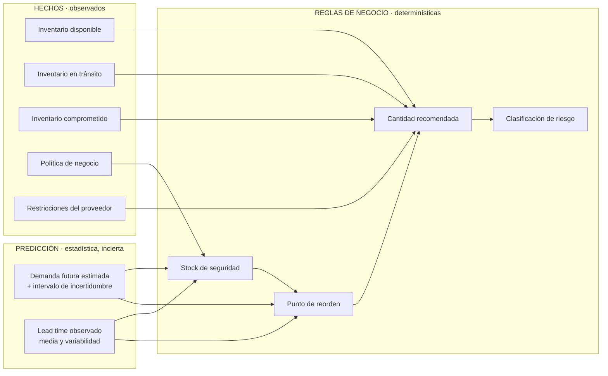

# 06 — Motor de abastecimiento (reglas de negocio)

**Estado:** Versión 1.0 — Etapa 0 (lógica conceptual, no implementada) · **Fecha:** 2026-09-04 · **Versión 1.1** — revisada en la auditoría de Etapa 0.1

> Este documento define **reglas determinísticas**, no un modelo. Todo lo aquí descrito debe poder
> calcularse a mano, verificarse con casos exactos y explicarse a un comprador.

---

## 1. La frontera: predicción vs. reglas de negocio



| | Predicción | Reglas de negocio |
|---|---|---|
| **Naturaleza** | Estadística, con error | Aritmética, exacta |
| **Salida** | Demanda estimada + incertidumbre | Cantidades, fechas, niveles de riesgo |
| **Reproducible** | Sí, con la misma versión de modelo y datos | Siempre, sin excepción |
| **Cambia con** | Reentrenamiento, nuevos datos | Cambio de política, aprobado por el negocio |
| **Se prueba con** | Backtesting y métricas de error | Casos exactos calculados a mano |
| **Se explica** | Con métricas e intervalos | Término a término |

**Consecuencia de diseño:** el módulo `supply_engine` es una biblioteca **pura**. Recibe números,
devuelve números. No accede a la base de datos, no llama a servicios, no usa aleatoriedad y no
consulta ningún LLM. Es lo que permite garantizar RNF-002.

## 2. Advertencia metodológica

Las fórmulas de esta sección proceden de la literatura estándar de gestión de inventarios (ver §12).
Son **puntos de partida verificables**, no fórmulas empresariales definitivas de esta organización.

Todavía **no existen datos suficientes** para afirmar que estas fórmulas son las adecuadas para el
negocio real. Concretamente, están **pendientes de definición por el negocio**:

- el nivel de servicio objetivo,
- el costo de faltante y el costo de mantener inventario,
- la política de revisión (continua o periódica) y su frecuencia,
- los umbrales de clasificación de riesgo,
- el criterio de selección entre varios proveedores.

Mientras no se definan, el sistema los expone como **configuración obligatoria** y **no los sustituye
por valores inventados**. Un parámetro faltante produce una recomendación marcada como no calculable,
no una recomendación con un valor supuesto.

## 3. Notación

| Símbolo | Significado | Origen |
|---|---|---|
| `D̂` | Demanda estimada por periodo | Forecast (ML) |
| `σ_D` | Desviación estándar de la demanda por periodo | Histórico e incertidumbre del forecast |
| `L` | Lead time medio, en periodos | Observado desde `PurchaseOrderReceipt` |
| `σ_L` | Desviación estándar del lead time | Observado |
| `R` | Periodo de revisión | Política |
| `SL` | Nivel de servicio objetivo (probabilidad de no agotar durante el ciclo) | **Política — pendiente del negocio** |
| `z` | Factor de servicio asociado a `SL` | Derivado de `SL` |
| `SS` | Stock de seguridad | Calculado |
| `ROP` | Punto de reorden | Calculado |
| `OH` | Existencia física (on hand) | Inventario |
| `IT_total` | Tránsito total: todo lo pedido y no recibido | Órdenes vigentes (almacenado) |
| `IT_efectivo` | Tránsito que llega dentro del intervalo de protección | Derivado en el cálculo (`DT-012`) |
| `RSV` | Inventario comprometido/reservado | Inventario |
| `IP_decisión` | Posición de inventario de decisión: `OH + IT_efectivo − RSV` | Calculado. **Es la que se compara con el ROP** |
| `IP_contable` | `OH + IT_total − RSV` | Calculado. Para informes y valoración |
| `MOQ` | Cantidad mínima de pedido | Proveedor |
| `M` | Múltiplo de compra | Proveedor |

Todas las cantidades comparten la unidad de medida del producto; todos los tiempos, la misma unidad
temporal (la del forecast).

## 4. Posición de inventario

```
IP_decisión = OH + IT_efectivo − RSV      ← se compara con el punto de reorden
IP_contable = OH + IT_total    − RSV      ← informes y valoración
```

**Este es el error más común en sistemas de reabastecimiento**: comparar el punto de reorden contra
la existencia física en lugar de contra la posición de inventario. El resultado es pedir de nuevo
algo que ya viene en camino, y generar sobreinventario justo en los productos que más se vigilan.

### 4.1 Dos conceptos de tránsito, no uno

`DT-012` distingue dos magnitudes que no deben mezclarse:

| Concepto | Definición | Naturaleza | Dónde vive |
|---|---|---|---|
| **`total_in_transit`** | Todo lo pedido y aún no recibido:<br/>`Σ (quantity_ordered − quantity_received)` sobre líneas de órdenes en estado `ISSUED` o `PARTIALLY_RECEIVED` | **Hecho** sobre el mundo, independiente de cualquier decisión | Almacenado en `Inventory.quantity_in_transit` |
| **`effective_in_transit`** | La parte de ese tránsito que se espera recibir **dentro del intervalo de protección de la decisión que se evalúa** | **Relativa a una decisión**: depende del horizonte de quien pregunta | **Derivado**, calculado por `supply_engine` en cada evaluación. **No es una columna** |

La misma orden es efectiva para un producto con lead time largo y no efectiva para otro con lead time
corto, y puede dejar de serlo mañana sin que nada cambie en la orden. Un valor que depende de la
pregunta no es un estado del inventario, y por eso no se almacena.

### 4.2 Cuál se usa en cada caso

```
IP_contable  = OH + total_in_transit     − RSV     ← qué hay comprometido en total
IP_decisión  = OH + effective_in_transit − RSV     ← qué habrá disponible a tiempo
```

**La comparación con el punto de reorden usa `IP_decisión`.** Usar el total produce un fallo
silencioso y grave: el sistema no recomienda comprar porque "ya viene en camino" algo que llegará
tarde. Ese es exactamente el escenario que causa un desabasto con una orden abierta en el sistema.

`IP_contable` se usa para informes de inventario y valoración, donde la pregunta es qué hay
comprometido, no qué llegará a tiempo.

**Ambos valores se almacenan en `calculation_inputs` de la recomendación**, junto con la diferencia,
para que el planificador vea que hay tránsito no contado y por qué. Ocultar esa diferencia sería
justamente el tipo de opacidad que este sistema trata de eliminar.

**Pendiente de definir en la Fase 4** (`DT-P11`): la fecha de corte exacta y el tratamiento de las
órdenes ya vencidas y no recibidas — ¿una orden atrasada cuenta como efectiva? Requiere criterio de
negocio; no se decide aquí.

## 5. Demanda durante el lead time

```
DDLT = D̂ × L
```

Con demanda variable por periodo (forecast no constante), se usa la **suma del forecast** sobre los
periodos que cubre el lead time, que es más fiel que multiplicar por una media:

```
DDLT = Σ  D̂ₜ   para t en el intervalo del lead time
```

Bajo **revisión periódica**, el intervalo de protección es `L + R`, no solo `L`: entre dos revisiones
no hay oportunidad de reaccionar.

```
DDLT_periódica = Σ D̂ₜ   para t en (L + R)
```

**Decisión pendiente:** si la política será de revisión continua o periódica. Afecta directamente a
esta fórmula y al punto de reorden. Registrada en `knowledge/business-rules.md` como pendiente
(`BR-X02`).

### 5.1 Conversión entre el pronóstico semanal y un lead time en días

El pronóstico se produce en semanas (`DT-008`) y el lead time se registra en días. `L = 10 días` no
son dos semanas ni una y media: **hace falta una regla explícita**, o dos personas implementarán dos
fórmulas distintas y el sistema dará dos cifras para la misma pregunta.

La regla, sus alternativas y su estado están en **`DT-019`** y en `docs/05-motor-predictivo.md` §3.1.
Resumen:

- **Recomendación provisional:** prorrateo uniforme. Con `L = 10 días` y forecast semanal `F₁, F₂`:
  `DDLT = F₁ + (3/7)·F₂`.
- **Qué `L` usa V1:** el **lead time observado**, calculado como la mediana de las últimas
  observaciones válidas del par producto–proveedor, con **fallback al acordado** cuando no hay
  histórico suficiente (`DT-031` §V1-09). Adopta la dirección de `BR-P01`, que sigue siendo regla
  propuesta. El acordado **no se retira del modelo**: es el fallback y la referencia contra la que se
  mide la desviación del proveedor.
- **Supuesto que introduce:** demanda uniforme dentro de la semana (`ASSUMPTION-019`).
- **Estado:** `PENDIENTE DE VALIDACIÓN` — depende del calendario laboral (`BR-X06`).

**Regla de implementación no negociable:** esta conversión vive en **una única función** del
`supply_engine` —conceptualmente `demand_over_horizon(forecast, start_date, days)`— que es el único
punto del sistema autorizado a traducir entre granularidades. Ningún otro módulo, consulta SQL,
informe de Power BI ni pantalla la reimplementa. La regla aplicada y el valor obtenido se registran en
`calculation_inputs`.

## 6. Stock de seguridad

El stock de seguridad cubre la **variabilidad**, no la demanda esperada. Existen dos fuentes de
variabilidad y ambas importan.

### 6.1 Caso base — variabilidad de la demanda

```
SS = z × σ_D × √L
```

### 6.2 Caso completo — variabilidad de demanda y de lead time

Formulación estándar en la literatura de gestión de inventarios:

```
SS = z × √( L × σ_D²  +  D̂² × σ_L² )
```

El segundo término suele dominar cuando el proveedor es poco confiable. En esos casos, el problema no
se resuelve comprando más: **se resuelve con el proveedor**. El sistema debe hacer visible qué parte
del stock de seguridad se debe a la variabilidad del proveedor, porque esa es una palanca de gestión
distinta.

### 6.3 Sobre `z` y el nivel de servicio

`z` deriva del nivel de servicio objetivo bajo un supuesto de distribución (normalmente normal). Dos
advertencias que deben quedar documentadas y no olvidarse en la implementación:

1. El supuesto de normalidad **no se sostiene** en demanda intermitente ni muy asimétrica. Para esos
   segmentos hay que evaluar alternativas (distribuciones adecuadas o métodos empíricos basados en la
   distribución observada del error de pronóstico).
2. Existen dos definiciones distintas de "nivel de servicio" —probabilidad de no agotar en un ciclo
   (*cycle service level*) y proporción de demanda satisfecha (*fill rate*)— y **no son
   intercambiables**. El negocio debe indicar cuál usa. Mientras no lo haga, queda pendiente.

### 6.4 Qué incertidumbre debe cubrir `σ_D` — PENDIENTE

**Aquí conviven cuatro conceptos distintos que no deben confundirse** (`DT-010`):

| # | Concepto | Qué mide | Origen |
|---|---|---|---|
| 1 | Variabilidad de la demanda | Cuánto varía el fenómeno | Serie histórica |
| 2 | Error de pronóstico | Cuánto nos equivocamos al anticiparlo, **a un horizonte dado** | Residuos del backtesting |
| 3 | Incertidumbre declarada por el modelo | Cuánto **cree** el modelo que se equivoca | Intervalo de predicción; puede estar mal calibrado |
| 4 | Variabilidad del lead time (`σ_L`) | Cuánto varía el tiempo de entrega | Histórico de recepciones |

(1) y (2) no son lo mismo: si el modelo predice bien una demanda muy variable, usar (1) sobreestima el
stock necesario. (2) y (3) tampoco: lo que el modelo cree equivocarse solo coincide con lo que se
equivoca si el intervalo está calibrado, y eso hay que comprobarlo. (4) es independiente de las tres.

**Punto técnico determinante.** Lo que hay que cubrir es el error **acumulado sobre el intervalo de
protección** (`L`, o `L + R`), no el error a un paso. Escalar el error de un paso por `√L` **no es una
identidad general**: esa relación se deriva para el método naïve **bajo residuos no correlacionados y
varianza constante**, supuestos que los errores multi-horizonte suelen incumplir. Aplicarla sin
verificarla subestimaría el stock de seguridad precisamente donde más cuesta.

**Estado: `PENDIENTE DE VALIDACIÓN`.** El error de pronóstico es la fuente de información más
pertinente, pero la metodología exacta —error acumulado por backtesting al horizonte, cuantiles
empíricos no paramétricos, o intervalo del modelo previa verificación de calibración— **se decidirá en
la Fase 5 con datos**, comparando su efecto sobre las métricas de **Nivel 2** (`DT-020`): desabastos,
nivel de servicio e inventario medio. Una fuente que reduce el error de pronóstico pero empeora el
servicio no es la correcta.

Mientras tanto, las fórmulas de §6.1 y §6.2 son un **punto de partida verificable**, no la fórmula
oficial del proyecto.

## 7. Punto de reorden

**Revisión continua:**
```
ROP = DDLT + SS
```

**Revisión periódica** (nivel objetivo, *order-up-to level*):
```
S = DDLT_periódica + SS        donde DDLT_periódica = Σ D̂ₜ sobre (L + R)
```
Se usa la **suma del forecast** sobre el intervalo de protección, coherente con §5. Multiplicar por
una media (`D̂ × (L + R)`) solo equivale a esto cuando el forecast es constante, que es justo el caso
que no interesa.

**Señal de reposición:** se recomienda pedir cuando `IP ≤ ROP` (o, en revisión periódica, en cada
revisión hasta alcanzar `S`).

## 8. Cantidad recomendada

Cálculo en tres pasos, todos visibles en la salida:

**Paso 1 — Necesidad bruta**
```
Q_bruta = max(0, (ROP + D̂ × H_cobertura) − IP)
```
donde `IP` es **`IP_decisión`** (§4.2, con `effective_in_transit`) y `H_cobertura` es la cobertura
adicional deseada más allá del punto de reorden (**parámetro de política pendiente del negocio**,
`BR-X13`). En revisión periódica: `Q_bruta = max(0, S − IP_decisión)`.

**Unidades:** `H_cobertura` se almacena en **días** (`InventoryPolicy.target_coverage_days`) y el
forecast está en semanas, de modo que este término **también atraviesa la conversión de granularidad**
y usa la misma función única de `DT-019` que el lead time. `D̂ × H_cobertura` es notación abreviada de
`demand_over_horizon(forecast, fecha, target_coverage_days)`. No hay una segunda regla de conversión.

**Paso 2 — Restricciones del proveedor**
```
Q_moq      = max(Q_bruta, MOQ)                    si Q_bruta > 0
Q_final    = ceil(Q_moq / M) × M                  ajuste al múltiplo de compra
```

**Paso 3 — Verificación de sensatez**
Si `Q_final` genera una cobertura superior al umbral de sobreinventario, se **señala el conflicto**
(típicamente, un MOQ desproporcionado para un producto de baja rotación). El sistema no oculta la
contradicción: la muestra para que el comprador decida, porque puede haber razones comerciales que
el sistema desconoce.

**Restricciones no incluidas en la primera versión** (fuera de alcance, documentado para que no se
implementen por inercia): optimización de lote económico con costos reales, consolidación de órdenes
por proveedor, restricciones de presupuesto y de capacidad de almacén, descuentos por volumen.

## 9. Riesgo de desabasto

Indicadores calculados:

| Indicador | Definición |
|---|---|
| **Cobertura (días)** | `IP / demanda diaria estimada` |
| **Fecha estimada de agotamiento** | Fecha en la que el consumo acumulado previsto agota `IP` |
| **Déficit frente al ROP** | `max(0, ROP − IP)` |
| **Margen frente al lead time** | Días de cobertura − lead time necesario |

Clasificación propuesta (**umbrales pendientes de validación**, no son requisito):

| Nivel | Condición conceptual |
|---|---|
| `CRITICAL` | La cobertura es menor que el lead time: aun pidiendo hoy, habrá desabasto |
| `HIGH` | `IP` por debajo del `ROP` y sin tránsito suficiente que llegue a tiempo |
| `MEDIUM` | `IP` por debajo del `ROP` pero con tránsito que llega dentro del margen |
| `LOW` | `IP` por encima del `ROP` |

La condición de `CRITICAL` es la más importante del sistema: identifica el caso en que **la decisión
óptima ya no existe** y lo que procede es una acción excepcional (proveedor alternativo, envío
urgente, sustitución del producto). Es información distinta de "hay que comprar".

## 10. Riesgo de sobreinventario

| Indicador | Definición |
|---|---|
| **Cobertura excesiva** | Cobertura en días por encima del umbral máximo de política |
| **Cantidad excedente** | `max(0, IP − (demanda prevista en el horizonte de política + SS))` |
| **Capital inmovilizado** | Cantidad excedente × costo unitario (requiere costo registrado) |
| **Riesgo de obsolescencia** | Relevante si el producto tiene vida útil y la cobertura la supera |

Señales adicionales de interés para el planificador: productos sin movimiento en N periodos con
existencia positiva, y productos cuya demanda decrece de forma sostenida mientras el inventario se
mantiene o crece.

## 11. Riesgo asociado al proveedor

Insumos: `SupplierPerformance` (`docs/04-modelo-datos.md`).

| Indicador | Definición |
|---|---|
| **Cumplimiento en tiempo** | % de recepciones dentro de la fecha comprometida |
| **Cumplimiento en cantidad** | % de cantidad recibida sobre pedida |
| **Variabilidad del lead time** | `σ_L` observado |
| **Desviación acordado vs. observado** | `L_observado − L_acordado` |

Uso en las reglas:

1. En el cálculo se usa el **lead time observado**, no el acordado. Usar el contractual cuando el
   proveedor entrega sistemáticamente tarde genera desabastos previsibles y evitables.
2. La variabilidad del proveedor entra en `SS` (§6.2), encareciendo el inventario. Ese sobrecosto es
   atribuible al proveedor y debe poder mostrarse como tal.
3. Cuando hay varios proveedores para un producto, el criterio de selección **está pendiente de
   definición por el negocio** (costo vs. lead time vs. confiabilidad). Mientras tanto, el sistema
   sugiere el proveedor preferente marcado y **muestra las alternativas con sus indicadores** para que
   el comprador decida. No se inventa una función de puntuación.

## 12. Origen y justificación de las fórmulas

Las expresiones de §5–§8 son formulaciones estándar de la teoría de control de inventarios,
ampliamente documentadas en la literatura de referencia del área (entre otras, *Inventory and
Production Management in Supply Chains*, de Silver, Pyke & Thomas; y los tratamientos habituales de
gestión de operaciones y cadena de suministro). La combinación de variabilidad de demanda y de
lead time en el stock de seguridad (§6.2) es la formulación clásica para lead time estocástico.

Ninguna de estas fórmulas ha sido validada todavía **contra datos de esta organización**. Su estado
es `PROPUESTA` hasta que:

1. exista un histórico real o sintético representativo,
2. una **simulación retrospectiva** muestre su comportamiento medido con las métricas de **Nivel 2**
   (`DT-020`, `docs/05-motor-predictivo.md` §9.4): desabastos, nivel de servicio, inventario medio,
   exceso y órdenes urgentes,
3. el negocio confirme los parámetros de política.

**Cualquier fórmula específica de la empresa que aparezca más adelante sustituirá a estas**, y se
registrará con su origen en `knowledge/business-rules.md`.

> **Sobre `DT-031` y este estado.** Que `DT-031` esté `ACEPTADA` desde el 2026-09-21 **no levanta
> ninguna de las tres condiciones de arriba**. Lo aceptado allí es que esas fórmulas, con parámetros
> provisionales declarados, son **las reglas de V1**; no que hayan sido validadas contra datos de esta
> organización ni que el negocio haya confirmado sus parámetros. Las tres condiciones siguen abiertas
> y este estado `PROPUESTA` sigue siendo el correcto para las fórmulas como tales.

## 13. Explicabilidad obligatoria

Toda recomendación debe exponer, además del resultado:

```
Producto · Proveedor sugerido · Cantidad recomendada · Fecha sugerida · Urgencia
├─ Forecast utilizado (id, versión de modelo, as_of_date, método)
├─ Demanda durante lead time         = ...
├─ Lead time aplicado (observado)    = ...  (acordado: ...)
├─ Variabilidad de demanda σ_D       = ...
├─ Variabilidad de lead time σ_L     = ...
├─ Nivel de servicio objetivo / z    = ...
├─ Stock de seguridad                = ...
├─ Punto de reorden                  = ...
├─ Posición de inventario (decisión) = OH ... + IT_efectivo ... − RSV ...
├─ Tránsito total / efectivo         = ... / ...   (diferencia: ...)
├─ Cantidad bruta                    = ...
├─ Ajustes aplicados (MOQ, múltiplo) = ...
└─ Versión del motor de reglas       = ...
```

Este desglose es un **requisito**, no una función de depuración. Sin él, el planificador no puede
confiar en la recomendación (riesgo R-08), el sistema no es auditable y una recomendación pasada no
puede reconstruirse (RF-024).

## 14. Casos límite de prueba obligatorios

| Caso | Comportamiento esperado |
|---|---|
| Demanda estimada cero | No recomienda compra; señala posible producto sin rotación |
| Inventario cero y demanda positiva | Riesgo `CRITICAL`; recomienda con máxima urgencia |
| Lead time cero | Fórmulas estables; `DDLT = 0`, `SS` solo por variabilidad del lead time (`z × D̂ × σ_L`) |
| `σ_D = 0` y `σ_L = 0` | `SS = 0`; `ROP = DDLT` |
| Tránsito **efectivo** superior al ROP | No recomienda compra |
| Tránsito total superior al ROP pero **efectivo** insuficiente (la orden llega tarde) | **Sí recomienda**, y señala el tránsito no contado. Caso central de `DT-012` |
| Lead time no múltiplo de 7 días con forecast semanal | Aplica la conversión de §5.1 y registra la regla usada |
| MOQ mayor que la necesidad | Recomienda **al menos** el MOQ, ajustado al múltiplo según el Paso 2 de §8, y **señala** la sobrecobertura. Con `MOQ = 25` y `M = 10` la cantidad es **30**, no 25: cuando el MOQ no es múltiplo del múltiplo de compra, el mínimo pedible real es `⌈MOQ/M⌉·M`. El desglose debe distinguir cuánto impone el MOQ y cuánto el redondeo (`DT-031` §V1-06) |
| Múltiplo de compra grande | Redondeo hacia arriba correcto |
| Producto sin proveedor activo | No recomienda; señala el dato faltante. V1 exige además que el proveedor sea el **preferente activo**: si el producto tiene proveedores pero ninguno preferente, tampoco recomienda (`DT-031` §V1-10) |
| Nivel de servicio no definido | **No calcula** `SS`; marca la recomendación como no calculable, indicando el parámetro que falta (`BR-009`). **V1 puentea este caso** con `z_v1 = 1,65` **solo dentro del entorno sintético** (`DT-031` §V1-05): fuera de él, la fila sigue rigiendo sin excepción |
| Sin forecast disponible | Usa baseline y lo declara; si tampoco hay, no recomienda |
| Producto inactivo o descontinuado | Excluido del cálculo |
| Cantidades negativas de inventario | Rechazado como inconsistencia de datos, no calculado. V1 no genera el caso: el dataset mantiene `on_hand ≥ 0` (`DT-031` §V1-13). No confundir con `IP_decisión`, que **sí** puede ser negativo de forma legítima |

Cada uno de estos casos tendrá una prueba unitaria con resultado esperado calculado a mano.

> **Reglas provisionales de V1.** Mientras los parámetros de §15 sigan pendientes, `DT-031` define
> **trece reglas provisionales** que hacen calculable esta cadena sobre el dataset sintético:
> necesidad bruta, posición de inventario, horizonte de cobertura, demanda sobre el horizonte, stock
> de seguridad, MOQ y múltiplo, escenarios mínimos, alcance del validador, lead time observado,
> elección de proveedor, y tres reglas de alcance que acotan el dataset — **sin diferenciación ABC**
> (`V1-11`), **sin sobre-recepción** (`V1-12`) y **sin inventario negativo** (`V1-13`).
>
> Las trece quedaron confirmadas por el responsable el 2026-09-21. **Siguen sin ser políticas de la
> organización** y su salida no puede presentarse como una recomendación de negocio: `BR-009` sigue
> rigiendo fuera del entorno sintético.

## 15. Parámetros pendientes de definición por el negocio

Bloquean la parametrización definitiva. Registrados también en `knowledge/business-rules.md`:

1. Nivel de servicio objetivo, y **qué definición** de nivel de servicio se usa (§6.3).
2. Política de revisión: continua o periódica; si periódica, con qué frecuencia.
3. Horizonte de cobertura deseado más allá del punto de reorden (`H_cobertura`) — `BR-X13`.
4. Umbrales de clasificación de riesgo de desabasto y de sobreinventario.
5. Costo de faltante y costo de mantener inventario.
6. Criterio de selección entre proveedores alternativos (`BR-X05`; en V1 se usa el preferente activo, `DT-031` §V1-10, sin puntuación ni ranking).
7. Calendario laboral y festivos (afecta a la conversión entre días naturales y hábiles).
8. Diferenciación de política por clase ABC o por categoría, si aplica (`BR-X07`; V1 aplica **política única**, `DT-031` §V1-11, porque `abc_class` queda nulo por `DT-029`).
9. Calendario laboral, para fijar la regla de conversión entre pronóstico semanal y lead time en días
   (`BR-X06`, `DT-019`).
10. Tratamiento de las órdenes vencidas y no recibidas en el cálculo del tránsito efectivo
    (`DT-P11`, `DT-012`).
