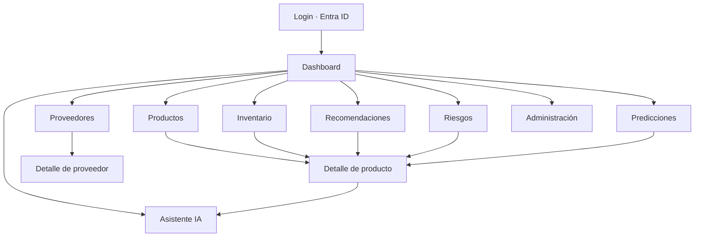
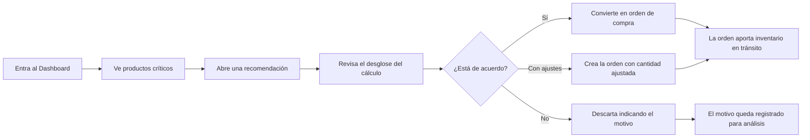

# 08 — Diseño del frontend

**Estado:** Versión 1.0 — Etapa 0 (diseño, **no implementado**) · **Fecha:** 2026-09-03 · **Versión 1.1** (2026-09-30) — §11, vistas frente a los contratos de la Etapa 2; §§1–10 no cambian · **Versión 1.2** (2026-10-05) — Fase 7 autorizada, no implementada: §12, concreción y diferencias con §1–§10 (`DT-070`); ruta de la explicación corregida en §11; notas en §4.1 y §8

> No se escribe código React en esta etapa. Este documento define vistas, componentes y flujos.

---

## 1. Principio de diseño

La interfaz sirve a una pregunta concreta que un planificador se hace cada mañana:
**"¿qué necesita mi atención hoy y por qué?"**

De ahí se derivan tres reglas:

1. **Priorizar, no enumerar.** La pantalla inicial no es un catálogo: es una lista de acciones
   ordenadas por urgencia.
2. **Toda cifra es explicable.** Cualquier número relevante permite ver de dónde sale.
3. **El sistema recomienda, la persona decide.** No hay ninguna acción automática de compra.

## 2. Usuarios y sus tareas

| Rol | Necesidad principal |
|---|---|
| `PLANNER` | Ver qué comprar hoy, entender por qué, decidir y registrar la decisión |
| `ANALYST` | Analizar históricos, calidad del pronóstico y desempeño de proveedores |
| `ADMIN` | Mantener maestros, políticas, cargas de datos y usuarios |
| `VIEWER` | Consultar el estado de inventario y riesgos |

## 3. Mapa de navegación

## 4. Vistas

### 4.1 Login
*(Fase 7, `DT-070`: autenticación simulada con token `dev-…` validado con `/me`; Entra ID llega con la Fase 8. Ver §12.)*
- Autenticación con Microsoft Entra ID; no hay formulario de contraseña propio.
- Redirección al proveedor de identidad y retorno con token; sesión renovada de forma silenciosa.
- Estados: no autenticado · autenticando · error de autenticación · sin permisos asignados.
- **Regla:** no se muestra ningún dato antes de que el token esté validado.

### 4.2 Dashboard
Vista de entrada. Responde a "¿qué requiere atención?".

- **Tarjetas de estado:** productos críticos, recomendaciones abiertas por urgencia, órdenes
  pendientes de recepción, productos en sobreinventario, cobertura media del catálogo.
- **Lista priorizada de acciones:** las recomendaciones más urgentes, con acceso directo al detalle.
- **Estado del sistema:** fecha del último recálculo, versión de modelo vigente y proporción de SKU
  que usó baseline en lugar de modelo. Esto último no es un detalle técnico: si el 40 % del catálogo
  se está prediciendo con baseline, el planificador debe saberlo.
- **Vacío inicial:** si aún no hay datos ni cálculos, la vista explica qué falta en lugar de mostrar ceros.

### 4.3 Productos
- Tabla con búsqueda por SKU o nombre, filtros por categoría, estado, clase ABC y rotación.
- Columnas: SKU, nombre, categoría, existencia, cobertura, riesgo, recomendación abierta.
- Paginación en servidor; ordenación por columna.
- Acciones según rol: crear, editar, desactivar (`ADMIN`).

### 4.4 Inventario
- Posición de inventario del catálogo: `on hand`, comprometido, en tránsito, disponible, posición,
  cobertura en días.
- Filtro destacado: **"por debajo del punto de reorden"**.
- Acceso al histórico de movimientos de cada producto.
- Registro de movimientos (`PLANNER`), con la aclaración visible de que los movimientos son
  inmutables y las correcciones se registran como ajustes.

### 4.5 Proveedores
- Listado con indicadores: cumplimiento en tiempo, cumplimiento en cantidad, lead time medio y su variabilidad.
- **Detalle de proveedor:** productos suministrados con sus condiciones (MOQ, múltiplo, costo, lead
  time acordado), evolución del lead time observado frente al acordado, órdenes recientes y su estado.
- La comparación acordado vs. observado es la información de gestión más útil de esta vista.

### 4.6 Predicciones
- Serie de demanda: histórico y predicción en un mismo gráfico, con **banda de incertidumbre** visible.
- Metadatos siempre presentes: versión de modelo, `as_of_date`, método usado (modelo / baseline /
  método para demanda intermitente) y confianza declarada.
- Filtros por producto, categoría y horizonte.
- **Regla de honestidad visual:** una predicción con confianza baja se muestra como tal (banda ancha
  y aviso explícito), nunca con la misma apariencia que una predicción fiable.

### 4.7 Recomendaciones
- Lista priorizada por urgencia, con filtros por estado, categoría, proveedor y urgencia.
- Por fila: producto, cantidad recomendada, proveedor sugerido, fecha sugerida, urgencia, estado.
- Acciones (`PLANNER`): marcar como atendida, descartar **con motivo obligatorio**, o convertir en
  orden de compra.
- Selección múltiple para acciones en lote, con confirmación explícita.
- El motivo de descarte no es burocracia: es el dato que permitirá medir si el sistema es útil y por
  qué el planificador discrepa.

### 4.8 Detalle de producto
Vista central del sistema. Reúne todo lo relativo a un SKU:

1. **Cabecera:** SKU, nombre, categoría, unidad, estado, clasificación de serie.
2. **Posición de inventario:** desglose de existencia, comprometido y tránsito (con las órdenes que lo componen).
3. **Histórico y predicción:** gráfico combinado con banda de incertidumbre y marcas de periodos con desabasto.
4. **Recomendación vigente con desglose completo** del cálculo (§13 de `docs/06-motor-abastecimiento.md`):
   cada término visible, no solo el resultado.
5. **Riesgos:** nivel, cobertura, fecha estimada de agotamiento, excedente si aplica.
6. **Proveedores:** alternativas con sus condiciones y desempeño.
7. **Explicación en lenguaje natural:** botón que solicita la explicación al asistente, con las
   fuentes citadas.

### 4.9 Riesgos
- Dos pestañas: **desabasto** y **sobreinventario**.
- Desabasto: nivel, cobertura, fecha estimada de agotamiento, déficit frente al punto de reorden.
  Los `CRITICAL` (donde ya no llega a tiempo aunque se pida hoy) se destacan de forma inequívoca.
- Sobreinventario: cobertura excesiva, cantidad excedente, capital inmovilizado.

### 4.10 Asistente IA
- Conversación con historial de la sesión.
- Cada respuesta muestra **sus fuentes**: qué datos del sistema y qué documentos se usaron.
- Se puede abrir desde el detalle de producto, con contexto precargado.
- Estados explícitos: pensando, sin datos suficientes, servicio no disponible.
- **Aviso permanente y visible:** las cifras provienen del motor de cálculo; el asistente las explica,
  no las calcula.
- Degradación: si el servicio generativo no está disponible, el resto de la aplicación funciona igual.

### 4.11 Administración (`ADMIN`)
- Maestros: productos, categorías, proveedores, relaciones producto–proveedor.
- **Políticas de inventario:** con aviso explícito de que un cambio de política afecta a todos los
  cálculos posteriores y de que se guarda como nueva versión con vigencia.
- Cargas de datos: subida de archivos, `data_origin` obligatorio, resultado con filas rechazadas y motivo.
- Ejecuciones: historial de recálculos y su resultado.
- Usuarios y roles: consulta del mapeo con Entra ID.

## 5. Componentes principales

| Componente | Responsabilidad |
|---|---|
| `AppShell` | Layout, navegación, estado de sesión |
| `AuthProvider` | Adquisición y renovación de token; expone identidad y roles |
| `RoleGate` | Oculta o deshabilita elementos según rol (**refuerzo visual, nunca seguridad**) |
| `DataTable` | Tabla con paginación en servidor, ordenación, filtros y selección múltiple |
| `FilterBar` | Filtros persistentes en la URL (para compartir vistas) |
| `KpiCard` | Indicador con valor, variación y acceso al detalle |
| `TimeSeriesChart` | Histórico + predicción + banda de incertidumbre + marcas de eventos |
| `ForecastMetaBadge` | Versión de modelo, método, `as_of_date`, confianza |
| `RiskBadge` | Nivel de riesgo con codificación **no dependiente solo del color** |
| `RecommendationCard` | Resumen accionable de una recomendación |
| `CalculationBreakdown` | Desglose término a término del cálculo. Componente clave para la confianza del usuario |
| `SupplierPerformancePanel` | Indicadores de proveedor y comparación acordado vs. observado |
| `AssistantPanel` | Conversación, contexto, fuentes citadas |
| `AsyncJobStatus` | Seguimiento de procesos asíncronos (recálculos, cargas) |
| `EmptyState` / `ErrorState` | Estados vacíos y de error con explicación accionable |

## 6. Flujos de usuario

### 6.1 Flujo principal — revisión diaria del planificador

### 6.2 Flujo de investigación
Detectar una anomalía → abrir el detalle del producto → revisar histórico y predicción → comprobar el
desempeño del proveedor → pedir explicación al asistente → decidir.

### 6.3 Flujo de carga de datos
Administración → subir archivo → indicar origen → seguimiento del proceso → revisar filas rechazadas
→ corregir y recargar.

### 6.4 Flujo de recálculo
Disparar recálculo → confirmación con alcance → seguimiento asíncrono → aviso al terminar → datos actualizados.

## 7. Estado y datos

- **Estado del servidor:** gestionado con una librería de *data fetching* con caché e invalidación
  explícita tras acciones de escritura.
- **Estado de UI:** local al componente. Sin almacén global salvo sesión y preferencias.
- **Filtros en la URL:** para que una vista pueda compartirse y recuperarse.
- **Sin lógica de negocio en el cliente:** el frontend no recalcula puntos de reorden ni stock de
  seguridad. Muestra lo que la API entrega. Duplicar la fórmula en el cliente rompería RNF-001 y
  produciría discrepancias silenciosas.

## 8. Autenticación en el cliente

*(Fase 8. En la Fase 7 la autenticación es simulada, `DT-070` y §12.)*

- MSAL para React con **flujo de código de autorización con PKCE**, que es el recomendado para SPA.
- Tokens en memoria; renovación silenciosa; sin almacenar credenciales.
- El token se adjunta a cada llamada a la API.
- `RoleGate` mejora la experiencia ocultando lo que el usuario no puede usar, pero **la autorización
  real vive en el backend** (RS-003).

## 9. Requisitos transversales de UI

| Aspecto | Criterio |
|---|---|
| **Accesibilidad** | Contraste suficiente, navegación por teclado, etiquetas ARIA; el estado nunca se comunica solo por color |
| **Responsividad** | Escritorio como escenario principal; tabletas soportadas; móvil solo para consulta |
| **Rendimiento** | Paginación en servidor; sin cargar el catálogo completo en el cliente |
| **Errores** | Mensaje comprensible + acción sugerida; nunca detalles técnicos internos |
| **Estados de carga** | Esqueletos, no pantallas en blanco |
| **Idioma** | Interfaz en español; código en inglés |
| **Formatos** | Fechas y números en el formato local del negocio; unidades siempre visibles |

## 10. Pendiente de definición

- Identidad visual y sistema de diseño (¿existe una guía corporativa?).
- ¿Se requiere modo oscuro?
- ¿Uso real en dispositivos móviles en almacén?
- Necesidad de exportación a Excel desde las vistas.
- ¿Notificaciones dentro de la aplicación para riesgos críticos?
- Idiomas adicionales.

## 11. Etapa 2 — vistas frente a los contratos

*Añadido el 2026-09-30. **No se escribe código React** hasta que los contratos de `docs/07` §7 estén
implementados y estables (Fase 7). Esta tabla fija qué consume cada vista y de dónde sale cada dato.*

| Vista | Datos | Endpoints (`docs/07` §7.2) | Origen del dato | Roles | En V1 |
|---|---|---|---|---|---|
| Productos | Catálogo y estado | `/products` | Hechos (maestros) | Los cuatro | Sí |
| Detalle de producto | Maestro, inventario, proveedores, consumo, forecast, evaluación del motor | `/products/{id}`, `/products/{id}/history`, `/products/{id}/forecast`, `/products/{id}/recommendation` | Hechos · ML (forecast) · motor (evaluación) | Los cuatro; el histórico, ANALYST+ | Sí |
| Inventario | Existencia, tránsito total, posición contable, líneas abiertas | `/inventory`, `/inventory/{product_id}` | Hechos | Los cuatro | Sí, sin filtro «bajo el punto de reorden» (`docs/07` §7.3) |
| Predicciones | Serie con banda de incertidumbre, método, versión | `/forecasts`, `/products/{id}/forecast` | ML / baseline | Los cuatro | Tras U3 |
| Recomendaciones | Lista y detalle con `CalculationBreakdown` | `/recommendations`, `/recommendations/{id}` | Motor | Los cuatro | Tras U4; **sin** urgencia ni acciones |
| Explicación | Texto verificado | `GET /api/v1/recommendations/{id}/explanation` (U6, `DT-068`; hasta el 2026-10-05 esta fila decía `/assistant/explain/{id}`) | Plantilla determinista que explica cifras del motor | Los cuatro | Tras U6 |
| Dashboard, Riesgos | Críticos, sobreinventario | — | Motor | — | **Aplazadas**: dependen de `BR-X03` |
| Proveedores, Administración | — | — | — | — | **Aplazadas** con sus endpoints |

**En V1 la interfaz no tiene acciones**: la API es de solo lectura. Cuando la respuesta trae
`notices` `SYNTHETIC_DATA` o `V1_PROVISIONAL_POLICY`, la vista lo muestra de forma permanente y
visible: la cantidad es provisional y no es una recomendación de negocio (`DT-031`). La vista de
entrada que pedía RNF-012 («ordenada por urgencia») no puede construirse hasta que exista una escala
de urgencia (`BR-X03`); mientras tanto, la lista de recomendaciones se ordena por los campos que la
API admite y lo dice.

## 12. Fase 7 — concreción y diferencias con §1–§10 (`DT-070`)

*Añadido el 2026-10-05 al autorizar la Fase 7. **Fase 7 autorizada para implementación; no implementada.**
Las decisiones completas están en `DT-070` (`docs/15`). Esta sección dice qué cambia, para la V1, respecto
de §1–§10, que siguen describiendo el sistema completo.*

| § | Dice | En la Fase 7 (V1) |
|---|---|---|
| §3, §4.1, §8 | Login con Entra ID, MSAL y PKCE | **Autenticación simulada** (RF-017): token `dev-…` validado con `GET /api/v1/me`, solo en memoria; al recargar se vuelve a entrar; 401 → login; 403 → «Sin permiso para ver esto». MSAL y Entra ID llegan con la Fase 8 tras el mismo `AuthProvider` |
| `docs/03` (React → FastAPI) | CORS restringido a orígenes conocidos | Sin CORS: el servidor de desarrollo hace de **proxy** de `/api` hacia `127.0.0.1:8000`; en producción, mismo origen detrás de un proxy inverso (Fase 12) |
| §4.2, US-071, RNF-012 | Dashboard priorizado por urgencia | **Fuera de la Fase 7** (`BR-X03`); no aparece como funcionalidad activa |
| §4.7, US-073 | Atender, descartar o convertir; urgencia y estado | Lista y detalle **sin acciones** (V1 de solo lectura, `DT-059`) y sin urgencia; orden por `sku`, `recommended_quantity` o `suggested_order_date`, y la vista lo dice |
| §4.4, US-072 | Filtro «por debajo del punto de reorden», cobertura en días | Fuera (`docs/07` §7.3, `DT-P19`, `BR-X03`) |
| §4.6, US-075 | Banda de incertidumbre; filtro por horizonte | Banda **nominal** (`confidence_level`, hoy 0.80) de los baselines de U3, sin afirmar cobertura validada (US-055, Fase 5); aviso con `INSUFFICIENT_HISTORY`; historia y forecast separados; sin filtro de horizonte (la API no lo tiene) |
| §4.3 | Columnas existencia, cobertura, riesgo, recomendación abierta; filtros ABC y rotación | Columnas del maestro que entrega `/products`; sin ABC ni rotación (`DT-029`), sin cobertura ni riesgo |
| §4.3, §4.6, §4.7 | Filtros por categoría y proveedor | Solo por identificador explícito: la API no tiene `/categories` ni `/suppliers` y la interfaz **no fabrica catálogos** |
| §4.8.5, §4.9, US-076 | Riesgos | Fuera (`BR-X03`) |
| §4.8.6, §4.5 | Proveedores con desempeño | Solo las condiciones de `/products/{id}`; vista de proveedores fuera |
| §4.8.7, §4.10 | Explicación del asistente con fuentes citadas | Explicación determinista de U6 (`GET /recommendations/{id}/explanation`), sin fuentes ni chat; el asistente es de la Fase 10 |
| §4.11 | Administración | Fuera (escrituras); solo el detalle de una ejecución (`/runs/{id}`) como enlace para PLANNER y ADMIN |
| §9 Formatos | Formato local del negocio | `es-MX` y zona `America/Mexico_City`; cifras sin `float` y sin separador de miles (coinciden con la narrativa de U6) |
| §10 | Identidad visual pendiente | Estilo neutro con tokens de diseño; la identidad corporativa sigue pendiente |

**Vistas de la Fase 7:** Productos, Inventario, Detalle de producto (con historial para ANALYST, PLANNER y
ADMIN), Recomendaciones (lista y detalle con `CalculationBreakdown` y explicación) y Predicciones. Partición
en unidades F7a–F7d (`DT-070` punto 24).
