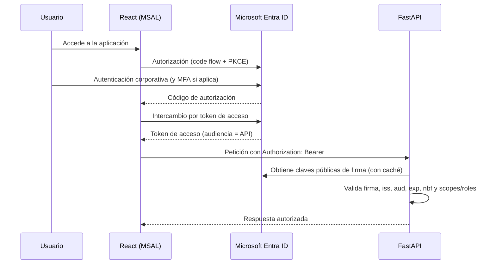

# 10 — Seguridad

**Estado:** Versión 1.0 — Etapa 0 (diseño, **no implementado**) · **Fecha:** 2026-09-04 · **Versión 1.1** — revisada en la auditoría de Etapa 0.1

> No se crean credenciales, aplicaciones de Entra ID ni recursos de Azure en esta etapa.
> Antes de implementar, verificar la documentación oficial vigente de Microsoft Entra ID.

---

## 1. Principios

1. **Autenticado por defecto.** Toda ruta requiere identidad; las excepciones se declaran una a una.
2. **Privilegio mínimo.** Cada componente y cada credencial tienen el permiso justo.
3. **Sin secretos en el repositorio.** Nunca, bajo ninguna circunstancia.
4. **Identidad antes que claves.** Se prefiere Entra ID e identidad administrada a las claves de API.
5. **La autorización vive en el servidor.** Lo que el frontend oculta es comodidad, no seguridad.
6. **Defensa en profundidad.** Ninguna capa es la única barrera.
7. **Auditabilidad.** Las acciones sensibles dejan rastro.

## 2. Microsoft Entra ID

### 2.1 Registros de aplicación previstos

| Registro | Tipo | Función |
|---|---|---|
| **Frontend SPA** | Aplicación pública | Autentica al usuario y obtiene un token para la API |
| **API backend** | Aplicación web / API protegida | Expone un *scope* propio y valida los tokens recibidos |
| **CI/CD** | Identidad federada (OIDC) | Permite a GitHub Actions acceder a Azure **sin secretos de larga vida** |
| **Servicios** | Identidad administrada | Acceso del backend al almacén de secretos, Azure OpenAI y AI Search |

### 2.2 Flujo de autenticación



**Flujo elegido:** código de autorización con PKCE, que es el recomendado para aplicaciones de página
única. Se descarta el flujo implícito por sus riesgos conocidos de exposición de tokens.

### 2.3 Validación del token en el backend

Obligatorio, en cada petición y sin excepciones:

1. Firma verificada contra las claves públicas publicadas por el emisor (con caché y rotación).
2. `iss` (emisor) corresponde al *tenant* esperado.
3. `aud` (audiencia) corresponde **a esta API**. Un token válido para otra aplicación no sirve aquí.
4. `exp` / `nbf` dentro de vigencia, con margen de reloj acotado.
5. Presencia del *scope* o del *app role* requerido por el endpoint.
6. Algoritmo de firma esperado; se rechazan tokens sin firma o con algoritmo no permitido.

**Nunca** se confía en reclamaciones no verificadas ni se decodifica el token sin validar la firma.

## 3. Autorización

### 3.1 Roles conceptuales propuestos

**Pendientes de validación con el negocio** (RS-002). Son una propuesta razonable, no un requisito.

| Rol | Descripción | Alcance |
|---|---|---|
| `ADMIN` | Administra el sistema | Todo: maestros, políticas, cargas, usuarios, configuración |
| `PLANNER` | Planificador / comprador | Opera: registra movimientos y órdenes, resuelve recomendaciones, dispara recálculos |
| `ANALYST` | Analista | Consulta y analiza: históricos, modelos, desempeño de proveedores. Sin acciones operativas |
| `VIEWER` | Consulta | Solo lectura de estado, riesgos y recomendaciones |

Matriz detallada en `docs/07-api.md` §3.

### 3.2 Implementación

- Los roles se definen como **app roles** en el registro de la API en Entra ID y se asignan a grupos
  o usuarios; llegan en el token como reclamaciones.
- El backend resuelve identidad y roles desde el token y los comprueba mediante una dependencia
  aplicada a cada endpoint.
- **Sin rol asignado ⇒ sin acceso.** No hay rol por defecto implícito.
- El frontend usa los roles para adaptar la interfaz; esa adaptación **no sustituye** la verificación
  en el servidor (RS-003).

### 3.3 Pendiente de definición

- Mapeo entre grupos organizacionales existentes y los cuatro roles.
- ¿Se requiere segmentación por categoría, línea de producto o ubicación (autorización por ámbito de datos)?
- ¿Quién aprueba la asignación de roles y con qué procedimiento?
- ¿Hay requisito de MFA o acceso condicional?

## 4. Tokens

| Aspecto | Criterio |
|---|---|
| **Almacenamiento en el cliente** | En memoria; renovación silenciosa. Evitar `localStorage` por exposición a XSS |
| **Transmisión** | Solo por HTTPS, en la cabecera `Authorization` |
| **Vigencia** | La definida por la política del *tenant*; el backend no la extiende |
| **Revocación** | Gestionada por Entra ID; el backend no mantiene sesiones propias |
| **Registro en logs** | **Nunca** se registran tokens, completos ni parciales |
| **Servicio a servicio** | Identidad administrada o credenciales federadas, no claves compartidas |

## 5. Gestión de secretos

### 5.1 Regla absoluta

**Ningún secreto en el repositorio.** Ni claves de API, ni tokens, ni cadenas de conexión con
credenciales, ni certificados, ni archivos `.env` reales. Solo `.env.example` con valores ficticios
evidentes.

### 5.2 Dónde vive cada secreto

| Entorno | Almacén |
|---|---|
| Desarrollo local | Archivo `.env` local, **excluido por `.gitignore`** |
| CI/CD | *Secrets* y *environments* de GitHub, con acceso restringido |
| Azure | Almacén de secretos gestionado, accedido mediante identidad administrada. Producto **sin fijar** (`DT-022`, `PROPUESTA`); Azure Key Vault es el candidato natural |

### 5.3 Controles

- `.gitignore` cubre `.env`, `*.pem`, `*.key`, `secrets/` y equivalentes desde el primer commit.
- **Detección de secretos en CI**: el pipeline falla si detecta uno.
- Rotación periódica de las credenciales que existan, y rotación inmediata ante sospecha.
- Si un secreto llega a commitearse: se revoca **primero** y se limpia después. Borrarlo del
  historial no lo invalida; asumir que está comprometido.

## 6. Variables de entorno

Toda configuración sensible o dependiente del entorno se lee de variables. Conjunto previsto
(nombres orientativos, sin valores):

```
DATABASE_URL                 # sin credenciales embebidas en el repositorio
ENTRA_TENANT_ID
ENTRA_API_CLIENT_ID
ENTRA_API_AUDIENCE
AZURE_OPENAI_ENDPOINT
AZURE_OPENAI_DEPLOYMENT
AZURE_SEARCH_ENDPOINT
AZURE_SEARCH_INDEX
AZURE_ML_ENDPOINT
APP_ENV                      # dev | staging | prod
LOG_LEVEL
CORS_ALLOWED_ORIGINS
```

**Regla:** la aplicación falla al arrancar si falta una variable obligatoria. Es preferible un fallo
inmediato y explícito a un arranque con configuración incompleta que falle más tarde de forma confusa.

## 7. Acceso a PostgreSQL

| Control | Criterio |
|---|---|
| **Usuario de aplicación** | Privilegios mínimos: `SELECT`/`INSERT`/`UPDATE` sobre las tablas necesarias. **Sin DDL** |
| **Usuario de migraciones** | Credencial separada, usada solo por el proceso de migración |
| **Usuario de lectura analítica** | Solo lectura, sobre las vistas expuestas a Power BI |
| **Conexión** | TLS obligatorio; sin acceso público a la instancia |
| **Contraseñas** | En el almacén de secretos; nunca en el código ni en la URL versionada |
| **Consultas** | Siempre parametrizadas. Prohibida la concatenación de SQL con entrada del usuario |
| **Datos en no productivos** | Sintéticos o anonimizados; nunca datos reales sin aprobación (RS-012) |

## 8. Acceso a servicios de Azure

| Servicio | Método preferido |
|---|---|
| Almacén de secretos (`DT-022`) | Identidad administrada |
| Azure OpenAI | Entra ID (identidad administrada); clave solo como último recurso |
| Azure AI Search | Entra ID; consultas con filtro de permisos aplicado en origen |
| Azure Machine Learning | Identidad administrada para invocar el endpoint |
| Desde GitHub Actions | **OIDC con credenciales federadas**, sin secretos de larga vida |

El acceso de CI a Azure mediante OpenID Connect elimina la necesidad de almacenar credenciales
persistentes en GitHub: el flujo intercambia un token de corta vida emitido por GitHub por un token
de Azure. Es la práctica documentada tanto por GitHub como por Microsoft y debe preferirse siempre.

## 9. Protección de la API

| Control | Criterio |
|---|---|
| **HTTPS obligatorio** | Sin HTTP plano en ningún entorno desplegado |
| **CORS** | Lista explícita de orígenes; sin comodines en producción |
| **Validación de entrada** | Esquemas Pydantic en todas las entradas; rechazo de campos no esperados |
| **Límite de tasa** | Por usuario y endpoint; estricto en los endpoints del asistente por su costo |
| **Límite de tamaño** | De cuerpo de petición y de archivos cargados |
| **Cabeceras de seguridad** | HSTS, `X-Content-Type-Options`, `Referrer-Policy`, CSP en el frontend |
| **Errores** | Mensaje genérico al cliente; detalle solo en los logs internos |
| **Documentación interactiva** | Deshabilitada en producción |
| **Dependencias** | Versiones fijadas y análisis de vulnerabilidades en CI (RS-013) |
| **Carga de archivos** | Tipo y tamaño validados; procesamiento aislado; sin ejecución |

## 10. Seguridad de la IA generativa

Resumen; detalle en `docs/09-ia-generativa.md` §9.

1. El contenido recuperado y la entrada del usuario se tratan como **datos**, nunca como instrucciones (RS-011).
2. El asistente opera con la identidad del usuario y hereda sus permisos (RS-004).
3. El filtro de permisos se aplica **en la consulta** al índice, no después de recuperar.
4. La salida se verifica: toda cifra debe existir en el contexto entregado (RS-010).
5. El servicio generativo **no tiene acceso de escritura** a la base de datos.
6. En el prompt solo se incluye lo necesario para responder.
7. Batería de pruebas con intentos de inyección incrustados en documentos y preguntas.

## 11. Auditoría

Se registran, con usuario, marca de tiempo, acción y entidad afectada:

- Inicio de sesión y fallos de autorización.
- Cambios en maestros (productos, proveedores, relaciones).
- **Cambios en políticas de inventario** (afectan a todos los cálculos posteriores).
- Cargas de datos y su origen.
- Resolución de recomendaciones (aceptada, descartada con motivo, convertida en orden).
- Cambios de estado de órdenes de compra y recepciones.
- Cambios de rol o de permisos.
- Disparos de recálculo y promoción de modelos.

**Características:** el registro de auditoría no es modificable desde la aplicación; no contiene
secretos ni datos personales innecesarios; su periodo de retención está **pendiente de definición**.

## 12. Logging

| Sí se registra | Nunca se registra |
|---|---|
| Identificador de correlación | Tokens, claves, contraseñas |
| Identificador de usuario (no su nombre ni su correo) | Cuerpos completos de petición en producción |
| Endpoint, método, código de estado, duración | Datos personales innecesarios |
| Errores con contexto técnico interno | Cadenas de conexión |
| Eventos de negocio relevantes | Contenido íntegro de documentos recuperados |

Formato estructurado (JSON) para poder consultarlo; nivel configurable por entorno.

## 13. Seguridad en el ciclo de desarrollo

| Etapa | Control |
|---|---|
| Commit | `.gitignore` correcto; sin secretos |
| Pull Request | Revisión obligatoria; sin merge directo a `main` |
| CI | Linting, detección de secretos, análisis de dependencias, pruebas |
| Imágenes | Base mínima, sin ejecutar como root, sin secretos en capas |
| Despliegue | Credenciales por OIDC; entornos separados; promoción explícita |
| Producción | Sin acceso directo a la base salvo procedimiento aprobado |

## 14. Decisiones que requieren validación posterior

Marcadas explícitamente como **pendientes**; no deben implementarse por defecto:

1. Definición final de roles y su mapeo a grupos de Entra ID.
2. ¿Se requiere autorización por ámbito de datos (categoría, ubicación, línea de producto)?
3. Política de MFA y acceso condicional.
4. Periodo de retención de logs y de registros de auditoría.
5. Requisitos de residencia de datos y de cumplimiento normativo aplicables.
6. Clasificación de la información gestionada (¿hay datos confidenciales o personales?).
7. ¿Se requiere cifrado a nivel de columna para algún dato (p. ej. costos)?
8. Procedimiento de respuesta ante incidentes y responsables.
9. ¿Se exige revisión de seguridad externa antes del despliegue productivo?
