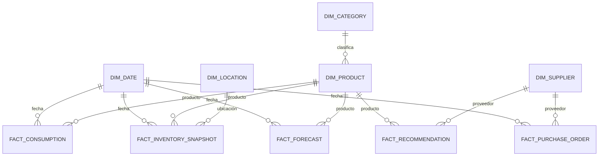

# 11 — Diseño analítico en Power BI

**Estado:** Versión 1.0 — Etapa 0 (diseño, **no implementado**) · **Fecha:** 2026-09-04 · **Versión 1.1** — revisada en la auditoría de Etapa 0.1

> **No se crea ningún dashboard en esta etapa.** Se define qué se va a medir y con qué estructura,
> para que el modelo de datos de la Fase 2 ya contemple lo que la analítica necesitará.

---

## 1. Alcance y frontera con la aplicación

| | Aplicación web | Power BI |
|---|---|---|
| **Público** | Planificador, comprador, analista | Dirección, finanzas, compras, gestión |
| **Pregunta** | "¿Qué hago hoy con este SKU?" | "¿Cómo va el abastecimiento en conjunto?" |
| **Horizonte** | Operativo, inmediato | Táctico y estratégico, con tendencia |
| **Interacción** | Acciones sobre el sistema | Solo lectura y exploración |
| **Detalle** | SKU individual | Agregados por categoría, proveedor, periodo |

**Regla de oro:** **ninguna lógica de negocio se reimplementa en Power BI.** Los puntos de reorden,
el stock de seguridad, la cobertura y los niveles de riesgo se calculan **una vez**, en el motor de
abastecimiento, y Power BI los consume ya calculados. Reimplementar una fórmula en DAX produciría dos
verdades distintas para el mismo indicador, que es precisamente lo que el proyecto trata de eliminar.

En Power BI solo se calculan **agregaciones** (sumas, promedios, conteos, evolución) sobre valores
que el sistema ya produjo.

## 2. Conexión

- **Origen:** PostgreSQL, mediante el conector nativo de Power BI, sobre **vistas analíticas
  dedicadas** — nunca directamente sobre las tablas operativas.
- **Usuario:** de solo lectura, con acceso limitado a esas vistas (`docs/10-seguridad.md` §7).
- **Modo de conexión:** *Import* como opción por defecto, con actualización programada. El volumen de
  referencia (ASSUMPTION-012) lo permite y ofrece mejor rendimiento y flexibilidad de modelado.
  DirectQuery se reservará para el caso en que se requiera latencia baja sobre datos operativos, y se
  decidirá con evidencia en la Fase 11 (`DT-014`, estado `PROPUESTA`).
- **Frecuencia de actualización:** alineada con el proceso batch de recálculo (propuesta: diaria,
  posterior a la generación de forecast y recomendaciones).

## 3. Modelo dimensional

Esquema en estrella, construido sobre vistas.

### 3.1 Dimensiones

| Dimensión | Atributos principales |
|---|---|
| `DIM_DATE` | Fecha, día, semana, mes, trimestre, año, día hábil, festivo (**pendiente**: calendario del negocio) |
| `DIM_PRODUCT` | SKU, nombre, categoría, unidad, clase ABC, clase de rotación, segmento de serie, estado |
| `DIM_CATEGORY` | Código, nombre, jerarquía |
| `DIM_SUPPLIER` | Código, nombre, estado, segmento de confiabilidad |
| `DIM_LOCATION` | Código, nombre, tipo |
| `DIM_MODEL_VERSION` | Versión, algoritmo, fecha de entrenamiento, estado |

### 3.2 Tablas de hechos

| Hecho | Grano | Medidas |
|---|---|---|
| `FACT_CONSUMPTION` | Producto × ubicación × día | Cantidad consumida, indicador de desabasto |
| `FACT_INVENTORY_SNAPSHOT` | Producto × ubicación × día | On hand, comprometido, en tránsito, posición, valor, cobertura en días |
| `FACT_FORECAST` | Producto × ubicación × periodo × `as_of_date` | Cantidad prevista, límites del intervalo, método, versión de modelo |
| `FACT_RECOMMENDATION` | Producto × fecha de generación | Cantidad recomendada, urgencia, punto de reorden, stock de seguridad, estado, resolución |
| `FACT_PURCHASE_ORDER` | Línea de orden × evento | Cantidad pedida, recibida, pendiente, importe, días de retraso |
| `FACT_FORECAST_ACCURACY` | Producto × periodo | Previsto, real, error, error absoluto, sesgo |

**Nota sobre `FACT_INVENTORY_SNAPSHOT`:** la fotografía diaria del inventario es necesaria para poder
analizar la evolución y calcular rotación y cobertura históricas. Reconstruirla cada vez a partir de
los movimientos sería costoso y frágil. Su generación se define en la Fase 2.

**Nota sobre `as_of_date` en `FACT_FORECAST`:** conservarla permite responder la pregunta más útil
sobre la calidad del pronóstico — "¿qué predecíamos hace ocho semanas y qué ocurrió realmente?" —,
que es la base de `FACT_FORECAST_ACCURACY`.

## 4. KPIs

### 4.1 Indicadores de inventario

| KPI | Definición | Interpretación |
|---|---|---|
| **Stock actual** | Existencia física total, en unidades y en valor | Volumen y capital |
| **Posición de inventario (contable)** | On hand + tránsito **total** − comprometido | Situación de aprovisionamiento comprometida. La posición **de decisión**, con el tránsito efectivo, vive en la aplicación y no se recalcula aquí (`DT-012`) |
| **Cobertura media (días)** | Posición ÷ demanda diaria prevista | Cuánto tiempo aguanta el inventario |
| **Rotación de inventario** | Consumo del periodo ÷ inventario medio | Eficiencia del capital |
| **Valor de inventario** | Σ (cantidad × costo unitario) | Capital inmovilizado |
| **Inventario sin movimiento** | SKU con existencia y sin consumo en N periodos | Candidatos a liquidación |
| **Exactitud de inventario** | Desviación de los ajustes sobre el total | Calidad del dato |

### 4.2 Indicadores de abastecimiento

| KPI | Definición |
|---|---|
| **Productos críticos** | SKU con riesgo de desabasto `CRITICAL` o `HIGH` |
| **Productos en sobreinventario** | SKU con cobertura por encima del umbral de política |
| **Recomendaciones abiertas** | Número y valor de las recomendaciones sin resolver, por urgencia |
| **Órdenes pendientes** | Órdenes emitidas no recibidas, en número, valor y unidades |
| **Antigüedad de órdenes pendientes** | Días desde la emisión de órdenes aún abiertas |
| **Tasa de conversión de recomendaciones** | Recomendaciones convertidas en orden ÷ recomendaciones emitidas |
| **Tasa de descarte y motivos** | Proporción de recomendaciones descartadas, agrupadas por motivo |

Los dos últimos son los indicadores de **adopción del sistema**. Una tasa de descarte alta con un
motivo recurrente no significa que los planificadores se equivoquen: significa que al motor le falta
una restricción que ellos sí conocen. Es la señal más valiosa para mejorar las reglas.

### 4.3 Indicadores de proveedores

| KPI | Definición |
|---|---|
| **Cumplimiento en tiempo** | % de recepciones dentro de la fecha comprometida |
| **Cumplimiento en cantidad** | Cantidad recibida ÷ cantidad pedida |
| **Lead time medio observado** | Media de días entre emisión y recepción |
| **Variabilidad del lead time** | Desviación estándar del lead time observado |
| **Desviación acordado vs. observado** | Lead time observado − lead time acordado |
| **Concentración de proveedor** | % de compra concentrada en un proveedor (riesgo de dependencia) |
| **Impacto en stock de seguridad** | Parte del stock de seguridad atribuible a la variabilidad del proveedor |

El último KPI traduce el desempeño del proveedor a dinero inmovilizado. Es el argumento cuantitativo
para una negociación.

### 4.4 Indicadores predictivos

| KPI | Definición |
|---|---|
| **Demanda proyectada** | Demanda prevista agregada por categoría y periodo |
| **Error de pronóstico (WAPE / MASE)** | Error agregado ponderado por volumen |
| **Sesgo del pronóstico** | Error con signo acumulado: detecta sobre o subestimación sistemática |
| **Cobertura del intervalo** | % de observaciones dentro del intervalo declarado |
| **Uso de baseline** | % de SKU predichos con baseline en lugar de modelo |
| **SKU sin predicción** | Productos que no obtuvieron estimación y por qué |
| **Evolución del error por versión de modelo** | Comparación entre versiones a lo largo del tiempo |

El **sesgo** merece atención especial: un sesgo negativo persistente produce desabastos crónicos
aunque el error absoluto parezca aceptable, y es invisible en las métricas habituales de error.

### 4.5 Indicadores de impacto (a construir cuando haya histórico)

| KPI | Definición |
|---|---|
| **Incidencias de desabasto** | Número de SKU-día con existencia cero y demanda |
| **Evolución del capital inmovilizado** | Valor de inventario a lo largo del tiempo |
| **Compras urgentes** | Órdenes emitidas con lead time inferior al normal (proxy del costo logístico extra) |
| **Nivel de servicio alcanzado** | Demanda satisfecha ÷ demanda total |

Estos son los indicadores que miden si el proyecto **cumple su objetivo**. Los demás miden si el
sistema funciona; estos, si sirve.

**Coinciden deliberadamente con las métricas de Nivel 2** de `docs/05-motor-predictivo.md` §9.4, que
son las que deciden si un modelo se promueve (`DT-020`). Es la misma pregunta formulada en dos
horizontes: en Power BI, cómo va el abastecimiento en producción; en la evaluación del modelo, si un
forecast concreto lo mejoraría. **La definición de cada métrica debe ser una sola**, y vive en
`knowledge/glossary.md`.

## 5. Informes previstos

| Informe | Público | Contenido |
|---|---|---|
| **Panorama de inventario** | Dirección, finanzas | Valor, cobertura, rotación, evolución, distribución por categoría |
| **Situación de abastecimiento** | Compras | Productos críticos, recomendaciones abiertas, órdenes pendientes |
| **Desempeño de proveedores** | Compras, gestión | Cumplimiento, lead times, variabilidad, concentración |
| **Calidad del pronóstico** | Analistas, TI | Error, sesgo, cobertura del intervalo, uso de baseline, evolución por versión |
| **Impacto del sistema** | Dirección | Desabastos, sobreinventario, nivel de servicio, capital, adopción |

## 6. Reglas de construcción

1. **Sin lógica de negocio en DAX.** Solo agregaciones.
2. **Sin conexión a tablas operativas.** Solo vistas analíticas dedicadas y documentadas.
3. **Definición única de cada métrica**, documentada en `knowledge/glossary.md`. Si "cobertura"
   significa una cosa en la aplicación y otra en el informe, el proyecto ha fallado.
4. **Fecha de actualización visible** en cada informe: un dato de ayer presentado como de hoy induce
   a error operativo.
5. **Seguridad:** el acceso a los informes se gestiona en Power BI; si se requiere restricción por
   categoría o ubicación, se implementará con seguridad a nivel de fila (**pendiente**, §8).
6. **Coherencia de nombres** con el glosario y con la interfaz de la aplicación.

## 7. Dependencias con otras fases

| Necesita | De |
|---|---|
| Vistas analíticas en PostgreSQL | Fase 2 |
| Fotografía diaria de inventario | Fase 2 |
| Forecast persistido con `as_of_date` | Fase 5 |
| Recomendaciones con estado y motivo de resolución | Fase 4 |
| Métricas de desempeño de proveedor | Fase 4 |
| Métricas de exactitud del pronóstico | Fase 5–6 |

## 8. Pendiente de definición

1. ¿Existe una licencia y una capacidad de Power BI disponibles? ¿Qué tipo?
2. ¿Quién consumirá los informes y con qué frecuencia?
3. ¿Se requiere seguridad a nivel de fila por categoría, ubicación o unidad de negocio?
4. Calendario laboral y festivos del negocio (necesario para `DIM_DATE`).
5. ¿Hay informes existentes cuyas definiciones deban respetarse para mantener continuidad?
6. ¿Se requiere distribución automática (suscripciones, alertas)?
7. Periodo de histórico a conservar en el modelo analítico.
