# 12 — Estrategia DevOps

**Estado:** Versión 1.0 — Etapa 0 (diseño, **no implementado**) · **Fecha:** 2026-09-04 · **Versión 1.1** — revisada en la auditoría de Etapa 0.1 · **Versión 1.2** (2026-10-03) — §5: correspondencia entre los entornos y `APP_ENV` para la API de U5 (`DT-065`) · **Versión 1.3** (2026-10-05) — §2.2: excepción de merge commit para la integración inicial de U1–U6; §3.1: imagen `frontend` en el mismo origen que `/api` (`DT-070`)

> No se crean workflows, imágenes ni recursos en esta etapa.

---

## 1. Principios

1. **Automatizar lo repetible**, empezando por lo que más duele: pruebas y verificación de calidad.
2. **`main` siempre desplegable.** Nada se integra sin pasar el pipeline.
3. **Sin secretos de larga vida.** Acceso a Azure mediante OIDC con credenciales federadas.
4. **Reproducibilidad.** Lo que se prueba es exactamente lo que se despliega: la misma imagen.
5. **Incremental.** El pipeline crece con el proyecto; no se construye completo desde el día uno.

## 2. GitHub — control de versiones

### 2.1 Estrategia de ramas

Modelo basado en ramas cortas sobre `main` (*trunk-based*), adecuado a un equipo pequeño y a entregas
frecuentes.

| Rama | Uso |
|---|---|
| `main` | Rama principal. Protegida. Siempre desplegable |
| `feature/<área>-<descripción>` | Nueva funcionalidad |
| `fix/<descripción>` | Corrección |
| `docs/<descripción>` | Documentación |
| `chore/<descripción>` | Mantenimiento, dependencias, configuración |
| `exp/<descripción>` | Experimentos de ML; no se integran directamente |

Ramas cortas: de horas a pocos días. Una rama de dos semanas genera conflictos y revisiones inútiles.

### 2.2 Protección de `main`

- Sin push directo. Todo cambio entra por Pull Request.
- Al menos una revisión aprobada.
- Todos los *checks* del pipeline en verde.
- Rama actualizada respecto a `main` antes del merge.
- Historial lineal (*squash merge* preferido).
- *Excepción puntual (2026-10-05, `DT-070` punto 21):* la integración inicial de `feat/u1-supply-engine` (U1–U6) en
  `main` se hace por PR con **merge commit** normal, sin *rebase*, *squash* ni `force push`, para conservar los
  commits y los hashes citados en `project/status.md`. Las ramas posteriores siguen la regla general.
- Sin `force push`.

### 2.3 Convenciones

- **Commits:** *Conventional Commits* — `feat:`, `fix:`, `docs:`, `test:`, `refactor:`, `chore:`, `perf:`.
- **Pull Request:** describe el propósito, el alcance, la evidencia de pruebas y los documentos
  actualizados. Enlaza la historia de usuario correspondiente.
- **Issues:** vinculados al backlog (`project/backlog.md`).
- **El agente de IA no hace commit ni push sin autorización** (`CLAUDE.md` §13).

## 3. Docker

### 3.1 Imágenes previstas

| Imagen | Contenido |
|---|---|
| `backend` | API FastAPI + motores de abastecimiento y predicción |
| `frontend` | Build de React servido por un servidor estático ligero, detrás de un proxy inverso en el mismo origen que `/api` (`DT-070` punto 23); Node 24 LTS en la etapa de construcción |
| `db` | PostgreSQL oficial (solo en desarrollo; en la nube, servicio gestionado) |
| `jobs` | Procesos por lotes (ingesta, forecast, recomendaciones). Puede compartir base con `backend` |

### 3.2 Reglas de construcción

1. **Multi-stage build:** dependencias de construcción fuera de la imagen final.
2. **Imagen base mínima** y versión fijada por *digest*, no por etiqueta móvil.
3. **Sin ejecutar como root.**
4. **Sin secretos en el Dockerfile ni en las capas.** La configuración llega por variables de entorno
   en tiempo de ejecución.
5. **Capas ordenadas** para aprovechar la caché: dependencias antes que el código.
6. **`.dockerignore`** que excluya `.git`, `node_modules`, datos, artefactos y `.env`.
7. **`HEALTHCHECK`** definido.
8. **Etiquetado** con la versión y el commit de origen, para trazar qué se desplegó.

### 3.3 Desarrollo local

`docker compose` levanta backend, frontend y PostgreSQL con datos sintéticos. Requisito operativo:
**un desarrollador nuevo debe poder levantar el sistema sin credenciales de Azure** (RNF-006).

## 4. GitHub Actions

### 4.1 Flujo objetivo

```mermaid
flowchart LR
    F[feature branch] --> PR[Pull Request]
    PR --> LINT[Lint · formato · tipado]
    LINT --> TEST[Tests unitarios + integración]
    TEST --> SEC[Detección de secretos<br/>+ análisis de dependencias]
    SEC --> BUILD[Build de imágenes Docker]
    BUILD --> REV[Revisión humana]
    REV --> MERGE[Merge a main]
    MERGE --> PUB[Publicación de imagen etiquetada]
    PUB --> DEV[Despliegue a dev]
    DEV --> STG[Despliegue a staging<br/>aprobación]
    STG --> PRD[Despliegue a producción<br/>aprobación]
```

### 4.2 Workflows previstos

| Workflow | Disparador | Contenido |
|---|---|---|
| `ci.yml` | PR y push a `main` | Lint, formato, tipado, pruebas, cobertura, detección de secretos |
| `build.yml` | Push a `main` | Construcción y publicación de imágenes etiquetadas |
| `deploy.yml` | Manual o tras `build` | Despliegue por entorno, con aprobación en staging y producción |
| `ml-train.yml` | Manual o programado | Entrenamiento y evaluación; publica el informe. **No promueve automáticamente** |
| `db-migrate.yml` | Parte del despliegue | Aplicación de migraciones con credencial dedicada |
| `security.yml` | Programado semanal | Análisis de dependencias y vulnerabilidades |

### 4.3 Autenticación hacia Azure

Mediante **OpenID Connect con credenciales federadas**: el workflow obtiene un token de corta vida
emitido por GitHub y lo intercambia por credenciales de Azure, sin almacenar secretos persistentes.
Es el método documentado tanto por GitHub como por Microsoft y es el que se adoptará. Requiere el
permiso `id-token: write` en el workflow y una credencial federada configurada en la aplicación de
Entra ID, con ámbito restringido al repositorio, la rama o el entorno concretos.

### 4.4 Buenas prácticas del pipeline

- Permisos mínimos por workflow (`permissions:` explícito, no el conjunto por defecto).
- Acciones de terceros fijadas por *commit SHA*, no por etiqueta móvil.
- Entornos de GitHub con revisores obligatorios para staging y producción.
- Caché de dependencias para acortar el ciclo.
- Ejecución en paralelo de trabajos independientes.
- El pipeline debe tardar poco: un CI lento se acaba evitando.
- **Falla rápido**: primero lo barato (formato, lint), después lo caro (pruebas, build).

## 5. Entornos

| Entorno | Propósito | Datos | Despliegue |
|---|---|---|---|
| **Local** | Desarrollo | Sintéticos | `docker compose` |
| **dev** | Integración continua | Sintéticos | Automático desde `main` |
| **staging** | Validación previa | Sintéticos o reales anonimizados | Con aprobación |
| **prod** | Producción | Reales | Con aprobación |

Configuración por entorno mediante variables y secretos separados; **nunca** se comparten credenciales
entre entornos.

*Nota del 2026-10-03 (`DT-065`, U5 implementada y validada el mismo día):* la variable `APP_ENV` toma los valores
`local`, `dev`, `staging` y `prod`, uno por entorno de esta tabla. Hasta que exista el validador de Entra ID
(Fase 8), la API de U5 solo arranca con `APP_ENV=local`, que incluye las pruebas, y se niega a arrancar en
`dev`, `staging` y `prod`.

**Destino de ejecución en Azure: pendiente** (ASSUMPTION-014). App Service, Container Apps u otro se
decidirá en la Fase 12–13 con requisitos reales de carga y presupuesto. Decidirlo ahora sería
comprometer una arquitectura sin información.

## 6. Base de datos

- **Migraciones versionadas** en el repositorio; ningún cambio manual de esquema en ningún entorno.
- Cada migración es **reversible** o incluye un procedimiento de reversión documentado.
- Se aplican como parte del despliegue, con credencial dedicada y distinta de la de la aplicación.
- Las migraciones destructivas requieren aprobación explícita y respaldo previo.
- Compatibilidad hacia atrás durante el despliegue: primero el esquema, después el código.

## 7. Versionado y publicaciones

- **Versionado semántico** para la aplicación.
- Etiquetas de imagen con versión y commit.
- Notas de publicación generadas a partir de los commits convencionales.
- Toda versión desplegada debe ser trazable hasta su commit y su imagen exactos.

## 8. Qué se automatiza y cuándo

| Automatización | Fase | Prioridad |
|---|---|---|
| Lint, formato, tipado | 3 | Alta |
| Pruebas unitarias | 3 | Alta |
| Detección de secretos | 3 | Alta |
| Pruebas de integración | 2 | Alta |
| Build de imágenes | 12 | Alta |
| Análisis de dependencias | 12 | Media |
| Despliegue a dev | 13 | Alta |
| Despliegue a staging/prod con aprobación | 13 | Alta |
| Migraciones automatizadas | 13 | Alta |
| Pruebas end-to-end | 14 | Media |
| Entrenamiento programado | 6 | Media |
| Pruebas de rendimiento | 14 | Media |

> **Lectura de la columna "Fase":** indica cuándo existe la verificación y se ejecuta de forma
> rutinaria (localmente y antes de proponer un cambio). Su ejecución **dentro de un workflow de
> GitHub Actions** llega con la Fase 13, cuando se crea `.github/workflows/`. Las pruebas se escriben
> mucho antes de que exista el pipeline que las dispara.

## 9. Lo que NO se automatiza (deliberadamente)

| No automatizado | Por qué |
|---|---|
| **Promoción de un modelo a producción** | Un modelo malo genera desabastos; el costo de la revisión humana es muy inferior al del error |
| **Conversión de recomendación en orden de compra** | La decisión de compra es humana por diseño (RF-015) |
| **Despliegue a producción sin aprobación** | Control de cambios |
| **Migraciones destructivas** | Riesgo irreversible |
| **Cambios de política de inventario** | Afectan a todos los cálculos posteriores |

## 10. Métricas del proceso

| Métrica | Para qué |
|---|---|
| Duración del pipeline | Un CI lento se evita, y entonces deja de proteger |
| Tasa de fallo en `main` | Salud de la integración |
| Frecuencia de despliegue | Ritmo de entrega |
| Tiempo de recuperación ante fallo | Capacidad de respuesta |
| Cobertura de pruebas por módulo | Señal de riesgo, no objetivo en sí |

## 11. Pendiente de definición

1. Servicio de cómputo en Azure para el despliegue.
2. Registro de contenedores a utilizar (GitHub Container Registry, Azure Container Registry).
3. Presupuesto de infraestructura.
4. ¿Existen restricciones corporativas de red (VNet, IP permitidas, private endpoints)?
5. ¿Quién aprueba los despliegues a producción?
6. Ventanas de mantenimiento permitidas.
7. Requisitos de retención de logs y de artefactos de build.
