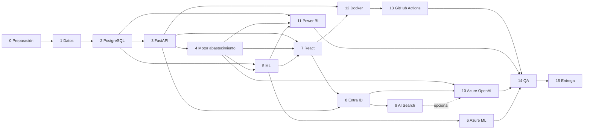

# Roadmap del proyecto

**Estado:** Versión 1.0 — Etapa 0 · **Fecha:** 2026-09-04 · **Versión 1.1** — revisada en la auditoría de Etapa 0.1 · **Versión 1.2** (2026-09-30) — cierre de la Etapa 1, inicio de la Etapa 2 y orden de implementación propuesto (`DT-047`) · **Versión 1.3** (2026-10-01) — contrato de U1 cerrado (`DT-048` a `DT-052`) y pendiente `DT-P22` · **Versión 1.4** (2026-10-01) — `DT-P22` cerrada; contrato de U1 sin pendientes · **Versión 1.5** (2026-10-01) — U1 implementada · **Versión 1.6** (2026-10-02) — U2 implementada (2026-10-01) y U3 autorizada para implementación (`DT-056`, `DT-057`) · **Versión 1.7** (2026-10-02) — U3 implementada y validada · **Versión 1.8** (2026-10-03) — U4 autorizada para implementación, no implementada (`DT-058` a `DT-063`) · **Versión 1.9** (2026-10-03) — U4 implementada y validada · **Versión 1.10** (2026-10-03) — U5 autorizada para implementación, no implementada (`DT-064` a `DT-067`) · **Versión 1.11** (2026-10-03) — U5 implementada y validada · **Versión 1.12** (2026-10-04) — U6 autorizada para implementación, no implementada (`DT-068`, `DT-069`) · **Versión 1.13** (2026-10-04) — U6 implementada y validada; termina el orden de `DT-047` · **Versión 1.14** (2026-10-05) — Fase 7 autorizada para implementación, no implementada (`DT-070`) · **Versión 1.15** (2026-10-05) — F7a implementada y validada · **Versión 1.16** (2026-10-05) — Fase 7 completada · **Versión 1.17** (2026-10-05) — Fase 5: decisiones documentadas; F5a autorizada (`DT-086`) · **Versión 1.18** (2026-10-05) — F5a implementada, pendiente de revisión · **Versión 1.19** (2026-10-05) — F5a integrada en `main`; F5b autorizada (`DT-088`) · **Versión 1.20** (2026-10-05) — F5b implementada, pendiente de revisión · **Versión 1.21** (2026-10-05) — G1 de la Fase 5 (`DT-089` a `DT-091`); dependencias con las Fases 7 y 8 · **Versión 1.22** (2026-10-06) — F5c autorizada (`DT-092`) y criterios complementarios de G1 (`DT-093`) · **Versión 1.23** (2026-10-06) — F5c implementada, pendiente de revisión

## Principios de secuenciación

1. **Los datos primero.** Sin datos no hay modelo, y sin modelo no hay recomendación con sentido.
2. **Valor antes que sofisticación.** El motor de abastecimiento (Fase 4) entrega valor real usando
   solo un baseline, antes de que exista ningún modelo de ML.
3. **Cada fase termina con algo verificable.** No se avanza sin cumplir el criterio de finalización.
4. **Azure al final.** Se construye primero un sistema completo y ejecutable en local; los servicios
   de Azure se integran cuando hay algo que integrar y un motivo para pagarlo.
5. **Sin estimaciones de tiempo todavía.** No hay información suficiente para estimarlas con honestidad.

> **Orden deliberado:** el motor de abastecimiento (Fase 4) va **antes** que el Machine Learning
> (Fase 5). El motor consume un forecast; ese forecast puede ser un baseline. Así el sistema entrega
> recomendaciones útiles y auditables desde temprano, y cuando llegue el modelo solo mejora una
> entrada de un motor ya probado. Invertir el orden retrasaría todo el valor hasta que el ML funcione.

## Etapas

| Etapa | Fases | Estado |
|---|---|---|
| **Etapa 0 — Preparación** | Fase 0 | ✅ Superada (2026-09-04, aprobada con observaciones) |
| **Etapa 1 — Datos** | Fase 1 | ✅ **COMPLETADA** (2026-09-29). Generador terminado: `generator_version` **0.4.0**, dataset **`ds-6c8ad65b4999`** publicado y validado (**51/51** comprobaciones del Componente 8, 0 fallos), **582 pruebas** en verde. Cierre autorizado por el responsable el 2026-09-30 |
| **Etapa 2 — Sistema principal** | Fases 2 a 15 | 🟡 **INICIADA** (2026-09-30). Primer bloque: arquitectura y fundación — contratos y orden de construcción. U1 (motor V1) y U2 (PostgreSQL + ingesta) implementadas el 2026-10-01 |

**Lo que la Fase 1 listaba y pasa a la Etapa 2.** El «proceso de ingesta y validación con marca de
origen» (`US-011`) se diseña en la Etapa 2 (`docs/04` §9, `DT-044`) y se implementa en su unidad U2.
Los umbrales de aceptación del modelo (`DT-P04`) siguen pendientes y se fijan en la Fase 5, con el
dataset 0.4.0. El resto de criterios de la Fase 1 se cumplió con el generador. *(2026-10-05: valores provisionales
en `DT-091`, solo con datos `SYNTHETIC`.)*

### Orden de implementación de la Etapa 2 (`DT-047`: `ACEPTADA` en cuanto a U1, U2, U3, U4, U5 y U6)

Las fases siguen siendo el mapa; las **unidades** son el orden en que se construye. Cada unidad
requiere su propia autorización.

| Unidad | Contenido | Fase | Historias | Necesita antes |
|---|---|---|---|---|
| **U1** | `supply_engine` V1: biblioteca pura + pruebas calculadas a mano (`docs/06` §16) | 4 (parte pura) | US-040 (parcial: V1 no usa `σ_L`, `BR-P02`), US-041, US-042, US-045 (cálculo) | `DT-P14`, `DT-P15` y `DT-P20` cerradas (2026-09-30 y 2026-10-01); contrato cerrado con `DT-048` a `DT-052` (2026-10-01, `docs/06` §16.11). `DT-P22`, `DT-053` y `DT-054` cerradas (2026-10-01). **Ninguna dependencia nueva**. ✅ **Implementada** (2026-10-01): `backend/app/supply_engine`, 146 pruebas |
| **U2** | PostgreSQL + migraciones + ingesta validada del 0.4.0 (`docs/04` §9) | 2 | US-011, US-020, US-021 | Controlador de PostgreSQL y PostgreSQL local en contenedor, autorizados el 2026-10-01 (`DT-055`); `DT-044` `ACEPTADA`. ✅ **Implementada** (2026-10-01): `backend/app/db`, `backend/app/ingestion`, `backend/db/migrations/0001_dataset_tables.sql`, `infra/docker-compose.yml`; dataset `ds-6c8ad65b4999` cargado e idempotente; 35 pruebas sin base + 43 de integración (`docs/04` §9.9) |
| **U3** | `ForecastProvider` + baselines + forecasts persistidos (`docs/05` §19) | 4 (baseline) | US-050, US-057 (parcial) | `DT-P17` cerrada por `DT-056`; `DT-046` `ACEPTADA`; `DT-057` (persistencia y ejecución). ✅ **Implementada y validada (2026-10-02)**: `backend/app/forecasting`, `backend/app/runs`, migración `0002`; ejecución real 2025-12-31 con 3 990 forecasts (1 330 primarios, sin respaldos); criterios de `docs/05` §19.9 cumplidos |
| **U4** | Ejecución de recomendaciones: base → forecast → motor → persistencia con trazabilidad (`docs/04` §9.11, `docs/06` §16.13) | 4 | US-045, US-046 | `DT-P18` cerrada por `DT-059` y `DT-P21` por `DT-058` (2026-10-03); `DT-058` a `DT-063` `ACEPTADA`. **Ninguna dependencia nueva**. ✅ **Implementada y validada (2026-10-03)**: `runs/recommendation*.py`, migración `0003` y `python -m app.runs recommend --as-of`; ejecución real 2025-12-31 con 100 evaluaciones (50 `RECOMMEND`, 40 `NO_NEED`, 10 `NOT_CALCULABLE`); criterios de `docs/06` §16.13.4 cumplidos, en local y en Docker |
| **U5** | API de solo lectura con autenticación local y roles (`docs/07` §7) | 3 | US-030, US-033 (US-031 queda para después: V1 no expone proveedores ni órdenes) | `DT-064` (FastAPI 0.141.1, Starlette 1.3.1, Pydantic 2.13.5, uvicorn 0.52.4; pruebas con `httpx2` 2.13.1), `DT-065`, `DT-066` y `DT-067` `ACEPTADA` (2026-10-03). ✅ **Implementada y validada (2026-10-03)**: `backend/app/api`, `backend/app/db/read`, `.env.example`; 13 endpoints de solo lectura, `python -m app.api` solo con `APP_ENV=local`; criterios de `docs/07` §7.5 cumplidos, en local y en Docker |
| **U6** | Explicación por plantilla + verificación de cifras (`docs/09` §14) | 4 | US-048 | `DT-068` (endpoint 14 `GET /api/v1/recommendations/{recommendation_id}/explanation`, contexto, `facts[]`, plantillas) y `DT-069` (presentación, verificación y degradación RS-010) `ACEPTADA` (2026-10-04). **Ninguna dependencia nueva**. ✅ **Implementada y validada (2026-10-04)**: `backend/app/genai`, endpoint 14, `template/1.0.0`; las 100 evaluaciones reales explicadas sin `DEGRADED`; criterios de `docs/09` §14.6 cumplidos, en local y en Docker |
| Después | Interfaz (7) · ML (5) · Power BI (11) · Entra ID (8) · AI Search y OpenAI (9–10) · Docker y CI/CD (12–13) · QA (14) · Entrega (15) | — | — | Sus bloqueos de la tabla final |

**Por qué el motor va primero** aunque el mapa ponga la Fase 4 después de las Fases 2 y 3: la parte
pura del motor no depende técnicamente de ninguna de ellas (RNF-001) —sí su persistencia, su batch y
sus endpoints, que van después— y no requiere dependencias nuevas. Sus **reglas** están cerradas
(`DT-031`); su contrato de implementación (`DT-045`) quedó aceptado al autorizar U1, y `DT-P14`,
`DT-P15` y `DT-P20` ya están cerradas. Los detalles del contrato se cerraron con `DT-048` a `DT-052`
(2026-10-01) y `DT-P22`; no queda ninguna decisión pendiente. Razonamiento completo en `DT-047`.

---

## FASE 0 — Preparación ✅ (superada)

- **Objetivo:** dejar el repositorio preparado para un desarrollo ordenado, incremental y documentado.
- **Entradas:** definición de alcance del responsable del proyecto.
- **Actividades:** inspección del repositorio; estructura documental; `CLAUDE.md` y `AGENTS.md`;
  requisitos; propuesta técnica; arquitectura; modelo de datos; estrategias de ML, abastecimiento,
  API, frontend, IA generativa, seguridad, Power BI, DevOps, testing y mantenimiento; decisiones
  técnicas; glosario, supuestos y reglas de negocio; roadmap, backlog y estado.
- **Entregables:** 32 archivos — los 31 listados en `docs/reports/etapa-0-reporte.md` §1 más
  `docs/reports/etapa-0-1-reporte.md`, añadido en la revisión 0.1 (31 documentos markdown y `.gitignore`).
- **Dependencias:** ninguna.
- **Criterio de finalización:** todos los documentos existen, son coherentes entre sí, los supuestos
  están marcados como tales y no hay hipótesis presentadas como requisitos.

## FASE 1 — Datos ✅ (completada el 2026-09-29; ingesta trasladada a la Etapa 2)

- **Objetivo:** disponer de un dataset sintético que represente un escenario empresarial verosímil, y
  del proceso de ingesta que permitirá sustituirlo por datos reales.
- **Entradas:** **`knowledge/dataset-specification.md`** (especificación del dataset, 2026-09-09),
  `docs/04-modelo-datos.md`, `docs/05-motor-predictivo.md`, `knowledge/assumptions.md`.
- **Actividades:**
  - Diseñar el dataset: productos de alta y baja rotación, demanda estable, creciente y decreciente,
    estacionalidad, variabilidad, periodos de desabasto, exceso de inventario, proveedores confiables
    y con retrasos, distintos lead times, órdenes de compra e inventario en tránsito.
  - Construir el generador con **parámetros explícitos y semilla fija** (los datos deben ser
    reproducibles y sus propiedades, conocidas).
  - Definir el proceso de ingesta y validación con marca de origen.
  - Producir un informe de calidad del dataset.
  - Fijar los umbrales de aceptación del modelo (pendiente `DT-P04`).
- **Entregables:** especificación del dataset, generador, dataset generado, proceso de ingesta,
  informe de calidad.
- **Dependencias:** Fase 0.
- **Criterio de finalización:** el dataset contiene todos los escenarios previstos y sus propiedades
  son verificables; los datos se cargan y validan sin errores; el origen queda marcado.

## FASE 2 — PostgreSQL

- **Objetivo:** materializar el modelo de datos con integridad y migraciones versionadas.
- **Entradas:** `docs/04-modelo-datos.md`, dataset de la Fase 1.
- **Actividades:** esquema físico; restricciones e índices; migraciones; vistas analíticas para
  Power BI; fotografía diaria de inventario; carga del dataset; pruebas de integración.
- **Entregables:** esquema, migraciones, vistas, datos cargados, pruebas.
- **Dependencias:** Fase 1.
- **Criterio de finalización:** el dataset se carga íntegramente; **la posición de inventario
  almacenada coincide con la reconstruida desde el histórico de movimientos**; las migraciones se
  aplican desde cero de forma reproducible.

## FASE 3 — FastAPI

- **Objetivo:** exponer los datos mediante una API con contrato explícito.
- **Entradas:** `docs/07-api.md`, base de datos de la Fase 2.
- **Actividades:** estructura del proyecto backend; **endpoints de lectura** de productos, inventario,
  proveedores, órdenes y consumo; **endpoints de escritura** de datos maestros (`US-034`), órdenes de
  compra (`US-035`) y registro de movimientos, consumo y recepciones (`US-032`); validación con
  Pydantic; manejo uniforme de errores; paginación; OpenAPI; pruebas de contrato.
  **Autenticación aún simulada** (se integra en la Fase 8).
- **Entregables:** API funcional en local, especificación OpenAPI, pruebas.
- **Dependencias:** Fase 2.
- **Criterio de finalización:** los endpoints de lectura y de escritura responden conforme al contrato;
  los registros históricos son inmutables por diseño (sin `PUT`/`DELETE`); las pruebas de contrato y de
  error pasan; la documentación de la API está generada.
- **Nota de la revisión 0.1:** el cálculo del **lead time observado** a partir de las recepciones
  pertenece a la Fase 4, no a esta.

## FASE 4 — Motor de abastecimiento

- **Objetivo:** calcular stock de seguridad, punto de reorden, cantidad recomendada y riesgos de forma
  determinística. **Primera entrega de valor real del proyecto.**
- **Entradas:** `docs/06-motor-abastecimiento.md`, `knowledge/business-rules.md`, API de la Fase 3.
- **Actividades:** implementar un **baseline de pronóstico simple** —naïve, naïve estacional y media
  móvil (`US-050`)— como primera implementación de `ForecastProvider`, suficiente para alimentar el
  motor; implementar `supply_engine` como **biblioteca pura**; **fijar la conversión entre pronóstico
  semanal y lead time en días en una única función** (`DT-019`); **implementar el tránsito efectivo
  como magnitud derivada, sin columna nueva** (`DT-012`); pruebas unitarias exhaustivas con casos
  calculados a mano y los casos límite de `docs/06` §14; cálculo de lead time observado y métricas de
  proveedor; proceso batch de generación de recomendaciones; persistencia con desglose completo;
  endpoints de recomendaciones y riesgos; **explicación por plantilla determinística** (`DT-018`).
- **Entregables:** motor, pruebas, proceso batch, endpoints, explicaciones.
- **Dependencias:** Fase 3. **No depende de la Fase 5**: el baseline se construye aquí (`US-050`) y la
  Fase 5 lo sustituye después por un modelo que debe superarlo.
- **Criterio de finalización:** el motor produce recomendaciones reproducibles con desglose completo;
  todos los casos límite pasan; una recomendación puede reconstruirse a partir de lo almacenado; la
  conversión de granularidad existe **en un solo lugar** del código; la recomendación registra tanto el
  tránsito total como el efectivo.

## FASE 5 — Machine Learning

- **Objetivo:** sustituir el baseline por un modelo de predicción de demanda que lo supere de forma demostrada.
- **Entradas:** `docs/05-motor-predictivo.md`, datos de la Fase 2.
- **Actividades:** segmentación del catálogo; pipeline de features con pruebas de ausencia de leakage;
  ampliación del conjunto de baselines iniciado en la Fase 4; backtesting con *rolling origin*; modelos candidatos por niveles con criterio de parada;
  evaluación por segmento; cuantificación de la incertidumbre; decisión sobre demanda censurada
  (`DT-011`); **decisión sobre la metodología del stock de seguridad** (`DT-010`); **elección de la
  métrica primaria** (`DT-021`); **evaluación de Nivel 2 y comparación end-to-end baseline vs. ML**
  (`US-058`, `DT-020`); registro de versiones; integración tras `ForecastProvider`.
- **Entregables:** pipeline, modelos evaluados, informe de evaluación **de Nivel 1 y Nivel 2**, modelo
  seleccionado, pruebas de ML.
- **Dependencias:** Fase 2 (datos) y Fase 4 (consumidor del forecast).
- **Criterio de finalización:** el modelo supera al baseline en la métrica primaria de forma
  consistente, sin degradar segmentos relevantes; **supera o iguala al baseline en la evaluación de
  Nivel 2** (`docs/05` §9.4–9.5) con idénticas reglas y parámetros; las pruebas de leakage y
  reproducibilidad pasan; el sistema degrada correctamente al baseline si el modelo no está.
  Si la mejora de Nivel 1 **no** se traduce en mejora de Nivel 2, ese hallazgo se documenta y el modelo
  **no se promueve**.
- **Estado (2026-10-06):** 🟡 **F5c autorizada e implementada, pendiente de revisión** (`DT-092`; rama `feature/ml-f5c`;
  `docs/reports/fase5-f5c-candidatos-sintetico.md`, `docs/05` §20.7).
  - Ningún candidato cumple el criterio de Nivel 2 frente a la media móvil 13.
  - Las estrategias (b) y (c) de `DT-011` reducen las unidades faltantes.
  - Todo es `SYNTHETIC` y nada se promueve.
  - Criterios complementarios de G1 registrados antes de evaluar candidatos (`DT-093`, `docs/05` §20.6).
  - F5d, G2 y G3 siguen sin autorizar.
  - La Fase 7 no cambia: el rótulo de la banda solo se recomienda en el informe de F5c.
- **Estado anterior (2026-10-05, G1):** 🟡 **G1 registrado; F5c pendiente de autorización** (`DT-089` a `DT-091`,
  `docs/05` §20.5). Todo es provisional y `SYNTHETIC`.
  - **Hecho:** F5a y F5b integradas en `main` (PR #8 y #9).
  - **G1:**
    - baseline oficial, la media móvil de 13 semanas (`DT-089`);
    - SES, candidato más fuerte, no promovido (mejor en Nivel 1, dentro del ruido en Nivel 2);
    - métrica primaria MASE (`DT-090`);
    - valores de aceptación provisionales (`DT-091`).
  - **Sigue abierto:**
    - segmentación (`DT-077`) e imputación (`DT-081`), que pertenecen a F5c;
    - la banda de sesgo y la tolerancia de cobertura, antes de evaluar candidatos;
    - el bloqueo de `DT-083` para F5d.
  - **El *holdout* (G2) no se ha usado.**
  - **Dependencias:** la Fase 7 no cambia y su banda de predicción sigue siendo **«nominal 0.80, no validada»**
    hasta US-055 (F5c); la Fase 8 no depende de la Fase 5.
- **Estado anterior (2026-10-05, antes de G1):** 🟡 **F5a integrada en `main`** (PR #8, merge `ea72df5`) y **F5b autorizada** (`DT-088`; OD-S1 a
  OD-S4 `ACEPTADA` en `DT-080`), **implementada y pendiente de revisión** en `feature/ml-f5b`: simulador de Nivel 2
  en bucle cerrado de los cuatro baselines con U1 sin cambios, informe `SYNTHETIC` en
  `docs/reports/fase5-f5b-nivel2-sintetico.md`, sin elegir baseline oficial, métrica ni tolerancias. F5a: `ml/` con backtesting de
  17 cortes con población a la fecha (`DT-087`), baselines de U3, SES provisional, Nivel 1 en `h = 1` y `L + R` y
  segmentación provisional; informe
  `SYNTHETIC` en `docs/reports/fase5-f5a-backtest-sintetico.md`, sin elegir baseline oficial ni métrica. Decisiones
  documentadas; F5a y F5b autorizadas (`DT-086`, `DT-088`) — cierre documental con
  `DT-071` a `DT-086` (`docs/05` §20): unidades F5a–F5d con puertas G1–G3, solo biblioteca estándar, `float` solo en `ml/` y
  en el proveedor de modelo, 17 cortes y *holdout* de uso único, simulador de Nivel 2 sin cambios en U1. Antes de
  autorizar el resto: umbrales de segmentación, `DT-P04` (incluido el 5 %) y el estimador de
  imputación; `DT-021` se fija en G1 con el procedimiento de `DT-078`. Toda evidencia es `SYNTHETIC`.

## FASE 6 — Azure Machine Learning

- **Objetivo:** llevar el ciclo de vida del modelo a una plataforma gestionada.
- **Entradas:** pipeline de la Fase 5.
- **Actividades:** **verificar la documentación oficial vigente**; configurar el espacio de trabajo;
  entrenamiento como job; registro de modelos; seguimiento con MLflow; decidir inferencia en línea vs.
  batch (`DT-P02`); configurar monitoreo de deriva; procedimiento de reentrenamiento y promoción con
  aprobación humana.
- **Entregables:** pipeline en Azure ML, modelos registrados, monitoreo, procedimiento documentado.
- **Dependencias:** Fase 5. **Requiere autorización para provisionar recursos.**
- **Criterio de finalización:** el entrenamiento se ejecuta en Azure ML; los modelos quedan
  registrados y versionados; el monitoreo emite señales; el sistema sigue funcionando si Azure ML no está.

## FASE 7 — React ✅ (completada el 2026-10-05)

- **Objetivo:** interfaz web operativa.
- **Entradas:** `docs/08-frontend.md`, API de las Fases 3–4.
- **Actividades:** estructura del proyecto; componentes base; dashboard; productos; inventario;
  proveedores; predicciones; recomendaciones; detalle de producto; riesgos; estados de carga, vacío y
  error; **`CalculationBreakdown`** (componente clave para la confianza); pruebas de componentes.
  Autenticación simulada hasta la Fase 8.
- **Entregables:** aplicación web funcional, componentes, pruebas.
- **Dependencias:** Fases 3 y 4; además la Fase 5 para la vista de predicciones con incertidumbre
  (`US-075` necesita el intervalo de `US-055`). *(2026-10-05, tras G1: US-055 sigue pendiente de F5c, así que la vista
  de predicciones sigue mostrando la banda de U3 como **«nominal 0.80, no validada»**; la interfaz no cambia.)*
- **Criterio de finalización:** todas las vistas navegables con datos reales de la API; el desglose
  del cálculo es visible en el detalle de producto; sin lógica de negocio duplicada en el cliente.
- **Estado (2026-10-05):** ✅ **Completada** — F7a a F7d integradas en `main` (PR #2 a #5, `22f1805`) y
  validadas en Node 24.21.0 / npm 11.19.0 (148 pruebas). *(Antes: «Autorizada para implementación — no implementada»
  y, durante la implementación, «En implementación».)* Alcance V1:
  US-070, US-072 (sin «bajo el punto de reorden»), US-073 (sin acciones), US-074, US-048, historial y US-075 con
  banda nominal; US-071 y US-076 fuera por `BR-X03`. Autenticación simulada (la real es la Fase 8). Unidades:
  F7a base, navegación, autenticación y cliente de API → F7b productos e inventario → F7c recomendaciones, desglose
  y explicación → F7d predicciones e historial. U1–U6 integradas en `main` con merge commit (`9012a8c`).

## FASE 8 — Microsoft Entra ID

- **Objetivo:** autenticación y autorización corporativas reales.
- **Entradas:** `docs/10-seguridad.md`.
- **Actividades:** **verificar la documentación oficial vigente**; registrar las aplicaciones; definir
  app roles; integrar MSAL en el frontend; validar tokens en el backend; aplicar la matriz de
  autorización a todos los endpoints; pruebas de seguridad completas.
- **Entregables:** autenticación y autorización operativas, matriz aplicada, pruebas.
- **Dependencias:** Fases 3 y 7. **Requiere validación de los roles con el negocio** (ASSUMPTION-010, RS-002).
  *(2026-10-05: no depende de la Fase 5; G1 no la cambia.)*
- **Criterio de finalización:** ningún endpoint responde sin token válido; cada rol accede exactamente
  a lo previsto; las pruebas de la matriz rol × endpoint pasan.

## FASE 9 — Azure AI Search

- **Objetivo:** recuperación de conocimiento documental.
- **Entradas:** `docs/09-ia-generativa.md`, corpus documental.
- **Actividades:** **confirmar primero que el corpus existe** (ASSUMPTION-008); definir el índice;
  fragmentación; búsqueda híbrida; filtro de permisos en la consulta; implementación de
  `DocumentRetriever`; evaluación de relevancia.
- **Entregables:** índice, integración, conjunto de evaluación.
- **Dependencias:** Fase 8 (permisos). **Bloqueada si no existe corpus documental.**
- **Criterio de finalización:** las consultas devuelven fragmentos relevantes con cita; los permisos
  se aplican en la consulta; la evaluación de relevancia alcanza el nivel acordado.

## FASE 10 — Azure OpenAI

- **Objetivo:** explicaciones y asistente en lenguaje natural.
- **Entradas:** `docs/09-ia-generativa.md`, Fases 4 y 9.
- **Actividades:** **verificar la documentación oficial vigente** (la API ha cambiado); sustituir el
  generador por plantilla por Azure OpenAI tras la misma interfaz; construcción del prompt con
  guardarraíles; verificación de salida; asistente conversacional; consultas predefinidas (`DT-007`);
  pruebas de inyección de prompt y de fuga; límites de tasa y control de costo.
- **Entregables:** servicio de IA generativa, asistente, pruebas de seguridad, conjunto de evaluación.
- **Dependencias:** Fases 4, 8 y (para RAG) 9. **Requiere autorización de gasto.**
- **Criterio de finalización:** las explicaciones son fieles a las cifras entregadas; la verificación
  de salida detecta cifras ajenas; las pruebas de inyección y de fuga pasan; el sistema funciona sin
  el servicio.

## FASE 11 — Power BI

- **Objetivo:** analítica para el público de negocio.
- **Entradas:** `docs/11-power-bi.md`, vistas de la Fase 2.
- **Actividades:** modelo dimensional; conexión; los cinco informes previstos; validar la **coherencia
  de cada KPI con la aplicación**; decidir Import vs. DirectQuery (`DT-014`); seguridad de acceso.
- **Entregables:** modelo, informes, documentación de métricas.
- **Dependencias:** Fases 2, 4 y 5.
- **Criterio de finalización:** los informes muestran los KPIs definidos; **cada métrica coincide con
  su equivalente en la aplicación**; sin lógica de negocio reimplementada en DAX.

## FASE 12 — Docker

- **Objetivo:** empaquetado reproducible.
- **Entradas:** `docs/12-devops.md`.
- **Actividades:** Dockerfiles multi-stage para backend, frontend y jobs; `docker compose` para
  desarrollo local; endurecimiento de imágenes; healthchecks; documentación de arranque.
- **Entregables:** imágenes, compose, documentación.
- **Dependencias:** Fases 3 y 7.
- **Criterio de finalización:** un desarrollador nuevo levanta el sistema completo con un comando y
  **sin credenciales de Azure**.

## FASE 13 — GitHub Actions

- **Objetivo:** automatizar verificación y despliegue.
- **Entradas:** `docs/12-devops.md`, `docs/13-testing.md`.
- **Actividades:** workflow de CI (lint, tipado, pruebas, detección de secretos, dependencias);
  workflow de build; **OIDC con credenciales federadas hacia Azure**; despliegue por entorno con
  aprobación; migraciones automatizadas; protección de `main`; decidir el destino de despliegue (`DT-P01`).
- **Entregables:** workflows, entornos configurados, documentación.
- **Dependencias:** Fase 12. **Requiere decisión sobre infraestructura y presupuesto.**
- **Criterio de finalización:** el pipeline falla cuando debe fallar; el despliegue a `dev` es
  automático; staging y producción requieren aprobación; **no existe ningún secreto de larga vida**.

## FASE 14 — QA

- **Objetivo:** verificación integral antes de la entrega.
- **Entradas:** `docs/13-testing.md`, sistema completo.
- **Actividades:** pruebas end-to-end de los flujos críticos; rendimiento con volumen representativo;
  seguridad integral (autorización, inyección, inyección de prompt, fuga); pruebas de degradación con
  servicios caídos; **simulación retrospectiva del motor** sobre el histórico; revisión de coherencia
  entre aplicación y Power BI; corrección de hallazgos.
- **Entregables:** suite E2E, informes de rendimiento y seguridad, informe de simulación, hallazgos resueltos.
- **Dependencias:** Fases 1–13.
- **Criterio de finalización:** todos los flujos críticos pasan; los objetivos de rendimiento se
  cumplen; sin hallazgos de seguridad abiertos de severidad alta; la degradación funciona en todos los escenarios.

## FASE 15 — Documentación y entrega

- **Objetivo:** dejar el sistema operable y mantenible por terceros.
- **Entradas:** todo lo anterior.
- **Actividades:** actualizar toda la documentación al estado real; guía de usuario para el
  planificador; manual de operación; procedimientos de reentrenamiento, respaldo y restauración; guía
  de resolución de incidencias; formación; revisión final de coherencia; cierre de supuestos y
  decisiones pendientes.
- **Entregables:** documentación completa y actualizada, manuales, material de formación, informe de cierre.
- **Dependencias:** Fase 14.
- **Criterio de finalización:** la documentación refleja el sistema real; los procedimientos operativos
  están probados; no quedan supuestos sin resolver o sin registrar explícitamente como abiertos.

---

## Dependencias entre fases

## Bloqueos externos

Estas fases **no pueden completarse** sin una decisión o una entrega del negocio:

| Fase | Bloqueo |
|---|---|
| 4 — Motor de abastecimiento | Parámetros de política: nivel de servicio, política de revisión, umbrales de riesgo y horizonte de cobertura (BR-X01, BR-X02, BR-X03, BR-X13); calendario laboral para fijar la conversión de granularidad (BR-X06, `DT-019`). **Dentro del entorno sintético, V1 los puentea** con las reglas provisionales de `DT-031`, salvo los umbrales de riesgo: sin `BR-X03` no hay clasificación de riesgo ni urgencia |
| 5 — Machine Learning | Ninguno del negocio para avanzar; los **objetivos** de Nivel 2 sí requieren BR-X01 y BR-X04, pero la comparación contra el baseline es relativa y no los necesita |
| 6 — Azure ML | Autorización para provisionar recursos y presupuesto |
| 8 — Entra ID | Validación de roles y mapeo con grupos organizacionales |
| 9 — Azure AI Search | **Confirmación de que existe corpus documental** (ASSUMPTION-008) |
| 10 — Azure OpenAI | Autorización de gasto; elección de modelo y región |
| 11 — Power BI | Licencia y capacidad disponibles |
| 13 — GitHub Actions | Decisión sobre infraestructura de despliegue |

Las Fases 1 a 5, 7 y 12 pueden avanzar íntegramente sin decisiones externas, salvo la parametrización
final del motor. Es una razón adicional para el orden elegido.
